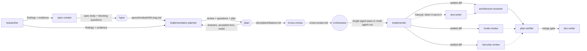

# Agents

Subagents for DevDigest. Each runs in its own context window with its own tool allowlist,
and returns a report to the caller. This file is the map of the set — the rules themselves
live in each agent's own file.

Agents are registered at **session start**. A newly added file is not available until
Claude Code restarts.

## Running the cycle

Three commands, deliberately separate — the two that decide *what* are run by hand, the one
that executes is a single call:

| Command | Stage | Who starts it |
|---|---|---|
| [`/spec`](../commands/spec.md) | specification | you, manually |
| [`/plan`](../commands/plan.md) | implementation plan | you, manually |
| [`/cross-review`](../commands/cross-review.md) | independent read of the plan by another model family | you, manually, between plan and impl |
| [`/impl`](../commands/impl.md) | implement → review → fix loop → verify → land | one call, gates only where it must stop |
| [`/retro`](../commands/retro.md) | retrospective on how the pipeline performed, with proposals | **manual only** — `disable-model-invocation: true`; nothing summons it |

`/impl` begins at an approved plan and **never writes a spec or a plan**. If it hits a
finding that contradicts the plan's design, it stops and sends you back to `/plan` rather
than patching around it.

**The fix loop is bounded at two rounds**, re-reviews only the round's delta, and treats
`minor` findings as follow-ups rather than fixes. A finding the implementer disputes with
evidence becomes `contested` and goes to you — never quietly patched, because editing
correct code to satisfy a false positive is the one review outcome nobody notices.

**The plan gets an outside read before it is executed.** [`/cross-review`](../commands/cross-review.md)
hands the spec and plan — and nothing about how we reached them — to a model from another
family, then marks each finding confirmed / rejected / cannot tell against evidence before
recording it. Withholding our reasoning is the point: a reviewer anchored on it inherits the
blind spot the stage exists to break. No provider key is configured here, so the default route
is a manual paste, and nothing leaves the machine without explicit confirmation.

**Cost is controlled by what can actually be counted.** A command cannot meter its own token
spend, so `/impl` binds on agent invocations instead: the planner declares an envelope per
execution mode, `/impl` counts every subagent it launches against `--max-agents`, and stops
at a stage boundary rather than assuming the next stage is cheap. Model tier comes from the
plan and is never silently upgraded. `--max-usd` is recorded and reported, but marked
advisory, because it cannot be verified from here.

**`test-writer` is off in the default run** to save tokens. Coverage rides on the plan
instead: every step that changes observable behaviour carries a `Test:` line, and the
implementer writes it. Invoke `test-writer` by hand when a change deserves a real suite.

## Catalog

| Agent | Model | Can write files | Invoke when |
|-------|-------|-----------------|-------------|
| [researcher](researcher.md) | `sonnet` | no | A question needs digging across many files or external sources, and you want the conclusion plus its evidence |
| [spec-creator](spec-creator.md) | `opus` | no | A feature should be agreed on before it is planned — requirements, acceptance criteria, corner cases, workflow, module communication, UX gaps in the design |
| [implementation-planner](implementation-planner.md) | `opus` | no | Before any non-trivial implementation — it audits the requirements first, asks what is ambiguous, recommends what could be better, then plans; ends by asking single-agent vs multi-agent execution |
| [implementer](implementer.md) | `inherit` | **yes** | An approved plan exists and needs to be executed |
| [test-writer](test-writer.md) | `sonnet` | **yes** | Manual only — a change deserves a real suite beyond the `Test:` line in its plan step |
| [plan-verifier](plan-verifier.md) | `sonnet` | no | An implementer reports done and the plan needs checking item by item before merge |
| [architecture-reviewer](architecture-reviewer.md) | `sonnet` | no | A diff has landed and its architectural boundaries need checking against the repo's own rules |
| [doc-writer](doc-writer.md) | `sonnet` | **yes** | A landed feature is worth documenting outside the session |

## Pipeline

`implementation-planner` is fronted by a slash command. It has no write tools, so
[`/plan`](../commands/plan.md) is what relays its blocking questions and recommendations to
the user, asks the execution mode, and persists `docs/plans/<feature>.md`. The split matters:
a recommendation the user never accepted must not appear in the steps, and the execution
mode must be chosen by a human before anything runs.

**The spec/plan split is the point.** `spec-creator` answers *what and why* and stops;
`implementation-planner` answers *how* and never edits the answer to *what*. A spec may
carry a workflow diagram, a module-interaction table, and contract expectations — those are
agreements — but never a file path, a step list, or a code block. Both agents are read-only
and fronted by a command: [`/spec`](../commands/spec.md) persists
`<package>/specs/<module>/NN-<slug>.md`, [`/plan`](../commands/plan.md) persists
`docs/plans/<feature>.md`. A `PreToolUse` hook
([`../hooks/specs-write-guard.sh`](../hooks/specs-write-guard.sh), wired in
`../settings.json`) is the second rubicon: under any `specs/` directory only `.md`,
`e2e/specs/*.flow.json`, and `assets/` images may be written. It ignores everything outside
`specs/`, so it cannot get in the way of the other agents.

**Specs are a numbered series per module** — `01-…`, `02-…`, following the
`e2e/specs/NN-*.flow.json` precedent. A new spec takes the next free number and may
`supersede:` an earlier one; nothing is renumbered or deleted, because plans and commits
cite these paths.

`researcher` is optional input, not a required stage. The orchestrator — the main session —
persists the plan and runs the review agents; no agent hands off to another directly.

**Review is deliberately outside `implementer`.** A reviewer with a fresh context sees only
the diff and the criteria, not the reasoning that produced the change — and the agent that
wrote the code is not the one that grades it. `plan-verifier` answers "was the plan
followed"; `architecture-reviewer` answers "were the boundaries respected". They are
separate because they fail differently: a change can satisfy every plan item and still
breach a boundary, or respect every boundary while missing half the plan.

**Order matters, and it is not the obvious one:**

1. `test-writer`, **when you run it at all**, goes **before** the reviewers. It writes
   files, so a review that precedes it graded a diff that no longer exists — and test files
   break boundaries too (a test reaching past `container.repoIntel.*`, a client test
   re-declaring a contract shape).
2. `plan-verifier` runs **last**, not early. Its own rule is that a behavioural "Done when"
   is not proven by a green typecheck — so before the tests exist, most rows come back
   `cannot tell`, which is an expensive way to learn nothing. The cheap early gate is free:
   read the implementer's `## Plan coverage` table, and send the work back if a step is
   `skipped` or `partial` before paying for review.

**`architecture-reviewer` does not find bugs, by design** — a finding must map to one of its
boundaries B1–B11 or it is dropped, and general correctness and security are explicitly out
of its scope. Correctness is `/code-review`; security is `/security-review` (the
`security review` agent is still unwritten — `docs/agent-prompts/security-reviewer.md`
covers the prompt side). Expecting the architecture reviewer to catch a logic error is the
most common way this pipeline lets one through.

**Tests are staged, never repeated.** `implementer` runs typecheck plus `vitest related`
on its own diff and the full package suite once at the end of its track; `plan-verifier`
re-runs the plan's verification table once as the gate; `test-writer`, when invoked, owns
the full suite of the packages it covered. All three
use `--reporter=dot` and quote output verbatim only for failures — the default reporter
names every test, and that text is paid for twice, on read and on quote.

**Insights are recorded once.** Executing agents emit `## Insight candidates`; the
orchestrator runs `engineering-insights` at the end of the run. Parallel tracks appending to
one append-only `INSIGHTS.md` collide.

---

## researcher

**Responsibility.** Investigates and reports; never changes the repository. Two modes —
Type A (repository: how something works, where it lives, what history says) and Type B
(external: library and API behaviour, versions, standards, prior art). Mixed questions
produce one merged report.

**Permissions.** `Read, Grep, Glob, Bash, WebSearch, WebFetch`. No `Write`/`Edit`. No
`Skill` — so it cannot invoke `/deep-research` or any other skill. No `Agent` — it cannot
spawn subagents. `Bash` is contractually read-only (inspection commands only).

| | |
|---|---|
| **Input** | A concrete question. Vague input triggers 2–4 clarifying questions, then a stop. |
| **Output** | Report with Answer → Findings (each with `file:line` or a URL, plus a confidence label) → References → **Not established** → next steps. |

The **Not established** section is mandatory; an empty one is a claim of completeness.

---

## spec-creator

**Responsibility.** Writes the specification a team agrees on before anyone plans: the
problem, the scope and its non-goals, testable requirements with acceptance criteria, the
states and corner cases the design never drew, the workflow, how the feature talks to other
modules and what each hop does when it fails, the contract fields that must cross a
boundary, and UX findings graded blocker / should / idea. It inspects the committed design
bundles in Chrome rather than reading them as text, and it asks before it writes rather than
guessing.

**Permissions.** `Read, Grep, Glob, Skill, Agent` plus the read/navigate Chrome tools. **No
`Write`, `Edit`, or `Bash`** — the write restriction is structural, not prose: the agent has
no way to touch the filesystem, and `/spec` is the only thing that persists its output.

It is the **only agent here holding `Agent`**, for one purpose: fanning out `researcher`
subagents (up to three in parallel, one falsifiable question each) for third-party
behaviour, prior art, and the git archaeology it cannot do without `Bash`. Researchers
return evidence; the requirements stay the spec-creator's. `Skill` is limited by prose to
`mermaid-diagram` and `consult-insights` — every implementation skill is explicitly
off-limits, because opening `postgresql-table-design` is the shortest path from a
specification into a schema. `find-docs` needs `npx ctx7` and therefore `Bash`, so external
docs go to a researcher instead.

`model: opus` — a missed corner case becomes a missing requirement, then a bug.

| | |
|---|---|
| **Input** | A feature request, today's date, an optional `<package>/<module>` target, the numbers already used in that module folder, the design bundle paths, and the earlier specs when superseding one. |
| **Output** | Four sections: **A** the spec body (15 sections, persisted verbatim), **B** blocking questions (max six, with options and a recommendation), **C** handoff — target path and next free number, design coverage, research delegated, corner-case misses, insight candidates, **D** a 14-line final self-check printed `pass` / `fixed` / `n/a — reason`. |

**Where the WHAT/WHY line actually falls.** Allowed: workflow and state diagrams, module
communication with per-hop failure behaviour, contract expectations as a table of fields and
meanings, observable error semantics. Not allowed: file paths, step lists, schemas, DDL,
library choices, algorithms — and never a code block. *If a reader could paste it into the
repo and have it compile, it went too far.*

**Consumed by** `implementation-planner`, which treats the spec as binding, uses its
`## 12. Traceability` table as a coverage checklist, and turns its open questions into
blocking ones.

**Spec status is a gate, not decoration:** `spec-creator` writes `draft`, **a human sets
`approved`** after reading it, and `/spec` flips it to `superseded` when a later number
replaces it. `/plan` **refuses to plan anything that is not `approved`** and never edits a
spec's frontmatter — planning a draft is how an unagreed requirement becomes a merged
feature, because the plan makes it look settled and nothing downstream asks again.

---

## implementation-planner

**Responsibility.** Turns an agreed requirement into an executable plan — but audits the
requirement first. It grades every requirement (clear / ambiguous / conflicting /
unverifiable / missing / **already built** / infeasible here), asks the blocking questions,
recommends what could be done better without folding those recommendations into the steps,
then maps the work onto the real package and module layout with the constraints, skills, and
verification commands in force. It finishes by asking whether to execute as a single-agent
pass or a multi-agent run, having produced both decompositions.

**Permissions.** `Read, Grep, Glob, Bash` (read-only). No `Write`/`Edit` — it does **not**
write the plan; `/plan` persists it. No `Skill`: it *names* the skills the executing agent
will use rather than executing them. No `Agent`.

`model: opus` — a planning error propagates through the whole implementation, and a missed
"already built" wastes the entire run.

| | |
|---|---|
| **Input** | A requirement or feature request, today's date, any `<package>/specs/<module>/spec.md` and research write-up, and the previous plan when re-planning. |
| **Output** | Requirements review → Blocking questions → Recommendations → Goal & scope (with explicit **Out of scope**) → Affected packages → Constraints in force → **Existing scaffolding check** → Steps (files, skill, "done when") → Contract & DB changes → Verification table → **both execution decompositions** → Risks → Handoff. |

**It does not write specifications.** Requirements, acceptance criteria, and UX calls are
inputs. A sentence a product owner would have to approve does not belong in a plan — it
belongs in a question or a recommendation.

**Multi-agent decomposition is constrained, not free.** Parallel tracks need disjoint file
sets; contract landing and `db:migrate` are barriers; `server/src/modules/index.ts` belongs
to exactly one track; parallel writers in one package need worktree isolation; reviewers
grade a settled diff.

**Consumed by** `implementer`, via `docs/plans/<feature>.md`.

---

## implementer

**Responsibility.** Executes an approved plan across the Fastify server and the Next.js
client, applies the matching project skills, and verifies its own changes with the existing
typecheck and test suites.

**Permissions.** `Read, Grep, Glob, Edit, Write, Bash, Skill, TodoWrite`. `Skill` is granted
because skill selection is part of the job. No `Agent` — it cannot delegate, and in
particular cannot spawn its own reviewer. `WebSearch`/`WebFetch` are withheld: third-party
API details come from the `ctx7` CLI via `Bash`.

`model: inherit` and no `permissionMode` — implementation runs on the session's model under
the session's permission rules rather than quietly widening either.

| | |
|---|---|
| **Input** | An approved plan. Without one, and for anything beyond a single obvious edit, it asks for the plan instead of inventing a design. |
| **Output** | Implementation Report: Plan coverage (every step accounted for) → Changes by package with skills applied → Verification run (real command output) → Scope check (`git diff --stat` vs the plan) → Deviations → **Out of scope — NOT reviewed here** → Follow-ups → Insight candidates. |

**Scope of its self-verification:** typecheck, tests, and a diff-scope check. Architecture
and security conclusions are absent by design.

---

## test-writer

**Responsibility.** Adds coverage that pins real behaviour, across all four packages —
picking the right runner, location, and naming per package, and declining to add tests that
would pass whether or not the behaviour they claim to check is broken.

**Permissions.** `Read, Grep, Glob, Edit, Write, Bash, Skill, TodoWrite`. `Write`/`Edit`
because test files are the deliverable; the body scopes them to tests and fixtures. No
`Agent` — it cannot delegate test authoring or spawn its own reviewer. No
`WebSearch`/`WebFetch` — third-party details come from `ctx7` via `Bash`.

| | |
|---|---|
| **Input** | A change, a diff, or a named surface needing coverage. |
| **Output** | Coverage added (package, file, kind, what it pins) → Placement & naming decisions → Skills applied → Verification run → **Deliberately not tested** → Follow-ups → Insight candidates. |

Two rules do the heavy lifting: **it may not weaken, skip, or delete an existing test to
make a suite pass**, and **every assertion must derive from the contract, not from current
output** — otherwise a bug gets pinned as expected behaviour.

---

## plan-verifier

**Responsibility.** Walks a Development Plan item by item against the finished work and
returns a verdict per item with the evidence used. It verifies the plan that exists; it does
not opine on how the work should have been done.

**Permissions.** `Read, Grep, Glob, Bash` (read-only). No `Write`/`Edit` — a verifier that
patches its own gaps has verified nothing. **No `Skill`, and that omission is load-bearing:**
with it the agent could pull in general best-practice skills and drift into "here's how I'd
improve this", which is precisely the substitution this agent exists to prevent. `Bash`
stays so it can *run* the plan's own "Done when" commands rather than believe them.

| | |
|---|---|
| **Input** | The plan (path or pasted) **and** the work under test. Missing either → it asks and stops; it will not verify against a plan it reconstructed. |
| **Output** | Verdict → Step-by-step table → Requirements & scope → Contract & DB items → Verification re-run → Not verified detail → Cannot tell detail → **Files changed but not in the plan** → Plan quality notes. |

Three verdicts: **verified** (evidence cited), **not verified** (checkable and failed),
**cannot tell** (not mechanically checkable — must state what would settle it). Unverifiable
is never counted as unmet. The implementer's own report is an input to be tested, never
evidence.

---

## architecture-reviewer

**Responsibility.** Checks a diff against eleven enumerated, checkable architectural
boundaries and reports violations with evidence — plus the boundaries it could not check.

**Permissions.** `Read, Grep, Glob, Bash` (read-only). No `Write`/`Edit` — a reviewer that
can edit will fix instead of report, and the caller loses the finding. **No `Skill`:** the
boundaries are defined by this repo's own files, and granting skills would let generic
best-practice opinions dilute the review. `Bash` is essential — the boundary checks *are*
grep and diff commands.

| | |
|---|---|
| **Input** | A diff range, a PR, or a named package for a full sweep. |
| **Output** | Verdict → Boundary results table (pass rows included, so silence is never ambiguous) → Findings with `file:line` and the boundary violated → Known baseline exceptions → Not checked → Out of scope. |

Anti-noise design: a finding must map to one of B1–B11 or it is dropped, and **"No issues
found" is an expected outcome** — the agent is told not to manufacture findings. The known
benign carve-outs are enumerated so they are not re-reported every run.

---

## doc-writer

**Responsibility.** Turns a plan, an implementation report, or code into curated
documentation with diagrams, and places it in the right location instead of the nearest
empty stub.

**Permissions.** `Read, Grep, Glob, Edit, Write, Bash, Skill`. `Skill` specifically so it can
invoke `mermaid-diagram` and `engineering-insights`. No `Agent`; no
`WebSearch`/`WebFetch` — it documents *this* repo. `Write`/`Edit` are scoped to markdown by
the body, with an explicit "if you are editing a `.ts` file, stop and report".

| | |
|---|---|
| **Input** | A Development Plan, an Implementation Report, a diff, or a named feature. Vague scope triggers clarifying questions first. |
| **Output** | Files written → **Placement rationale** → **Index updates** → Diagrams → Sources used → Not documented → Insight candidates. |

It carries the verified inventory of which `docs/`/`specs/` directories are real and which
are eight "Empty for now." stubs, and the rule that filling a stub obliges de-stubbing and
indexing its README. Gotchas are routed to `INSIGHTS.md` via the skill rather than into a doc.

---

## Sources behind the agent rules

The five repo-facing agents encode repo-specific rules rather than generic advice. Where
each rule comes from:

### Repository conventions

| Rule | Source |
|---|---|
| Not a workspace monorepo; sharing via tsconfig `paths`; static module registration; ESM `.js` extensions | root `CLAUDE.md` |
| Do-not-touch: `server/src/vendor/shared/`, `server/src/db/migrations/` | root `CLAUDE.md` |
| Read `docs/`/`specs/`/`INSIGHTS.md` before code; `INSIGHTS.md` writes are append-only | root `CLAUDE.md` (session protocol) |
| `workspace_id` on every domain table; DI via container; interfaces not classes; repo-intel only via `container.repoIntel.*`; best-effort context enrichment | `server/CLAUDE.md` |
| Types from `@devdigest/shared`, never hand-duplicated; all API access through `src/lib/api.ts` | `client/CLAUDE.md` |
| Iron rule "no I/O"; mandatory grounding gate; skills/memory/specs arrive pre-resolved | `reviewer-core/CLAUDE.md` |
| Deterministic flows, no LLM | `e2e/CLAUDE.md` |
| "ADD A MODULE" recipe; why registration is static and must stay so | `server/src/modules/index.ts` (its own doc block) |
| Per-module `withTypeProvider<ZodTypeProvider>()`; the fixed 422 / `AppError` / 500 error envelope | `server/src/app.ts` |
| `getContext` for tenancy | `server/src/modules/_shared/context.ts` |
| Container surface and `ContainerOverrides` | `server/src/platform/container.ts` |
| Barrel is extended with new files, never edited in place | `server/src/vendor/shared/index.ts` |
| Migration generation and output path | `server/drizzle.config.ts` |
| The `ApiError` shape and single-client rule | `client/src/lib/api.ts` |
| Eight `docs/`/`specs/` directories are "Empty for now." stubs — destinations, not sources; every package `CLAUDE.md` already links to them | the eight stub `README.md` files; the five package `CLAUDE.md` *Use when* sections |
| Documentation diagrams are fenced mermaid blocks, and every one in the repo is a `flowchart` | the six `README.md` files carrying mermaid blocks |
| The client `mermaid` npm dependency is a runtime renderer for `OnboardingSection.diagram`, **not** a docs toolchain; there is no `mmdc` and no diagram CI | `client/src/components/mermaid-diagram/`, `contracts/knowledge.ts` |

### Architectural boundaries and their checks

The eleven boundaries `architecture-reviewer` enforces, and where each is defined:

| # | Boundary | Source |
|---|---|---|
| B1 | The two `vendor/shared` copies stay byte-identical | root `CLAUDE.md`; `server/INSIGHTS.md` |
| B2 | All client API access goes through `src/lib/api.ts` | `client/CLAUDE.md` |
| B3 | No module reaches into another module's service or repository | `server/CLAUDE.md`; `server/src/modules/index.ts` |
| B4 | repo-intel is reached only through `container.repoIntel.*` | `server/CLAUDE.md` |
| B5 | Shared repositories live on the container | `server/CLAUDE.md`; `server/src/platform/container.ts` |
| B6 | `reviewer-core` does no I/O — DB, fs, GitHub, persistence | `reviewer-core/CLAUDE.md` |
| B7 | ESM `.js` extensions are package-scoped | root `CLAUDE.md` |
| B8 | Tenancy — `getContext` per handler, `workspace_id` per table | `server/CLAUDE.md` |
| B9 | Module registration stays static and length-aligned | `server/src/modules/index.ts` |
| B10 | Per-module Zod type provider | `server/src/app.ts` |
| B11 | Contracts are never re-declared on the client | `client/CLAUDE.md` |

Each carries a runnable command and a **verified baseline** in the agent file, so it reports
deltas rather than the standing state. Four baselines are traps worth knowing about: a naive
`fetch(` grep yields 8 false positives from TanStack Query `refetch()`; `reviewer-core`'s one
legitimate `fetch` is in its `LLMProvider`; the B7 check needs `--exclude-dir=node_modules`
or `e2e` alone returns 68 `@types/node` hits; and `server/src/db/schema/` is a documented
ESM carve-out. B1 outranks B7 inside `client/src/vendor/shared/`.

### Gotchas lifted from INSIGHTS.md

| Rule | Source |
|---|---|
| Two hand-maintained `vendor/shared` copies; edit in lock-step; `diff -rq` must print nothing | `server/INSIGHTS.md` — incl. the 2026-08-17 correction recording the five-file drift |
| Never hand-write migration SQL; schema → `db:generate` → `db:migrate` | `server/INSIGHTS.md` |
| Adding a required Zod contract field breaks the inline `stats` fixture in `server/test/contracts.test.ts` | `server/INSIGHTS.md` |
| `completeAgentRun`'s `values` shape is declared in two places that must match | `server/INSIGHTS.md` |
| `user-event` is not a client dependency — use `fireEvent`; **overrides the `react-testing-library` skill** | `client/INSIGHTS.md` |
| Cut course features leave working scaffolding behind — grep before writing | `client/INSIGHTS.md` |
| `COLUMN_KEYS` and `GRID` must stay length-aligned | `client/INSIGHTS.md` |
| Missing i18n key renders the raw key instead of erroring; `en` is the only locale | `client/INSIGHTS.md` |
| `Toggle` renders `role="switch"` | `client/INSIGHTS.md` |
| Read cost from `ReviewOutcome`, never recompute it | `reviewer-core/INSIGHTS.md` |

### Verification commands

| Rule | Source |
|---|---|
| Real per-package scripts; `reviewer-core` installs with `npm ci`; e2e is `tsx run.ts`, not Playwright | the four `package.json` files |
| Server unit/integration split by filename (`--exclude '**/*.it.test.ts'` vs `.it.test`) | `.github/workflows/server-unit.yml`, `server-integration.yml` |
| **No lint step exists** — no ESLint/Biome/Prettier config, no `lint` script anywhere | absence verified across all four packages and all CI workflows |
| A new path alias must be added in both `tsconfig.json` and `vitest.config.ts` | the per-package `vitest.config.ts` files, which duplicate the aliases |
| Nothing is pre-approved beyond three git commands; the one project hook guards writes under `specs/` only | `.claude/settings.local.json`, `.claude/settings.json` |
| A server test importing `test/helpers/pg.ts` **must** carry the `.it.test.ts` suffix, or it silently breaks the no-Docker unit lane | `TESTING.md` |
| `server/package.json` is `skip-worktree`, so CI calls `pnpm exec vitest run …` rather than committed test scripts | `TESTING.md` |
| Testing is typological, not exhaustive — no coverage target | `TESTING.md` |
| `.claude/**` is covered by no CI workflow, no `tsconfig` include, and no vitest glob — agent files have no build gate | `.github/workflows/*` `paths:` filters; the four `tsconfig.json` |

### Skill routing

The step-to-skill map in both agents is built from the `description` frontmatter of each
skill in [`../skills/`](../skills/README.md). Precedence when they conflict:

**package `INSIGHTS.md` → package `CLAUDE.md` → root `CLAUDE.md` → skill → general practice.**

### Agent-authoring practices

Structure and frontmatter follow the official Claude Code docs — [Subagents](https://code.claude.com/docs/en/sub-agents),
[Skills](https://code.claude.com/docs/en/skills), [Best practices](https://code.claude.com/docs/en/best-practices).
The load-bearing points:

- Only `name` and `description` are required. `permissions`, `allowed-tools`, and
  `disable-model-invocation` are **not** subagent fields (the first is `permissionMode`; the
  others belong to skills).
- `tools` is the only real enforcement. Omitting `Skill` blocks skill invocation; omitting
  `Agent` blocks spawning. Prose in the body is not a constraint.
- `permissionMode: plan` is silently ignored when the parent session is in auto mode — so no
  agent here relies on it for read-only behaviour.
- Descriptions are third person and state both *what it does* and *when to use it*.
  `use proactively` is deliberately absent: every agent here is invoked explicitly.
- The documented plan→implement→review shape is a self-contained spec naming files,
  interfaces, and out-of-scope items, executed from a fresh context, then reviewed by an
  agent that sees only the diff.
- The agent that wrote the code must not be the one that grades it — hence separate
  `test-writer`, `plan-verifier`, and `architecture-reviewer` rather than folding these into
  `implementer`.
- A reviewer prompted to find gaps will report some even when the work is sound; reviewers
  here are told to flag only what violates a stated boundary or requirement, and that
  "no issues found" is a correct outcome.
- Verification uses a three-way verdict — met / not met / **cannot verify** — because
  "could not check" must never be recorded as "not done".
- `color` is optional (`researcher.md` omits it). Taken so far: blue, green, yellow, red,
  purple, cyan.
- **Model follows the shape of the judgement, not the importance of the stage.** The two
  reviewers run on `sonnet` because both work from a closed list with mandatory evidence —
  `architecture-reviewer` against boundaries B1–B11, `plan-verifier` against the plan's own
  rows, where an unevidenced row is `cannot tell` by definition. The two authoring agents
  stay on `opus` because their output is open-ended and everything downstream inherits their
  mistakes: a missed corner case in a spec and a missed "already built" in a plan both cost
  a whole run.

Two gaps worth naming: there is **no official Anthropic guidance on Mermaid authoring** (only
a preference for text/SVG over raster), and none on the docs-vs-code-comments boundary. The
diagram and documentation rules in `doc-writer` are house style derived from what this repo
already does, not vendor guidance.

## Adding an agent

1. Create `<name>.md` here with `name` + `description` frontmatter (`name`: lowercase and
   hyphens, no `:`).
2. Give it the narrowest `tools` allowlist that works. Withhold `Agent` unless it genuinely
   needs to fan out; withhold `Skill` for anything that must stay read-only.
3. Define its output format in the body — the report *is* the return value.
4. Add a row to the catalog above and a section here.
5. Restart Claude Code, or the agent will not be in the registry.
