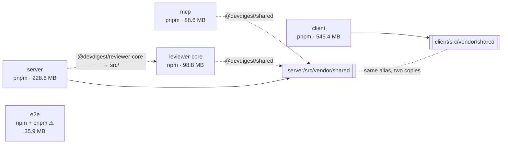

# Report template

Copy this shape. Keep the section order — a reader who knows the shape can find the one
thing they came for without reading the rest.

Numbers come from `scripts/scan.mjs`. Round to one decimal in MB. Never round a count.

---

# Dependency report — <repo> — <YYYY-MM-DD>

Generated from `.claude/skills/dependency-checker/scripts/scan.mjs`.
Commit: `<sha>`. Installed trees measured on disk; sizes are unpacked, not download size.

## 1. Summary

| Package | Manager | prod / dev | Installed | Size |
|---|---|---|---|---|
| server | pnpm | 22 / 8 | 396 | 228.6 MB |
| … | | | | |
| **Total** | | | | **1.0 GB** |

<Up to five sentences. Lead with anything currently broken from the invariants. If
nothing is broken, say so plainly — "no P1 findings" is a result worth stating.>

## 2. Component graph

Dashed = alias into raw source. Double-bracket nodes = vendored copies. Label every edge
with the alias that creates it.

## 3. Weight

Per package, top ten by **exclusive**. `total` is what the dependency drags in;
`exclusive` is what disappears if it goes.

### server

| Dependency | Kind | Total | Exclusive | +pkgs |
|---|---|---|---|---|
| js-tiktoken | prod | 21.4 MB | 21.4 MB | 1 |
| @testcontainers/postgresql | dev | 23.8 MB | 0.4 MB | 129 |
| … | | | | |

<Repeat per package. Close with the repo total and the share that is dev-only.>

## 4. Findings

### P1 — can produce a wrong artifact

**F1. <one-line title>**
`<path>` · <the fact, with the number> · <what ships wrong, and how it stays silent> ·
<first step>

### P2 — weight with a cheap fix

**F2. <title>**
<exclusive MB> · <import sites> · <what changes>

### P3 — hygiene

**F3. <title>** — <fact> · <why it is not urgent>

## 5. Recommendations

| # | Tier | Do this | Because | Cost |
|---|---|---|---|---|
| 1 | P1 | Delete `e2e/package-lock.json`, keep pnpm | two lockfiles disagree silently | 1 file |
| 2 | P2 | Drop `mermaid` from `client` | 112 MB exclusive, 102 pkgs, 2 import sites | ~half a day |

## Checked and not a finding

- <each item from the skill's "what is not a finding" list that applies here, one line>

## Not measured

- <anything the run could not see: uninstalled packages, bundle-level cost, private
  registries. Say it rather than let the reader assume coverage.>
