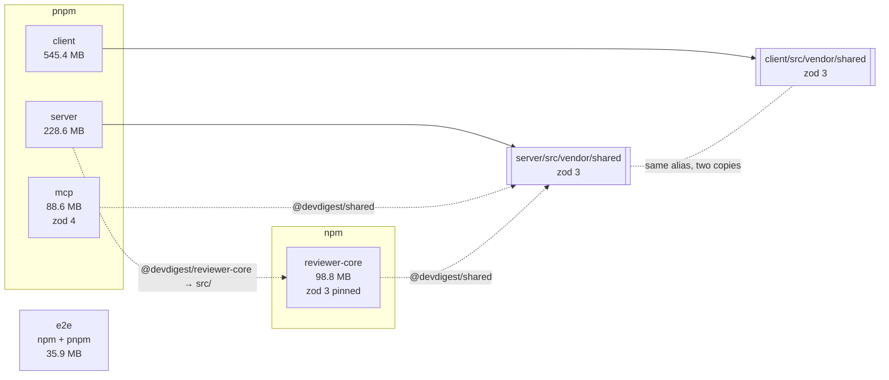

# Dependency report — DevDigest — 2026-08-31

Generated from `.claude/skills/dependency-checker/scripts/scan.mjs`.
Sizes are unpacked bytes on disk, not download size. pnpm trees include `.pnpm/`.

## 1. Summary

| Package | Manager | prod / dev | Installed | Size |
|---|---|---|---|---|
| `client` | pnpm | 11 / 12 | 421 | 545.4 MB |
| `server` | pnpm | 22 / 8 | 396 | 228.6 MB |
| `reviewer-core` | npm | 2 / 5 | 137 | 98.8 MB |
| `mcp` | pnpm | 2 / 4 | 51 | 88.6 MB |
| `skill-evals` | npm | 0 / 3 | 6 | 45.8 MB |
| `e2e` | npm + pnpm ⚠ | 0 / 3 | 7 | 35.9 MB |

Five packages, no workspace, three package managers in play. Nothing hoists, so the same
`typescript` is installed five times — that is the design, not a defect.

Two things are currently wrong and both ship silently. `mcp` is on **zod ^4.2.0** while
every other package is on **^3.24.1**, and `mcp` reaches the contracts by aliasing into
`server/src/vendor/shared/` — a copy written against zod 3. And `e2e` carries **two
lockfiles** that no longer have to agree.

The good news is specific: the two vendored copies of `@devdigest/shared` are currently
**byte-identical**, so the drift risk described below has not fired yet.

## 2. Component graph

Dashed = alias into raw source, declared in `tsconfig.json` and in no `package.json`.
`npm ls` and every SCA tool see five unrelated projects.

## 3. Weight

`total` is what a dependency drags in. `exclusive` is what disappears if it goes —
the number a removal decision rests on. Sorted by `exclusive`.
| **Total** | | | | **1.02 GB** |

### `client`

| Dependency | Kind | Total | Exclusive | +pkgs |
|---|---|---|---|---|
| `next` | prod | 136.9 MB | **134.2 MB** | 10 |
| `mermaid` | prod | 114.0 MB | **112.3 MB** | 102 |
| `lucide-react` | prod | 27.3 MB | **27.3 MB** | 0 |
| `typescript` | dev | 22.5 MB | **22.5 MB** | 0 |
| `vitest` | dev | 19.8 MB | **18.8 MB** | 40 |
| `jsdom` | dev | 13.1 MB | **11.7 MB** | 58 |
| `@vitejs/plugin-react` | dev | 12.7 MB | **9.2 MB** | 47 |
| `recharts` | prod | 10.4 MB | **7.6 MB** | 39 |

### `server`

| Dependency | Kind | Total | Exclusive | +pkgs |
|---|---|---|---|---|
| `typescript` | dev | 22.5 MB | **22.5 MB** | 0 |
| `js-tiktoken` | prod | 21.4 MB | **21.4 MB** | 1 |
| `octokit` | prod | 10.6 MB | **10.5 MB** | 32 |
| `vitest` | dev | 19.5 MB | **10.2 MB** | 40 |
| `drizzle-kit` | dev | 19.3 MB | **9.9 MB** | 19 |
| `drizzle-orm` | prod | 7.8 MB | **7.8 MB** | 0 |
| `fastify` | prod | 6.9 MB | **6.5 MB** | 45 |
| `openai` | prod | 8.3 MB | **4.0 MB** | 36 |

### `reviewer-core`

| Dependency | Kind | Total | Exclusive | +pkgs |
|---|---|---|---|---|
| `vitest` | dev | 39.4 MB | **28.5 MB** | 40 |
| `typescript` | dev | 22.5 MB | **22.5 MB** | 0 |
| `@vitest/coverage-v8` | dev | 11.2 MB | **10.5 MB** | 57 |
| `openai` | prod | 10.4 MB | **10.3 MB** | 36 |
| `zod` | prod | 3.4 MB | **3.4 MB** | 0 |
| `@types/node` | dev | 2.4 MB | **2.3 MB** | 1 |
| `tsx` | dev | 10.7 MB | **0.5 MB** | 1 |

### `mcp`

| Dependency | Kind | Total | Exclusive | +pkgs |
|---|---|---|---|---|
| `typescript` | dev | 22.5 MB | **22.5 MB** | 0 |
| `@modelcontextprotocol/server` | prod | 11.6 MB | **11.6 MB** | 2 |
| `vitest` | dev | 19.9 MB | **10.3 MB** | 40 |
| `zod` | prod | 4.3 MB | **4.3 MB** | 0 |
| `@types/node` | dev | 2.4 MB | **2.4 MB** | 1 |
| `tsx` | dev | 10.0 MB | **0.5 MB** | 1 |

### `skill-evals`

| Dependency | Kind | Total | Exclusive | +pkgs |
|---|---|---|---|---|
| `typescript` | dev | 22.5 MB | **22.5 MB** | 0 |
| `tsx` | dev | 10.7 MB | **10.7 MB** | 1 |
| `@types/node` | dev | 2.4 MB | **2.4 MB** | 1 |

### `e2e`

| Dependency | Kind | Total | Exclusive | +pkgs |
|---|---|---|---|---|
| `typescript` | dev | 22.5 MB | **22.5 MB** | 0 |
| `@types/node` | dev | 2.4 MB | **2.4 MB** | 1 |
| `tsx` | dev | 0.6 MB | **0.6 MB** | 1 |

## 4. Findings

### P1 — can produce a wrong artifact

**F1. `mcp` is on zod 4 and consumes contracts built for zod 3.**
`mcp/package.json` declares `zod ^4.2.0`; `mcp/tsconfig.json` aliases `@devdigest/shared`
to `../server/src/vendor/shared/`, which the rest of the repo builds against `^3.24.1`.
A *type-only* import is fine. A value import of a schema hands a zod-3 object to a zod-4
runtime: `instanceof` checks fail, refinements silently do not run, and `safeParse` error
shapes differ enough to take the wrong branch. Nothing throws.
*First step:* grep `mcp/src` for non-`import type` imports from `@devdigest/shared`.

**F2. `e2e` has two lockfiles.**
`package-lock.json` (16.7 KB) and `pnpm-lock.yaml` (9.8 KB) both present. Whichever
manager a developer or CI job reaches for wins, and the two need not resolve the same
versions. CI runs `npm ci` here.
*First step:* decide the manager, delete the other lockfile.

**F3. `mcp` and `reviewer-core` do not declare `@devdigest/shared` at all.**
It resolves only through a tsconfig alias, so it type-checks and then is absent at
runtime unless the consumer bundles it. Nothing in either manifest records the coupling.
*First step:* either bundle the alias target at build time, or promote it to a real
dependency.

### P2 — weight with a cheap fix

**F4. `mermaid` costs `client` 112.3 MB exclusive across 102 packages.**
It is the single largest removable item in the repo. Worth it only if the diagrams it
renders are few and static.
*First step:* count the import sites before deciding.

**F5. `js-tiktoken` is 21.4 MB exclusive and a production dependency of `server`.**
Tokeniser tables are large by nature; the question is whether the server needs exact
counts or an estimate.

### P3 — hygiene

**F6.** `typescript` is installed five times, ~22.5 MB each (~112 MB total). Inherent to
the no-workspace design; listed so the number is not mistaken for waste that a dependency
change could remove.

**F7.** `server`'s `testcontainers` pair totals ~48 MB but only ~0.8 MB exclusive — they
share 128 packages. Removing one saves almost nothing.

## 5. Recommendations

| # | Tier | Do this | Because | Cost |
|---|---|---|---|---|
| 1 | P1 | Audit `mcp/src` for value imports from `@devdigest/shared` | zod 3 objects in a zod 4 process, silent | one grep |
| 2 | P1 | Delete one of `e2e`'s two lockfiles | they need not agree | one file |
| 3 | P1 | Declare or bundle `@devdigest/shared` in `mcp` and `reviewer-core` | compile-time-only resolution | manifest edit or build step |
| 4 | P2 | Count `mermaid` import sites in `client`, then decide | 112.3 MB exclusive, 102 packages | half a day if it goes |
| 5 | P3 | Revisit the no-workspace decision if install time hurts | ~112 MB of duplicated `typescript` alone | large, do not do it for this alone |

## Checked and not a finding

- The same dependency installed in several packages — the no-workspace design.
- `reviewer-core`'s `zod` alias pin — deliberate, and load-bearing given F1.
- Large dev-only weight (`vitest`, `typescript`, `testcontainers`) in packages that never ship.
- The two vendored `@devdigest/shared` copies — verified byte-identical today.

## Not measured

- Production bundle contribution. Sizes here are unpacked on disk; a bundled client is
  much smaller and weighted differently. Measuring it needs `next build`.
- Anything in `skill-evals`, which is harness tooling rather than a shipped component.
- Vulnerability data. This report is about weight and wiring; run `npm audit` per package
  for CVEs.
