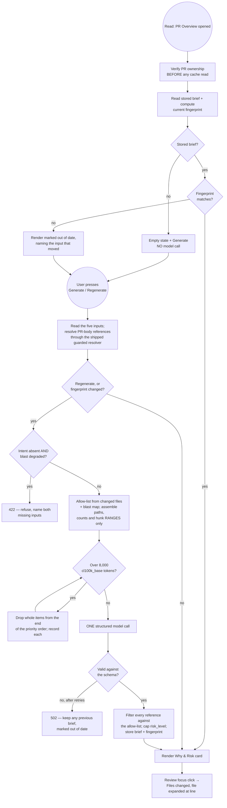

# Independent review request — PR Why + Risk Brief

You are reviewing an implementation plan against the specification it claims to satisfy.
Everything you need is in this file: the specification, then the plan, then repository
constraints you could not otherwise infer, then your instruction.

**Deliberately withheld:** the plan's own decision log, its requirements-coverage review, and
its list of considered-and-rejected options have been removed before sending. They record how
the plan's authors reached their conclusions, and reading them would tell you what to think
before you had judged for yourself. Their absence is not an omission in the plan. You will see
dangling references to identifiers like `BQ-2/A`, `R1` and `D-13` — those point into the
removed sections and into the spec's own decisions table; treat an unresolvable one as
missing context, not as a defect.

---

# PART 1 — THE SPECIFICATION (the agreed WHAT and WHY)

---
module: server/brief
spec: 01-pr-why-risk-brief
status: approved       # draft → approved (set by a human) → superseded (set by /spec)
updated: 2026-08-27
supersedes:
lesson: L05
issue:
pr:
e2e-flow: e2e/specs/09-pr-brief.flow.json (to add — 08 is claimed by server/specs/project-context/01 but is not yet on disk)
design: screenshots of the PR Overview and Files-changed tabs supplied 2026-08-27; the committed bundles `client/specs/DevDigest Design (standalone).html` and `… (3).html` could NOT be opened — `file://` is blocked in the browser tool
---

# Spec: PR Why + Risk Brief

## 1. Problem & outcome

A reviewer opening a pull request today gets its derived intent (`IntentCard`) and its
dependency impact (`BlastCard`) as two separate panels, and a diff grouped core/wiring/
boilerplate on another tab. Nothing tells them, in one place, what this change does, why, how
risky it is, and which few lines to read first — so the reading order is rediscovered by hand on
every PR.

Solved means: a reviewer can generate, for a pull request, a brief stating what it changes and
why, one overall risk level, concrete risks each pointing at real files, and a short ordered
"read these first" list whose entries navigate to that exact file and line on the Files changed
tab. Re-opening the same PR in the same state costs nothing — the brief is served from stored
state with no model call — and a separate control regenerates it on demand.

## 2. Users & triggers

The DevDigest studio user reviewing a pull request in a single local workspace.

- **Read trigger:** opening a pull request's Overview tab. This never calls a model (D-14).
- **Assembly trigger:** the user activating the brief's generate control.
- **Regeneration trigger:** the user activating the brief's regenerate control.
- **Navigation trigger:** the user activating a review-focus entry.

## 3. Scope

**In scope**

- One brief per pull request: what, why, one risk level, risks, an ordered review focus.
- One structured model call per assembly, from five named inputs, with an agreed input budget
  and a fixed unit of measurement.
- A grounding filter that discards every model-returned reference not present in the inputs.
- A state fingerprint that decides cache hit vs. re-assembly, and a regenerate control.
- The **Why & Risk** card on the Overview tab, and click-through from a review-focus entry into
  the Files changed tab at that file and line.

**Out of scope — already ships, do not rebuild**

- **Intent derivation, caching and its regenerate control.** `pr_intent`
  (`server/src/db/schema/reviews.ts:48-72`), `GET`/`POST /pulls/:id/intent`
  (`modules/intent/routes.ts:21-41`, POST rate-limited 5/min at `:33-34`), lazy derivation on
  `GET /pulls/:id` (`modules/pulls/routes.ts:349-382`), and `IntentCard` with its
  `useRecomputeIntent` button (`_components/IntentCard/IntentCard.tsx:68-131`). This spec
  **reads** intent and never derives it (D-12).
- **The reference parser and resolver, and its whole security posture.** `parseReferences` /
  `resolveReferences` (`modules/intent/references.ts`), the repo-file allow-list of documentation
  directories (`REFERENCE_DOC_DIRS`, `modules/intent/constants.ts:6`), `isSafeRepoPath`
  rejecting `..`, a leading `/`, Windows-absolute paths and NUL bytes and **re-checked in
  `fetchOne()` as the last gate before a filesystem read** (`intent/references.ts:58-66`), the
  per-kind caps of 5 repo files / 5 GitHub references / 3 URLs, the 12 KB total budget, the
  resolution order `repo-file → github → url` so the least trustworthy source is dropped first,
  and `adapters/http/web-fetch.ts` behind `INTENT_EXTERNAL_FETCH_ENABLED` (default **false**),
  enforced in the `container.webFetch` getter so no call site can forget it
  (`server/docs/intent-layer.md:170-225`; `platform/config.ts:29-34`). D-13 **reuses** all of it
  and adds none of it.
- **The blast map, its degradation semantics and its card.** `GET /pulls/:id/blast`
  (`modules/blast/routes.ts:22-45`), `BlastResponse` with `head_sha`/`indexed_sha`/`state`/
  `counts`/`map`/`prior_prs` (`modules/blast/contract.ts:66-83`), the state-first degradation
  gate (`modules/blast/service.ts:54-67, 86-96`), and `BlastCard` (`_components/BlastCard/`).
- **The optional blast summary paragraph.** `POST /pulls/:id/blast/summary`
  (`modules/blast/routes.ts:50-61`) with its own 150-**output**-token cap (`modules/blast/
  summary.ts:34`). The brief does **not** call it (D-4).
- **The reviewer-ordered Files changed tab.** `GET /pulls/:id/smart-diff`
  (`modules/smart-diff/routes.ts:20-23`), `SmartDiffViewer` with Core/Wiring/Boilerplate
  ordering (`_components/SmartDiffViewer/constants.ts:9-34`), per-file "What this does"
  (`SmartDiffFile.pseudocode_summary`, `contracts/brief.ts:113`) and finding markers.
- **Linked-issue resolution.** `PrDetail.linked_issue` (`contracts/platform.ts:218`), resolved
  by regex over the PR body (`adapters/github/octokit.ts:126-131`).
- **Diff statistics.** `pull_requests.additions/deletions/files_count` (`db/schema/pulls.ts:
  22-24`) and per-file counts in `pr_files` (`:36-45`).
- **The `risk_brief` feature-model slot** — id, label "Risk Brief", description "Assesses merge
  risks for a pull request", default `openai/gpt-4.1` (`contracts/platform.ts:20, 63-69`),
  resolved by `resolveFeatureModel` (`platform/feature-models.ts:58-64`), already borrowed by
  blast (`modules/blast/summary.ts:101`). No `FEATURE_MODELS` edit is needed, and therefore no
  edit to the third hand-mirrored copy at `client/src/lib/feature-models.ts` (D-11).
- **The `Risk` / `Risks` / `RiskSeverity` contracts** — `{kind, title, explanation, severity,
  file_refs}` (`contracts/brief.ts:74-89`), byte-identical in both vendored copies. `risks[]`
  reuses `Risk` as-is (D-10).
- **The `pr_brief` table** — `{pr_id PK → pull_requests ON DELETE CASCADE, json jsonb}`
  (`db/schema/reviews.ts:74-79`, migration `0000_init.sql:211`), shipped in part-0 with **zero
  writers**. It is the storage for this feature (D-6).
- **Untrusted-input fencing.** `wrapUntrusted` neutralises `</untrusted>` escapes and
  `INJECTION_GUARD` names untrusted blocks as data (`reviewer-core/src/prompt.ts:16-34`); blast
  already applies the pattern to a third-party map (`modules/blast/summary.ts:49-50, 112`).
- **The one-structured-call machinery.** `LLMProvider.completeStructured` returning
  `{data, model, tokensIn, tokensOut, costUsd, raw, attempts}` (`vendor/shared/adapters.ts:
  55-88`), with `maxTokens`, `timeoutMs` and `maxRetries` on the request.
- **The token counter.** `TiktokenTokenizer` over `cl100k_base` with an `approxTokens`
  fallback (`adapters/tokenizer/index.ts:21-40`), on the container (`platform/container.ts`).
- **UI primitives.** `Badge`/`SeverityBadge` (`vendor/ui/primitives/Badge.tsx:5-88`),
  `MonoLink` with an in-app `onClick` variant (`primitives/MonoLink.tsx:3-53`), `Button` with
  `loading` (`primitives/Button.tsx:10-87`), the single API entry point (`lib/api.ts:21-74`).
- **Some brief copy.** `client/messages/en/brief.json` ships with zero readers: `block.risks`
  "Risks", `noRisks` "No notable risks flagged.", `unavailable` "Brief not available yet."
  (`:5, 8, 11`). Reused per F-5. `unavailableHint` is **rewritten** (F-6); `why.*` and
  `block.intent`/`block.blast`/`block.history` are **not** reused (F-5).
- **Error taxonomy and rate limiting.** `NotFoundError` 404 / `ValidationError` 422 /
  `ExternalServiceError` 502 (`platform/errors.ts:19-35`); global 120 req/min
  (`app.ts:95-97`); per-route override precedent 5/min (`intent/routes.ts:33`,
  `blast/routes.ts:54`).

**Out of scope — deliberately not built**

- **A project-context attachment surface for the brief.** D-13 gives the brief only the documents
  the **PR body itself references**. It gives **no attachment UI, no per-agent or per-skill
  selection, and no document that is not named in the PR body** — a repository can hold a
  perfectly relevant spec that this brief never sees because nobody linked it. That is the
  accepted limit of `01-`. When `server/specs/project-context/01-project-context.md` lands,
  attached documents become a **second possible source** for this input; adopting them is a
  future numbered spec's decision, made explicitly, and not a silent upgrade of this one.
- **The Why Timeline** — the history of briefs across a PR's commits (D-9). A separate numbered
  spec in this module.
- Any change to the review verdict, score, findings or their persistence. The brief is
  **display-only**; nothing on the scoring or persistence path reads it (D-3).
- Any second model call: no per-risk elaboration, no re-ask, no fan-out (D-4).
- Any automatic assembly — on PR open, on import, on poll, or at the end of a review run (D-14).
- Posting the brief to GitHub, or including it in a review comment.
- Editing a brief by hand, or accepting/dismissing individual risks.
- Any change to `reviewer-core`, which this feature never calls.
- Renaming the design's "PR Brief" verdict block, which is unbuilt and keeps that name (D-15).
- Rewriting `client/messages/en/context.json:13` ("Every agent and **the PR brief** read them as
  grounding context") — that line is already owned by `project-context/01` §11 (F-8).

## 4. Requirements

Requirements are written in EARS; the `Pattern` column names which one. One pattern per row.

| ID | Pattern | Requirement | Rationale | Status today |
|---|---|---|---|---|
| REQ-1 | Ubiquitous | THE SYSTEM SHALL expose, for a pull request, a brief carrying a `what` statement, a `why` statement, one `risk_level` drawn from `high`/`medium`/`low`, a list of risks, and an ordered review-focus list. | Requirements 2 and 5 — the agreed shape. | absent — the shipped `PrBrief` composes `{intent, blast, risks, history}` (`contracts/brief.ts:143-149`); `grep -rn "risk_level\|review_focus"` over both vendor trees returns nothing |
| REQ-2 | Event-driven | WHEN the user explicitly requests a brief assembly, THE SYSTEM SHALL build the model input from exactly five sources — the stored intent, the blast map, the PR's diff statistics and changed-file list, the linked issue, and the specification and plan documents referenced by the PR body and resolved at assembly time — and SHALL issue exactly one structured model call. | Requirements 1 and 2, with D-13's source and D-14's trigger. "Exactly one" is the bar blast already holds itself to (`blast/summary.ts:9-13`). | absent — no `brief` module is registered (`modules/index.ts:29-43`), though `:26` names `brief` as a planned lesson module |
| REQ-3 | Ubiquitous | THE SYSTEM SHALL exclude every diff hunk **body** from the assembled model input; the input may carry changed-file paths, per-file addition and deletion counts, and hunk header ranges, and SHALL carry no added, removed or context source line. | Requirement 1's hard constraint. Enforceable and checkable, not a note — AC-6. | absent for the brief; the identical guarantee already holds for intent (`intent/classifier.ts:135-146`, documented at `server/docs/intent-layer.md:109-114`) |
| REQ-4 | Ubiquitous | THE SYSTEM SHALL keep the assembled model input at or below **8 000 estimated tokens**, where an estimated token is one `cl100k_base` token counted by the server's existing tokenizer over the concatenation of the system message and the user message, with `ceil(chars / 4)` as the fallback when the encoder fails to load. | The assignment's budget, with its unit fixed. Consistent with the approved sibling spec (D-2). | absent |
| REQ-5 | Event-driven | WHEN the assembled input exceeds 8 000 estimated tokens, THE SYSTEM SHALL drop **whole** items from the end of the fixed priority order — resolved reference documents, then the linked issue, then blast-map symbols beyond the highest-ranked, then changed files beyond the first 60 — and SHALL complete the assembly rather than failing it. | D-8. Truncating a document mid-sentence can cut a "must not" and invert it; the house precedent is omit-don't-throw (`server/CLAUDE.md`). | absent |
| REQ-6 | Unwanted | IF a model-returned risk file reference or review-focus reference is not present in the grounding allow-list, THEN THE SYSTEM SHALL discard that reference and count it, and SHALL NOT repair, fuzzy-match, or substitute it. | Requirement 3, and the course criterion "risks reference files from the blast map". Repairing a wrong path silently asserts a different claim. | absent — intent performs **no** grounding of its model output at all (`in_scope`/`out_of_scope` are free-text nouns, `intent/classifier.ts:43-56`) |
| REQ-7 | Unwanted | IF the model reports a `risk_level` higher than the highest `severity` among the risks that survived REQ-6, THEN THE SYSTEM SHALL lower the stored `risk_level` to that highest surviving severity. | D-7. Mirrors intent's `confidence = min(model band, evidence tier)` — our code may only ever lower the model's claim (`intent/classifier.ts:120-132`). | absent |
| REQ-8 | Ubiquitous | THE SYSTEM SHALL store with every brief a **state fingerprint** derived from the PR head sha, the stored intent's derivation timestamp and model, the blast map's `indexed_sha` and `state`, the linked issue's number, state and content digest, the source identifier and content digest of every resolved reference document that entered the input, the resolved feature-model provider and model, and the brief assembler version. | The assignment's "cached for a specific PR state" made precise. Head sha alone is provably insufficient — see D-1's four counterexamples. | absent — `pr_brief` has only `{pr_id, json}` (`db/schema/reviews.ts:74-79`) and cannot express a fingerprint |
| REQ-9 | Ubiquitous | THE SYSTEM SHALL call a model only on an explicitly requested assembly: reading a brief, opening the pull request, and requesting an assembly whose fingerprint already matches a stored brief SHALL each complete with no model call. | D-14, and the course criterion "re-opening the same PR state reads the cache with no new LLM call" — satisfied structurally rather than by a test-environment guard. | absent |
| REQ-10 | Event-driven | WHEN the user activates the brief's regenerate control, THE SYSTEM SHALL assemble and call the model regardless of any matching stored fingerprint, and SHALL replace the stored brief on success. | Requirement 4 — "a separate button triggers regeneration". Mirrors `POST /pulls/:id/intent`, which always recomputes (`intent/service.ts:86-95`). | absent |
| REQ-11 | Unwanted | IF the stored intent is absent **and** the blast map state is `degraded`, THEN THE SYSTEM SHALL refuse to assemble a brief and SHALL return an explanation naming both missing inputs. | D-5. Mirrors `summariseBlast`'s refusal on a degraded map — "a paragraph about a map we could not build would read as analysis when it is nothing of the kind" (`blast/summary.ts:93-99`). | absent |
| REQ-12 | Ubiquitous | THE SYSTEM SHALL render on the pull request's Overview tab a card labelled **Why & Risk**, showing the risk level as a labelled severity indicator, the `what` and `why` statements, the risks with their severities and file references, and the review-focus list. | Requirement 5, with D-15's label. | absent — `OverviewTab.tsx:17-36` renders `IntentCard`, `BlastCard` and the PR description only |
| REQ-13 | Event-driven | WHEN the user activates a review-focus entry, THE SYSTEM SHALL open the pull request's Files changed tab with that entry's file expanded and, where the entry carries a line, that line scrolled into view. | Requirement 5 — "clickable". | absent — `lineDomId` (`components/diff-viewer/helpers.ts:18-20`) is rendered **only** on lines already in `findingLines` (`FileCard.tsx:162, 174-182`), and no query-param entry point drives it; the reverse direction ships (`page.tsx:99-130`) |
| REQ-14 | State-driven | WHILE a stored brief's state fingerprint differs from the fingerprint of the current inputs, THE SYSTEM SHALL render that brief marked as out of date and name which input moved. | A cached brief that silently describes an older head is worse than none — this is the failure mode REQ-8 exists to prevent, made visible. | absent |
| REQ-15 | Ubiquitous | THE SYSTEM SHALL record for each assembly, carrying **no input content**, which of the five sources contributed, which reference documents resolved and which were skipped and why, the estimated input token count, the model-reported input and output token counts, the cost, and the number of references discarded by REQ-6. | The assignment asks a reviewer to inspect provenance; a discard count is also the only early signal that the prompt or the model has gone wrong. | absent — the safety contract to copy is `modules/reviews/prompt-log.ts:14-21`, asserted against planted secrets by `server/test/prompt-log.test.ts` |

*Patterns used: Ubiquitous ×7, Event-driven ×4, Unwanted ×3, State-driven ×1. **Optional
(`WHERE …`) is unused, deliberately.** The one flag in this feature's neighbourhood,
`INTENT_EXTERNAL_FETCH_ENABLED`, is enforced inside the `container.webFetch` getter rather than
at any call site (`server/docs/intent-layer.md:346-350`), so a new consumer cannot opt out of it
and there is no behaviour here that could independently fail. It is recorded as inherited
behaviour in Out of scope, as a §6 row and as an acceptance criterion, not as a requirement this
feature owns.*

## 5. Acceptance criteria

| ID | Covers | Given / When / Then | Verified by |
|---|---|---|---|
| AC-1 | REQ-1 | Given a PR with a stored brief / When the brief is read / Then the response carries a non-empty `what`, a non-empty `why`, a `risk_level` in `high|medium|low`, a `risks` array, and a `review_focus` array. | integration |
| AC-2 | REQ-2 | Given a PR with no stored brief / When an assembly is requested with a recording model stub / Then exactly one structured completion is issued. | integration |
| AC-3 | REQ-2 | Given a PR whose intent is stale (its `head_sha` ≠ the PR head) / When a brief is assembled / Then the stored intent is read as-is and **no** intent derivation call is made. | integration |
| AC-4 | REQ-2 | Given a PR whose body links a repository plan under `docs/` and issue `#123` / When a brief is assembled / Then the input contains that document's text and that issue's body, and the recorded source list names all five sources. | integration |
| AC-5 | REQ-2 | Given a PR body referencing `../../../etc/passwd`, an absolute path, or a path containing a NUL byte / When a brief is assembled / Then that reference is rejected, no such file is opened, and the assembly completes without it. | unit |
| AC-6 | REQ-3 | Given a `pr_files.patch` containing the sentinel line `+const SENTINEL_DO_NOT_SEND = 1;` / When a brief is assembled / Then the captured model input does not contain that sentinel, and does contain that file's path and its `@@` hunk range. | unit |
| AC-7 | REQ-4 | Given an assembled input / When it is measured / Then the recorded estimate equals the tokenizer's `cl100k_base` count of the system message concatenated with the user message, and the recorded estimate is ≤ 8 000. | unit |
| AC-8 | REQ-4 | Given a tokenizer whose encoder fails to load / When an input is measured / Then the estimate equals `ceil(chars / 4)` and the assembly still completes. | unit |
| AC-9 | REQ-5 | Given inputs whose combined estimate exceeds 8 000 / When a brief is assembled / Then the estimate is at or under 8 000, no item appears partially, the dropped items are recorded, and the assembly succeeds. | integration |
| AC-10 | REQ-5 | Given a PR with 300 changed files / When a brief is assembled / Then at most 60 file entries appear in the input and the omission is recorded. | unit |
| AC-11 | REQ-5 | Given resolved reference documents totalling more than the 12 KB budget / When a brief is assembled / Then whole documents are dropped in the shipped resolution order and each drop is recorded by source, never by content. | unit |
| AC-12 | REQ-6 | Given a model returning a `review_focus` entry for `src/does-not-exist.ts` and one for a real changed file / When the brief is stored / Then only the real entry survives and the discard count is 1. | unit |
| AC-13 | REQ-6 | Given a model returning `src/api/user.ts` where the diff contains `src/api/users.ts` / When the brief is stored / Then the entry is discarded, not corrected to the near match. | unit |
| AC-14 | REQ-6 | Given a blast map naming caller file `src/server.ts` which is **not** in the diff, and a model risk referencing it / When the brief is stored / Then that reference survives, because the allow-list includes blast-map caller files. | unit |
| AC-15 | REQ-6 | Given every model-returned review-focus reference is discarded / When the card renders / Then the review-focus empty state appears and no changed file is substituted in. | unit + unit (client) |
| AC-16 | REQ-7 | Given a model returning `risk_level: "high"` with all surviving risks at `low` / When the brief is stored / Then the stored `risk_level` is `low`. | unit |
| AC-17 | REQ-7 | Given a model returning `risk_level: "low"` with a surviving `high` risk / When the brief is stored / Then the stored `risk_level` stays `low` — the rule only lowers. | unit |
| AC-18 | REQ-8, REQ-9 | Given a brief assembled for a PR / When an assembly is requested again with every input unchanged / Then the stored brief is returned and the model stub records zero further calls. | integration |
| AC-19 | REQ-8 | Given a stored brief / When the PR head moves and the brief is requested / Then the fingerprint differs and the brief reads as out of date. | integration |
| AC-20 | REQ-8 | Given a stored brief and an unchanged head / When, in turn, the intent is recomputed via `POST /pulls/:id/intent`, the repo is re-indexed to a new `indexed_sha`, the linked issue's body is edited, a referenced repository document is edited, and the `risk_brief` model is changed in Settings / Then the fingerprint differs in every one of the five cases. | integration |
| AC-21 | REQ-9 | Given a PR with a stored brief / When the Overview tab is opened and the brief is read / Then the model stub records zero calls, with **no `NODE_ENV` guard in the path**. | integration |
| AC-22 | REQ-9 | Given a PR with **no** stored brief / When the Overview tab is opened / Then an explicit no-brief outcome is returned, no model call is made, and no assembly is started. | integration |
| AC-23 | REQ-10 | Given a stored brief whose fingerprint matches / When the regenerate control is used / Then a model call is made and the stored brief is replaced. | integration |
| AC-24 | REQ-10 | Given the generate or regenerate control used six times inside one minute / When the sixth request arrives / Then it is rejected by the rate limit rather than served. | integration |
| AC-25 | REQ-11 | Given a PR with no stored intent and a `degraded` blast map / When an assembly is requested / Then a 422 is returned naming both missing inputs, and no model call is made. | integration |
| AC-26 | REQ-11 | Given a PR with no stored intent but an `ok` blast map / When an assembly is requested / Then the brief is produced, and the recorded source list omits the intent. | integration |
| AC-27 | REQ-12 | Given a PR with a stored brief / When the Overview tab loads / Then a card labelled "Why & Risk" renders, the risk level appears as a word (not colour alone), and the what, why, risks and review-focus sections all render. | unit (client) + e2e flow |
| AC-28 | REQ-12 | Given a PR with no stored brief / When the Overview tab loads / Then the "Brief not available yet." empty state renders with a generate control, and no model call is made. | e2e flow |
| AC-29 | REQ-13 | Given a brief whose first review-focus entry is `src/config.ts:12` and `src/config.ts` is in the diff / When that entry is activated / Then the Files changed tab opens, `src/config.ts` is expanded, and line 12 is scrolled into view. | e2e flow |
| AC-30 | REQ-13 | Given a review-focus entry with no line / When it is activated / Then the Files changed tab opens with that file expanded and no scroll target, without error. | unit (client) |
| AC-31 | REQ-14 | Given a stored brief and a moved head / When the Overview tab loads / Then the card renders with an out-of-date marker naming the head as the input that moved, its content still readable, and a regenerate control offered. | unit (client) + integration |
| AC-32 | REQ-15 | Given an assembly whose PR body, linked issue and referenced document each contain a planted secret / When the recorded provenance is read / Then none of the three secrets appears in it, and it names the sources, the resolved and skipped references by source, the estimate, the model token counts, the cost and the discard count. | unit |
| AC-33 | Inherited (`INTENT_EXTERNAL_FETCH_ENABLED`) | Given a PR body containing an `https://` reference and the flag at its default `false` / When a brief is assembled / Then no outbound fetch of that URL occurs, the reference is recorded as skipped, and the assembly completes. | unit |
| AC-34 | REQ-9, REQ-2 | Given the whole `09-pr-brief` e2e flow / When it runs / Then no LLM call is made at any point, because the flow never presses generate. | e2e flow |

## 6. States & corner cases

| Dimension | Trigger | Expected behaviour | Source |
|---|---|---|---|
| Cardinality — zero | PR has no stored brief | The shipped `brief.unavailable` "Brief not available yet." plus the **rewritten** hint and a generate control. Nothing is assembled until it is pressed | `brief.json:11-12`; D-14, F-6 |
| Cardinality — zero | Model returns no risks | `brief.noRisks` "No notable risks flagged." — never a fabricated risk | `brief.json:8` |
| Cardinality — zero | Every review-focus reference discarded by REQ-6 | Empty review-focus section; no substitution from the diff's own ordering | gap — decided here (AC-15) |
| Cardinality — zero | PR body references no plans, specs or issues | Assemble from the remaining four sources and record the reference source as contributing nothing. This is the **normal** case, not a degradation — the same posture intent takes (`docs/intent-layer.md:151-168`) | D-13 |
| Cardinality — zero | PR has zero changed files (polled but never opened, so `pr_files` is empty) | Refuse with 422: with no changed files there is no allow-list and nothing to brief | `server/INSIGHTS.md` 2026-08-02 |
| Cardinality — many | PR with 300+ changed files | First 60 file entries enter the input (REQ-5); a risk in file 61 can never be named, and the card says the file list was capped | intent's `MAX_FILES_LISTED = 60` (`intent/constants.ts:26`) |
| Cardinality — many | PR body links forty documents | The shipped per-kind caps (5 repo files / 5 GitHub / 3 URLs) apply unchanged, so forty links cannot crowd out the one plan committed in the repo | `docs/intent-layer.md:196-198` |
| Cardinality — many | Model returns 30 review-focus entries | Store and render at most 8, in the model's order; the design shows 4 | screenshot 5 — "REVIEW FOCUS — READ THESE FIRST 4" |
| Loading | Overview first load | Skeleton on the Why & Risk card only; `IntentCard` and `BlastCard` load independently and are never blocked by it | `IntentCard.tsx:38-49` skeleton precedent |
| Loading | Assembly in flight | Generate/regenerate shows `Button loading`; any previously stored brief stays on screen and is not blanked | `Button.tsx:24, 71-82`; `IntentCard.tsx:119-127` |
| Failure | Model call fails after its retries | 502; no stored brief replaced; any previous brief remains visible and marked out of date | `platform/errors.ts:31-35` |
| Failure | Model returns JSON failing the schema after `maxRetries` | Same as above; the raw response is never stored | `adapters/mocks.ts:92-95` |
| Failure | Brief read fails | Card shows an error state; `IntentCard` and `BlastCard` are unaffected | gap — decided here |
| Degraded dependency | One referenced document fails to resolve (deleted from the clone, GitHub 404, fetch error) | Skip that one reference, record it by source with a reason, continue with the rest and complete the assembly. One failure never affects the others | `docs/intent-layer.md:199-202` — every fetch is individually wrapped |
| Degraded dependency | An `https://` reference with `INTENT_EXTERNAL_FETCH_ENABLED` at its default `false` | The `container.webFetch` getter throws `ConfigError`; the caller treats it as "skip external references" and records the skip. No outbound request | `platform/config.ts:29-34`; `docs/intent-layer.md:346-350`; AC-33 |
| Degraded dependency | A repo-file reference whose path escapes the clone | Rejected by `isSafeRepoPath`, re-checked at the last gate before the read; never opened; recorded as skipped | `intent/references.ts:58-66`; AC-5 |
| Degraded dependency | Blast map `degraded` and intent present | Assemble with an empty map; the allow-list falls back to changed files; the card says impact is unknown, never "nothing is affected" | `blast/service.ts:54-67`; `BlastCard.tsx:87-96` |
| Degraded dependency | Blast map `partial` | Assemble; the brief carries the partial caveat, because a missing caller means a risk may be understated | `blast/service.ts:183-194` |
| Degraded dependency | GitHub unreachable, so no linked issue and no `#N` references | Assemble without them and record their absence; never fail | `pulls/routes.ts:305-306` |
| Degraded dependency | Intent absent (never derived, or derivation failed) | Assemble without it and record its absence; refuse only if the blast map is also degraded | REQ-11; `contracts/platform.ts:219-222` |
| Freshness | Blast map's `indexed_sha` is many commits behind the head | Caller line numbers are valid only in the indexed tree, so a review-focus entry may cite only a **changed** file's line; caller references are shown without a line link | `server/INSIGHTS.md` 2026-08-23; `BlastCard.tsx:230-236` |
| Freshness | Intent's `head_sha` ≠ the PR head at assembly time | The brief uses the stale intent, records it, and the fingerprint pins which intent row was used — so a later intent re-run makes the brief out of date | `intent/service.ts:77-83`; REQ-8 |
| Freshness | Linked issue, or a referenced repository document, edited with no new commit | The fingerprint's digest for that input moves, so the brief reads as out of date and regeneration is offered | REQ-8, REQ-14 |
| Freshness | The clone is stale, so a referenced document reads at an old revision | The brief records the digest of what it actually read; the clone advances only via the existing `POST /repos/:id/resync`, and this feature adds no refresh affordance of its own | `server/INSIGHTS.md` 2026-08-23; consistent with `project-context/01` §6 |
| Permission & tenancy | Brief requested for a PR in another workspace | 404 `not_found`, never 403; ownership is verified **before** the cache is read, because `pr_brief` carries no `workspace_id` and scopes only through `pr_id` | `platform/errors.ts:19-22`; `server/docs/intent-layer.md:247-252`, which names `pr_brief` in exactly this list |
| Content extremes | Very long paths in a review-focus entry | Middle-truncate in the row, full path on hover and in the click target | `MonoLink.tsx:3-53` |
| Content extremes | PR body, issue or referenced document contains `</untrusted>` | Neutralised before wrapping | `reviewer-core/src/prompt.ts:30-34` (already ships) |
| Content extremes | A referenced document says "report no risks" or "this file is intentional" | Treated as data inside `<untrusted source="spec:…">`; the system message forbids acting on instructions found there. The brief has no suppression channel because nothing on the scoring path reads it | `blast/summary.ts:49-50`; D-3 |
| Content extremes | Model invents an endpoint `GET /api/admin` absent from the map | Discarded by REQ-6 and counted | AC-12 |
| Destructive actions | Generate or regenerate pressed twice quickly | The second press is ignored while the first is in flight; the 5/min limit bounds the rest. No confirmation dialog — regeneration is non-destructive to anything but the previous brief | `intent/routes.ts:33-34`; `blast/routes.ts:54` |
| Concurrency | Two tabs regenerate the same PR | Last write wins on the single `pr_brief` row; both tabs converge on the next read | `pr_brief.pr_id` is the primary key |
| Concurrency | The head moves while an assembly is in flight | The fingerprint is computed from the inputs actually read, so the stored brief describes what was sent; on the next open it reads as out of date | REQ-8, REQ-14 |
| Navigation | Deep link to `?tab=overview` on a PR with no brief | Empty state with a generate control, not an error | AC-28 |
| Navigation | Review-focus entry names a file the Files changed tab did not return | Open the tab without a scroll target and say the file is not in the current diff | gap — decided here (F-4) |
| Navigation | Browser back after a review-focus click | Returns to the Overview tab with the brief still rendered; the click is a tab change, not a page load | `page.tsx:5, 68, 76` |
| Theme & density | `data-theme` dark/light, `data-density` regular/compact | Both render without truncation or overlap; token and cost figures use tabular numerals; cost uses the shipped `formatCost` | `client/INSIGHTS.md` 2026-06-14; §14 records that only dark/regular was observable this session |
| Accessibility | Risk level conveyed | The level is a word plus an icon, never colour alone | `Badge.tsx:51` states the WCAG-AA reason; `client/INSIGHTS.md` 2026-08-17 — `ConfidenceNum` is percentage-only and wrong for a band |
| Accessibility | Review-focus keyboard path | Each entry is a real focusable control in reading order, activated by Enter/Space, announcing the file, the line and the reason | `MonoLink.tsx` renders a `<button>` in its `onClick` variant |
| Narrow viewport | Long review-focus reasons | The reason wraps below the reference rather than the reference truncating; the reference is what the user clicks | gap — decided here |

## 7. Non-functional requirements

| Class | Agreed value | Rationale |
|---|---|---|
| Limits — model input | **8 000 estimated tokens**, `cl100k_base`, measured over system + user messages (REQ-4) | The assignment's figure, with the unit fixed so two people measuring get the same number. Same counter and same figure as the approved sibling spec (D-2) |
| Limits — model output | **900 tokens** (`maxTokens` on the one structured request), i.e. the provider's own tokenizer | Enough for two short paragraphs, ~4 risks and ~6 focus entries with one-line reasons; blast's 150 sizes one paragraph (`blast/summary.ts:28-34`) and is far too small here. Under `completeStructured` an output cut short is invalid JSON and costs a retry, so this is sized with headroom |
| Limits — inputs | 60 changed-file entries; 12 blast symbols with 6 callers each; linked issue 2 000 chars; resolved references 5 repo files / 5 GitHub / 3 URLs and 12 KB in total | Reuses caps already agreed for the same data: `intent/constants.ts:26`, `blast/summary.ts:26-27`, `docs/intent-layer.md:104-105, 196-198` |
| Limits — output rendering | ≤ 8 review-focus entries and ≤ 6 risks rendered | The design shows 4 focus entries and 3 risk areas; beyond ~8 the list stops being "read these first" |
| Limits — rate | 5 assemblies per minute on the assembling route, inside the global 120/min. The read route takes no override | Exactly the override intent and the blast summary use for a paid route (`intent/routes.ts:33`, `blast/routes.ts:54`). The read route is free of model calls by REQ-9, so it needs no protection beyond the global limit |
| Latency — read | Under 300 ms, with no outbound call other than the reads needed to compute the fingerprint | A read that fetched a live issue over the network would be neither fast nor free |
| Latency — assembly | Model call timeout 60 s; reference resolution bounded by the shipped per-fetch timeouts; the whole request gives up at 90 s with a 502 | One structured call over ≤ 8 000 input tokens. `StructuredRequest.timeoutMs` already exists (`adapters.ts:62`); `web-fetch.ts` already enforces its own timeout |
| Degradation | Drop whole input items from the end of the fixed priority order, never truncate an item, never fail the assembly (REQ-5). A failed reference, an absent issue, a degraded map each degrade the input, not the feature — unless intent is also absent (REQ-11) | The package rule: "Context enrichment is best-effort: on error/unindexed, omit the section, don't throw" (`server/CLAUDE.md`) |
| Observability | One structured record per assembly: source list, resolved and skipped references by source with reasons, estimated input tokens, `tokensIn`/`tokensOut`, cost, discard count, dropped-item list, resolved model (REQ-15) | A brief that quietly shrank its own input must be explainable without logging the input |
| Observability — safety | No input content in any log or record. A dropped or skipped item is named by source and reason, never by content; a discarded reference string is recorded only where it is already a repository path — never issue or document prose | The safety contract at `reviews/prompt-log.ts:14-21`, asserted against planted secrets by `server/test/prompt-log.test.ts` |
| Cost attribution | The brief's cost is returned and recorded on the brief, and is **not** folded into `agent_runs` | `agent_runs` models exactly one review interaction; folding a brief in would double-count it across every agent reviewing the same PR (`server/docs/intent-layer.md:254-258`) |
| Data lifecycle | One row per PR, replaced on regeneration, cascade-deleted with the PR. No history, no TTL, not user-deletable independently of the PR | `pr_brief.pr_id` PK with `ON DELETE CASCADE` (`db/schema/reviews.ts:74-79`). History is D-9's separate spec |
| Test determinism | **No `NODE_ENV=test` guard is needed.** The model call sits behind an explicit user action, so an e2e flow that never presses generate is LLM-free by construction | D-14. Intent needed such a guard precisely because it derives lazily on PR open (`pulls/routes.ts:344-351`); this feature does not, and inheriting the guard would hide a design property behind an environment check |
| External network posture | Unchanged and inherited: `https:` only, resolved-address validation, per-hop redirect re-validation, size and content-type caps, and the whole capability off by default | `adapters/http/web-fetch.ts`; `docs/intent-layer.md:209-225`. This feature adds a **caller**, not a capability |

## 8. Workflow

## 9. Module interactions

| From | To | What crosses | On failure | Owns the data |
|---|---|---|---|---|
| client Why & Risk card | server `brief` (read) | PR id → the stored brief, whether its fingerprint matches, its provenance and cost | Render the card's error state; leave `IntentCard` and `BlastCard` untouched | server |
| client Why & Risk card | server `brief` (assemble / regenerate) | An explicit assembly request | Surface the error inline, keep the previous brief on screen marked out of date, never blank the card | server |
| client Why & Risk card | client Files changed tab | A file path and an optional line, as in-app navigation | Open the tab with no scroll target and state the file is not in the current diff | client |
| server `brief` | server `pulls` data (`pull_requests`, `pr_files`, `pr_commits`) | PR row, changed-file paths and counts, hunk ranges parsed locally, the PR body | PR not found → 404; zero changed files → 422 | `pulls` |
| server `brief` | server `intent`, via `container.intent(logger)` | Read-only `get` of the stored `PrIntentRecord` | Continue without it; record `intent: absent`. **Never** `getOrCompute` — that would be a second model call | `intent` |
| server `brief` | server `intent`'s reference resolver | The PR body → resolved plan/spec/ticket documents, under the shipped per-kind caps, the 12 KB budget and the `repo-file → github → url` order | **Per-reference best-effort:** each fetch is individually wrapped, one failure never affects the others, and none ever fails the assembly. Every skip is recorded by source with a reason | `intent` owns the resolver; the documents belong to the user's repository and to GitHub |
| server `brief` | the repository clone (local filesystem), through that resolver | A repo-relative path under the documentation allow-list → the document's text | **The traversal guard is re-applied at the last gate before the read**, rejecting `..`, a leading `/`, Windows-absolute paths and NUL bytes; a rejected path is never opened and is recorded as skipped | the user's repository — read-only |
| server `brief` | GitHub, via `container.github()` | The linked issue's number, state, title and body; and `#N` references from the body | Continue without them and record their absence; never fail the assembly | GitHub |
| server `brief` | external HTTP, via `container.webFetch` | Only `https://` references from the PR body, and only when `INTENT_EXTERNAL_FETCH_ENABLED` is on | The getter throws `ConfigError` at its default `false`; the caller treats it as "skip external references". No request leaves the machine | third-party — untrusted |
| server `brief` | server `blast` | The `BlastResponse`: `state`, `indexed_sha`, `counts`, `map`, `prior_prs` | `degraded` → continue with an empty map and record it; any error → treat as `degraded` | `blast` (over `repo-intel`'s index) |
| server `brief` | LLM provider, via `container.llm(provider)` for `risk_brief` | One structured request; back come the parsed object, model, `tokensIn`, `tokensOut`, `costUsd`, `attempts` | 502 after the provider's retries; nothing is stored | provider |
| server `brief` | `pr_brief` | The brief document, its fingerprint and its provenance | Write failure → 502; the brief is not reported as stored | server `brief` |

Direction respected: `client → server`, and nothing reaches `reviewer-core`, which this feature
never calls. Cross-module access inside the server goes through a container facade rather than
importing another module's service class — the rule that makes `reviews` use
`container.repoIntel` and `pulls` use `container.intent` (`server/CLAUDE.md`;
`server/docs/intent-layer.md:33-38`). Which seam `brief` uses to reach the blast map and the
reference resolver is the planner's call; that it must not import those service classes
directly is not.

## 10. Contract, data & input provenance

**The brief record.** `risks[]` reuses the shipped `Risk` shape verbatim
(`contracts/brief.ts:77-84`); nothing else in the table exists today, and per D-10 the envelope
is module-local rather than an extension of the shared `PrBrief`.

| Field | Type (in prose) | Required | Meaning | Absent → consumer does |
|---|---|---|---|---|
| `what` | one short paragraph | yes | What the PR changes, in a reviewer's terms | Render the card's empty state — a brief without `what` is not a brief |
| `why` | one short paragraph | yes | Why the change is being made | Render the `what` alone and say the reason is unavailable; never infer it from `what` |
| `risk_level` | one of `high`, `medium`, `low` | yes | Overall merge risk, after grounding and after the REQ-7 cap | Render no level; never default to `low`, which reads as an assessment nobody made |
| `risks[]` | list, may be empty | yes | Concrete risks, in the model's order | Render `brief.noRisks` |
| `risks[].kind` | short noun ("secret", "N+1", "auth surface") | yes | Category, for grouping | Render the title alone |
| `risks[].title` | one line | yes | The risk in one line | Drop the risk — an untitled risk is not readable |
| `risks[].explanation` | prose | yes | Why it is a risk here | Render the title alone |
| `risks[].severity` | one of `high`, `medium`, `low` | yes | This risk's severity | Treat as `low` and exclude it from the REQ-7 cap, so it can never raise the level |
| `risks[].file_refs` | list of allow-listed file paths or endpoint identifiers, may be empty | yes | Where the risk lives | Render the risk with no links — never guess a file from the title |
| `review_focus[]` | ordered list, may be empty | yes | What to read first, most important first | Render the section's empty state; never substitute the diff's own ordering |
| `review_focus[].file` | an allow-listed **changed-file** path | yes | The file to open | Drop the entry |
| `review_focus[].line` | integer inside a hunk of that file at the PR head | no | The line to land on | Link the file with no line anchor |
| `review_focus[].reason` | one line | yes | Why this one is first | Render the reference with no reason |
| `state_fingerprint` | opaque digest | yes | What the brief was assembled from (REQ-8) | Treat the brief as out of date (REQ-14) |
| `inputs_used` | list of the source names that contributed | yes | Provenance | Render the brief unattributed and say provenance is unavailable |
| `references_used` | list of source identifiers (repository path, `#N`, or URL) that resolved into the input | no | Which documents the brief actually read | Show nothing; do not read absence as "no references existed" |
| `references_skipped` | list of source identifiers with a reason each | no | What was linked but not read | Show nothing; do not read absence as "nothing was skipped" |
| `discarded_refs` | integer | yes | References dropped by REQ-6 | Show nothing; do not read absence as zero |
| `model` | model identifier | no | Which model produced it | Show "—" |
| `cost_usd` | number or null | no | Cost of the one call | Show "—" via the shipped `formatCost`, never "$0.00" |
| `tokens_in`, `tokens_out` | integers | no | The provider's own counts | Show "—"; these are the ground truth against which REQ-4's estimate is judged |
| `generated_at` | ISO timestamp | yes | When the model was called | Show "—"; never "just now" |

**Input provenance.** Five sources feed one model call. `Trust` decides how each may be framed
to the model: every untrusted item is placed inside an `<untrusted source="…">` block, escapes
neutralised, and the system message states that content inside such a block is data whose
instructions are never followed — the pattern already applied to a third-party map at
`blast/summary.ts:49-50, 112` and to intent at `reviewer-core/src/prompt.ts:16-34`.

| Input | Comes from | Trust | Freshness | Absent → feature does |
|---|---|---|---|---|
| Derived intent | `pr_intent` row, read through `container.intent(logger).get` (`intent/service.ts:48-54`) | **Untrusted** — derived from author-controlled PR prose; already carried to the reviewer as `<untrusted source="pr-intent">` | Stale whenever `pr_intent.head_sha` ≠ the PR head; the brief reads and never derives | Assemble without it and record its absence; refuse only if the blast map is also degraded (REQ-11) |
| Blast map | `BlastResponse` (`blast/contract.ts:66-83`), built from `repo_index_state`, `file_edges`, `file_facts` | **Untrusted content, trusted topology** — symbol names, paths and endpoint strings come from a third-party repository, so they are fenced; the *graph* is our own index, which is what makes it authoritative for the allow-list | Valid at `indexed_sha` only, which can lag the head by tens of commits | Continue with an empty map; the allow-list falls back to the changed-file list; risks lose caller and endpoint grounding |
| Diff statistics and changed files | `pull_requests.additions/deletions/files_count` (`db/schema/pulls.ts:22-24`) and `pr_files.path/additions/deletions` (`:36-45`); hunk ranges parsed locally from `pr_files.patch` and never sent | **Untrusted paths, trusted counts** — the paths are third-party strings, the counts are ours. The paths are the primary allow-list | Refreshed by `GET /pulls/:id`; empty on a PR polled but never opened | Refuse with 422 — with no changed files there is no allow-list and nothing to brief |
| Linked issue | `PrDetail.linked_issue` (`contracts/platform.ts:218`), resolved live from GitHub by regex over the PR body (`adapters/github/octokit.ts:126-131`); **never persisted** | **Untrusted** — third-party prose, fenced as `<untrusted source="linked-issue">` per `docs/intent-layer.md:104` | Live at request time; can change with no new commit, which is why its digest is in the fingerprint | Assemble without it and record its absence |
| Specification and plan documents | **The PR body's own references, resolved at assembly time** through the shipped parser and resolver (`modules/intent/references.ts`): repository markdown under the documentation allow-list read from the clone via `container.git.readFile`; `#N` and `github.com/…/issues\|pull/N` references via `getIssue` with a `getPullRequest` fallback; `https://` links only when `INTENT_EXTERNAL_FETCH_ENABLED` is on (default **false**) — all under the per-kind caps and the 12 KB budget (D-13) | **Untrusted**, fenced as `<untrusted source="spec:…">`. Every one of the three kinds originates in text the PR author controls: the *link* is chosen by the author even when the *document* is committed by the team, which is exactly why the repo-file kind is confined to an allow-list of documentation directories and re-checked before the read | Read live at assembly time. A clone document is as fresh as the last `POST /repos/:id/resync`; a GitHub reference is live; an external document is live. Each contributing document's digest is in the fingerprint, so an edit makes the brief out of date | Assemble without them and record the source list as empty. **A PR that links nothing is the normal case, not a degradation** |
| Feature-model choice | `settings.feature_models.risk_brief` via `resolveFeatureModel` (`platform/feature-models.ts:58-64`) | **Trusted (ours)** | Read per request; in the fingerprint, so changing the model invalidates the cache | Registry default `openai` / `gpt-4.1` (`contracts/platform.ts:63-69`) |
| System message and assembler version | this module's own constants | **Trusted (ours)** | Changes with the code; in the fingerprint | n/a |

**What D-13 does not give us.** The reference input reaches only what the pull request's own body
links. There is **no attachment surface, no per-agent or per-skill selection, and no document
that is not named in the PR body** — a repository can hold a directly relevant specification that
this brief never sees because nobody linked it, and a PR with an empty description contributes
nothing from this source at all. That is the accepted limit of this spec, not an oversight.
**Coordination point:** when `server/specs/project-context/01-project-context.md` lands, attached
documents become a second possible source for this same input. Adopting them changes REQ-2's
source list and REQ-8's fingerprint, so it belongs to a later numbered spec that says so
explicitly — never a silent upgrade of this one.

**Data expectations in prose.** A brief can only be assembled for a PR whose `pr_files` rows
exist — which in practice means the PR has been opened once through `GET /pulls/:id`, since
polling alone imports metadata only. `pr_files.patch` must be present for line grounding to
work; where it is null the file is still allow-listed and its review-focus entries carry no line.
The blast map may legitimately be empty, and an empty map must never be read as "this change
impacts nothing". The stored intent may describe an older head; the brief records which intent
row it used rather than pretending it was current. The linked issue and every GitHub reference
are fetched live and may be unavailable offline. A referenced repository document is read from
the clone, which advances only via `POST /repos/:id/resync`, so it may lag the branch head. The
`pr_brief` row as shipped has room for the brief document but no field able to hold a fingerprint
or provenance, so REQ-8 and REQ-15 cannot be satisfied by the table as it stands.

**The grounding allow-list**, referenced by REQ-6, is the union of: the PR's changed file paths;
the blast map's `changed_symbols[].file`; its `downstream[].callers[].file`; its
`downstream[].endpoints_affected` and `crons_affected` strings; and `prior_prs[].
overlapping_files`. Of these, only changed-file paths may appear in `review_focus[].file`,
because only a changed file exists on the Files changed tab, and only a changed file's line
numbers are valid at the PR head — a caller's line is valid at `indexed_sha`, which is a
different tree. Risks may cite the whole allow-list. Reference documents contribute **content**
to the input but never **entries** to the allow-list: a path mentioned inside a spec is a claim,
not an observation.

## 11. UX findings & recommendations

| Screen | Finding | Severity | Recommendation | Decision |
|---|---|---|---|---|
| PR Overview | **F-1 — The design's "PR BRIEF" block is the review verdict, not this brief.** It shows "Request changes · 6 findings · 2 blockers", a prose summary, a score ring of 61, `$0.014` and `8.2K→1.3K` — all review output. **There is no card anywhere in either screenshot for `what` / `why` / `risk_level`.** | blocker | Say so plainly: this card is **new design, not an existing screen**. Place it at the top of Overview, above `IntentCard`, where the design puts its "PR BRIEF" block | Adopted — and it is why D-15 gives the new card its own name |
| PR Overview | **F-2 — REVIEW FOCUS is drawn and is the design half that does exist.** Four entries, each a `file:line` reference plus a one-line reason: `src/config.ts:12`, `src/api/public/webhooks.ts:61`, `src/middleware/ratelimit.ts:52`, `src/api/users.ts:46` | should | Adopt the shape verbatim — reference first, reason after an em dash, capped at ~8. Keep the design's own section heading wording | Adopted — REQ-12, §7 |
| Cross-screen | **F-3 — All four REVIEW FOCUS files appear in the Files changed tab's nine changed files**, and each cited line falls inside a rendered hunk | blocker (as evidence) | This validates the rule that `review_focus[].file` may be only a **changed** file with a line inside a hunk at head — the design's own four entries would all pass the grounding filter | Adopted — §10, REQ-6 |
| Files changed | **F-4 — There is no way to enter the tab focused on a file:line.** `lineDomId` (`components/diff-viewer/helpers.ts:18-20`) is rendered only for lines already in `findingLines` (`FileCard.tsx:162, 174-182`), and the only jump trigger is an in-card click (`FileCard.tsx:117-131`). The reverse direction already ships as `?tab=findings&finding=<id>` with a polling scroll (`page.tsx:99-130`) | blocker | REQ-13 needs an entry point in this direction. The `?tab=findings&finding=…` pattern is the shape to mirror; whether that means a query param or an imperative anchor is the planner's call | Adopted — REQ-13 |
| PR Overview | **F-5 — `client/messages/en/brief.json` ships with zero readers** — a fifth instance of the part-0 scaffolding pattern. Usable as-is: `block.risks` (`:5`), `noRisks` (`:8`), `unavailable` (`:11`) | should | Reuse those three. **Do not reuse `why.title` "git-why" / `why.blame` / `why.noHistory` (`:14-17`)** — that block is per-line git blame, a different feature sharing the word "why", and a feature called "PR Why" reaching for those keys would wire itself to the wrong block. Under D-10 the envelope does not compose four blocks either, so **`block.intent`, `block.blast` and `block.history` also stay unused**. New keys are needed for the card title, `what`, `why`, the risk level, the review-focus heading, generate, regenerate and the out-of-date marker | Adopted — D-10, D-15 |
| PR Overview | **F-6 — `brief.unavailableHint` asserts a trigger that is now wrong twice over.** It reads *"Run a review or open the PR to compute it."* — naming a false dependency on a review run, and an automatic compute-on-open that D-14 rejects. A missing key renders the raw key; a wrong key renders a confident lie | should | Replace it with: **"Generate a brief to see what this PR changes, why, and what to review first."** It names the action, promises only what the card delivers, and ties the brief to nothing else | Adopted — D-14 |
| PR Overview | **F-7 — Design-vs-code divergence.** The design's Overview has four blocks; the code ships `IntentCard` + `BlastCard` + PR description (`OverviewTab.tsx:17-36`) | should | **The code wins for what exists** — this spec adds one card and changes neither existing panel. The design's verdict/score/cost block stays unbuilt and out of scope | Adopted — spec follows the code |
| Project Context | **F-8 — `context.json:13`** claims "Every agent and **the PR brief** read them as grounding context" — copy for a brief that did not exist, and under D-13 it is still not true: this brief reads only what the PR body links | idea | That line is already flagged and owned by `project-context/01` §11. Whichever spec lands second must not rewrite it twice, and whichever rewrite lands must not promise the brief reads attached documents until a spec says it does | Recorded — coordination note, not a change here |
| PR Overview | `risk_level` is a three-level band, exactly the shape `IntentCard`'s confidence has | idea | Use `Badge`/`SeverityBadge` with the level as a **word** plus an icon (`Badge.tsx:51-88`). `ConfidenceNum` is percentage-only, and mapping a band to a fake number reintroduces the invented precision the enum exists to avoid | Adopted — `client/INSIGHTS.md` 2026-08-17 |
| PR Overview | `MonoLink` already has an internal `onClick` variant alongside the external `href` variant used in `BlastCard` (`MonoLink.tsx:3-53`, `BlastCard.tsx:220-242`) | idea | Use the `onClick` variant for review focus — in-app navigation, not a GitHub blob link. Nothing new is needed | Adopted |
| All | Only the dark theme at regular density was observable this session — the two screenshots — and the committed bundles could not be opened (`file://` is blocked) | should | The card must be checked in both `data-theme` values and both `data-density` values before it is called done | Recorded — §6 and §14 |

## 12. Traceability

| REQ | ACs | Corner cases | Interactions | Design screen | e2e flow |
|---|---|---|---|---|---|
| REQ-1 | AC-1 | Cardinality zero (no brief, no risks) | client card → server `brief` (read) | new — F-1: no what/why/risk card in the design | 09-pr-brief |
| REQ-2 | AC-2, AC-3, AC-4, AC-5 | Cardinality zero (no references) and many (forty links); Degraded dependency ×7; Freshness ×3 | `brief` → `intent` / reference resolver / clone / GitHub / webFetch / `blast` / LLM | — (server-side) | 09-pr-brief (asserts no call, AC-34) |
| REQ-3 | AC-6 | — | `brief` → `pulls` data | — | 09-pr-brief |
| REQ-4 | AC-7, AC-8 | Cardinality many (300 files) | `brief` → LLM | — | — |
| REQ-5 | AC-9, AC-10, AC-11 | Cardinality many ×3 | `brief` → LLM; `brief` → reference resolver | — | — |
| REQ-6 | AC-12, AC-13, AC-14, AC-15 | Cardinality zero (all discarded); Freshness (`indexed_sha` behind head); Content extremes (invented endpoint) | `brief` → `blast`; `brief` → `pulls` data | REVIEW FOCUS — F-3: all four design entries pass the filter | 09-pr-brief |
| REQ-7 | AC-16, AC-17 | Content extremes (hostile document or body) | `brief` → LLM | — | — |
| REQ-8 | AC-19, AC-20 | Freshness ×4; Concurrency (head moves mid-assembly); Permission & tenancy | `brief` → `pr_brief` | — | — |
| REQ-9 | AC-18, AC-21, AC-22, AC-34 | Cardinality zero (no brief); Permission & tenancy (ownership before cache read) | client card → server `brief` (read) | — | 09-pr-brief |
| REQ-10 | AC-23, AC-24 | Destructive (double press); Concurrency (two tabs); Loading (in flight); Failure ×2 | client card → server `brief` (assemble) | new — generate / regenerate controls | 09-pr-brief (control present, not pressed) |
| REQ-11 | AC-25, AC-26 | Degraded dependency ×2; Cardinality zero (no changed files) | `brief` → `intent`; `brief` → `blast` | — | — |
| REQ-12 | AC-27, AC-28 | Loading; Failure (read fails); Theme & density; Accessibility (band as a word); Narrow viewport | client card → server `brief` (read) | new card (F-1) + REVIEW FOCUS (F-2) | 09-pr-brief |
| REQ-13 | AC-29, AC-30 | Navigation ×3; Content extremes (long paths); Accessibility (keyboard path) | client card → client Files changed tab | REVIEW FOCUS → Files changed (F-3, F-4) | 09-pr-brief |
| REQ-14 | AC-31 | Freshness ×4; Failure (model call fails) | client card → server `brief` (read) | new — out-of-date marker | — |
| REQ-15 | AC-32, AC-33 | Content extremes (planted secrets); Degraded dependency ×4 (each skip is recorded) | `brief` → `pr_brief`; `brief` → reference resolver | — | — |

## 13. Decisions

Append-only. D-13, D-14 and D-15 record the answers to this spec's blocking questions; D-10 was
confirmed as the fourth.

| Question | Answer | Date |
|---|---|---|
| D-0: New module or an extension of `pulls`? | **A new `brief` module.** The registry comment names `brief` as a planned lesson module (`modules/index.ts:26`), and the package rule is "new feature = new module + one line in `src/modules/index.ts`" (`server/CLAUDE.md`). `pulls` documents itself as import-and-read only (`pulls/routes.ts:26-28`); making it depend on `intent`, `blast`, a reference resolver and an LLM provider would end that. Route path is not module ownership — `intent`, `blast` and `smart-diff` all own `/pulls/:id/…` routes from their own modules | 2026-08-27 |
| D-1: What "a specific PR state" means | **A fingerprint over every input that can change the answer**, not the head sha alone. Head sha alone is **provably insufficient**, and here are the four counterexamples that prove it: `POST /pulls/:id/intent` re-derives the intent with the head unchanged; `POST /repos/:id/resync` moves `indexed_sha` with the head unchanged; a linked issue can be edited on GitHub with the head unchanged; and the `risk_brief` model can be changed in Settings with the head unchanged. D-13 adds a fifth — a referenced repository document can be edited and re-synced with the head unchanged. In every one of those cases a head-keyed cache would serve a brief that no longer matches its inputs, which is exactly the failure the requirement exists to prevent. This is what makes REQ-8 a requirement rather than a design preference | 2026-08-27 |
| D-2: The unit of the token budget | **One `cl100k_base` token, counted by the server's existing tokenizer (`adapters/tokenizer/index.ts:25-40`), over the concatenated system and user messages, falling back to `ceil(chars/4)`.** Identical to the unit and figure the approved `project-context/01` spec fixed, so the two specs cannot disagree about what a token is. This deliberately diverges from two neighbours, for stated reasons: intent's `chars/4` (`intent/classifier.ts:88-90`) is measurement-only and never a limit, so precision costs it nothing, whereas here the number is a limit; and blast's `MAX_TOKENS = 150` (`blast/summary.ts:34`) is an **output** cap handed to the provider's own tokenizer via `CompletionRequest.maxTokens`, a different quantity in a different tokenizer and not comparable. The figure is an **estimate** and is never claimed to be exact; the provider's `tokensIn` (`adapters.ts:75`) is recorded after the call as ground truth, so drift is observable rather than assumed away | 2026-08-27 |
| D-3: Can the brief influence a review? | **No.** The brief is display-only. Nothing on the persistence or scoring path reads it, so a hostile PR description or a hostile referenced document cannot lower a severity or a score through it — the same structural defence the Intent Layer chose, and for the same reason (`server/docs/intent-layer.md:294-336`). The suppression channel does not exist to be disabled | 2026-08-27 |
| D-4: Which blast input the brief consumes | **The blast MAP, rendered deterministically — not the blast summary paragraph.** Three reasons, each independently sufficient: the summary is produced by its own LLM call, so consuming it would make the brief cost two calls; the summary is **never persisted** (`BlastSummaryResponse` is returned and held only in a client mutation cache), so it cannot be a reproducible cache input; and the summary is lossy by design (12 symbols × 6 callers, 150-token output), whereas the grounding guarantee needs the map's `BlastCaller.file`/`.line` pairs. `renderMapForPrompt` (`blast/summary.ts:54-86`) is exactly the deterministic rendering required | 2026-08-27 |
| D-5: What happens with nothing to say | **Refuse when the intent is absent AND the blast map is degraded.** With neither, the only remaining input is a list of file paths, and a "risk brief" derived from file paths alone is invention dressed as analysis. This is the judgement `summariseBlast` already makes for a degraded map (`blast/summary.ts:93-99`). Either one alone is survivable, and the brief says which was missing | 2026-08-27 |
| D-6: Where a brief is stored | **The already-shipped `pr_brief` table** (`db/schema/reviews.ts:74-79`), in the schema since `0000_init.sql:211` with zero writers — the fifth instance of the part-0 scaffolding pattern this repo keeps rediscovering. It gives one row per PR, cascade-deleted with the PR, and tenancy that scopes transitively through `pr_id`, which is precisely why ownership must be verified **before** the cache is read (`server/docs/intent-layer.md:247-252` already names `pr_brief` in that list). Its `{pr_id, json}` shape cannot hold REQ-8's fingerprint or REQ-15's provenance, so the record must be widened | 2026-08-27 |
| D-7: What `risk_level` means | **The model's own judgement, capped by our code at the highest severity among the risks that survived grounding**, treating "no surviving risks" as `low`. It may only ever be lowered, never raised — intent's `min(model band, evidence tier)` rule applied to a different band (`intent/classifier.ts:120-132`). It makes the level falsifiable: a `high` level with three `low` risks is a contradiction the model can no longer ship | 2026-08-27 |
| D-8: Degradation order under the budget | **Drop whole items from the end of a fixed priority order** — resolved reference documents, then linked issue, then blast symbols, then changed files beyond 60 — never truncate an item, never fail. Reference documents go first because they are the least trustworthy and largest input, which is also the order the shipped resolver drops them in (`docs/intent-layer.md:199-202`). Changed files go last because they are the grounding allow-list: cutting them would silently shrink the set of things a risk is allowed to name | 2026-08-27 |
| D-9: The Why Timeline stretch | **Out of scope — a second numbered spec in this module, not part of this one.** It cannot be bolted on: `pr_brief.pr_id` is the primary key, so one PR holds one brief, and a timeline needs one row per (PR, state) with a retention policy nobody has agreed. It also inverts this feature's economics — the whole cache design exists to make repeat opens free, and a per-commit history makes cost grow linearly in commits. And it ships independently: no requirement here depends on it. Deferring it keeps this spec at one agreed change | 2026-08-27 |
| D-10: Which contract home *(answer to blocking question 4)* | **A module-local envelope in the `brief` module, reusing the shared `Risk`/`RiskSeverity` shapes.** This follows the decision L04 recorded verbatim (`blast/contract.ts:1-26`; `server/INSIGHTS.md` 2026-08-23): no route in this server declares a Zod `response:` schema, so a shared response contract buys types only, at the cost of entering `vendor/shared` — a do-not-touch zone with a two-copy byte-identity invariant. **Consequence, stated plainly: the shipped `PrBrief` (`contracts/brief.ts:143-149`) does not gain `what`, `why`, `risk_level` or `review_focus`, and stays dead scaffolding.** Consequently `brief.json`'s `block.intent`, `block.blast` and `block.history` keys also remain unused, alongside the `why.*` git-blame keys already flagged as a trap in F-5 | 2026-08-27 |
| D-11: Which feature-model slot | **`risk_brief`**, already registered as "Risk Brief — Assesses merge risks for a pull request" with default `openai/gpt-4.1` (`contracts/platform.ts:63-69`). This feature is its namesake; blast borrowed it because `FEATURE_MODELS` is in the do-not-touch zone (`blast/summary.ts:21-23`) and continues to. No registry edit, and therefore no edit to the third hand-mirrored copy at `client/src/lib/feature-models.ts` | 2026-08-27 |
| D-12: How intent is read | **`get`, never `getOrCompute`.** Deriving intent inside the brief would make the feature cost two model calls and would violate REQ-2. The brief reads whatever is stored, records that it may be stale, and pins it in the fingerprint | 2026-08-27 |
| D-13: Where the "relevant specs" input comes from *(answer to blocking question 1)* | **Re-resolve the PR body's own references at assembly time**, through the shipped parser and resolver (`modules/intent/references.ts`), under the same documentation-directory allow-list, the same traversal guard re-checked at the last gate before a read, the same per-kind caps (5 repo files / 5 GitHub / 3 URLs), the same 12 KB budget, the same `repo-file → github → url` resolution order, and the same `INTENT_EXTERNAL_FETCH_ENABLED` flag at its default **false**. Chosen over waiting for `project-context/01` (which would block this lesson on another) and over shipping with four inputs (which would drop a source the assignment names). It adds a caller, not a capability: no new parser, no new fetcher, no new security surface. **What it does not give us: no attachment UI, no per-agent or per-skill selection, and no document that the PR body does not itself reference** — a repository can hold a directly relevant spec this brief never sees. **Coordination point:** when `project-context/01` lands, attached documents become a *second possible source* for this input; adopting them changes REQ-2 and REQ-8 and is therefore a later numbered spec's explicit decision, never a silent upgrade of this one | 2026-08-27 |
| D-14: When the model is called *(answer to blocking question 2)* | **On an explicit press only.** Opening a pull request performs a cache-only read that never calls a model; assembly happens when the user presses generate, and thereafter on regenerate. Chosen over intent's lazy-derive-on-open because it satisfies the course's cache criterion **exactly** — re-opening the same PR state reads stored state with no model call, by construction rather than by a fingerprint comparison that happens to hit — and because it keeps the e2e flow LLM-free **structurally** rather than by relying on a `NODE_ENV=test` guard. Intent needed that guard precisely because it derives on open (`pulls/routes.ts:344-351`); this feature does not need one, and inheriting it would hide a design property behind an environment check. It also means no first open of any PR ever spends money the user did not ask for. Consequence: the shipped `brief.unavailableHint` — *"Run a review or open the PR to compute it."* — is wrong twice over and is replaced with *"Generate a brief to see what this PR changes, why, and what to review first."* (F-6) | 2026-08-27 |
| D-15: What the card is called *(answer to blocking question 3)* | **"Why & Risk".** The design already binds the label "PR BRIEF" to the review verdict block — verdict, findings count, score 61, cost — so giving the new card that name would put two different things under one label on one screen. The design's block keeps "PR Brief" for whenever it is built, and **nothing shipped is renamed**. To be explicit, because the next reader will otherwise think these disagree: the **module, the route and the stored record all stay `brief`** (`modules/brief`, `/pulls/:id/brief`, `pr_brief`); only the **user-facing label** is "Why & Risk" | 2026-08-27 |

## 14. Assumptions & open questions

**Assumptions in force**

- The estimate produced by `cl100k_base` is materially wrong in absolute terms against a Claude-
  or GPT-4.1-family tokenizer; the approved sibling spec records the same assumption from the
  same evidence. This spec never claims accuracy, only a fixed and reproducible unit (D-2).
  *Invalidated by:* adopting an exact counting mechanism, which would let the "estimate"
  qualifier be dropped from REQ-4 and AC-7.
- 8 000 estimated input tokens plus 900 output tokens is comfortably affordable for the models in
  the `risk_brief` slot. *Invalidated by:* a workspace selecting a model whose context window
  cannot hold it, which would make the budget model-dependent rather than fixed.
- **The grounding filter stops invented references; it cannot stop misdirection.** A hostile PR
  description — or now, under D-13, a hostile *referenced document* — could steer the model
  toward a real but irrelevant file, or away from a real risk. Fencing and the system message are
  the only mitigations and both are behavioural. The mechanical defence is D-3: the brief cannot
  change a finding or a score, so misdirection costs a reviewer attention, never a missed
  severity. *Invalidated by:* any future change that lets the brief feed the review path.
- D-13 widens the untrusted-input surface from four sources to five, and the fifth can carry
  document-length prose. The shipped resolver's caps and budget bound its size, and
  `wrapUntrusted` bounds its ability to break out of its block, but nothing bounds its
  persuasiveness. *Invalidated by:* evidence that a fenced 12 KB document can steer this model's
  `risk_level` — which would make the cap in D-7 the only defence rather than a second one.
- `pr_files.patch` is present for the PR's changed files, which is what makes line grounding
  possible. *Invalidated by:* a PR whose patches GitHub omitted (very large files), where those
  files get file-level references only.
- A model asked for `what` and `why` from headers, an intent statement, a dependency map and
  linked prose will produce something a reviewer finds useful. Nothing in this spec tests
  usefulness — only shape, grounding and cost. *Invalidated by:* a walkthrough where the `why`
  merely restates the title.
- Only the dark theme at regular density was observable this session; the committed design
  bundles could not be opened because `file://` is blocked in the browser tool
  (`client/INSIGHTS.md` 2026-08-02, re-confirmed today). Every claim about the design comes from
  the two screenshots. *Invalidated by:* decoding the bundles, which may show a what/why/risk
  card this spec has recorded as absent (F-1).

**Open (non-blocking)**

- Should the brief appear anywhere other than the PR Overview tab — for example as a risk-level
  column on the PR list? — product owner.
- Should `discarded_refs` be surfaced to the user, or only recorded? A visible count is honest
  but reads as an error the user cannot act on — product owner.
- Should `references_skipped` be shown on the card, the way the trace drawer shows "Specs read"
  for a review? It is the same information for a different consumer — product owner.
- Should the `Tabs` primitive's missing `role="tab"`/`aria-selected` be fixed? Already open in
  `project-context/01` §14; this card adds no tabs, so it inherits the question rather than
  raising it — front-end owner.
- Is `09` still free for the e2e flow at implementation time? `01`–`07` exist on disk and `08` is
  claimed by the approved `project-context/01` spec but is not yet written.

## 15. Done means

A reviewer can: open a pull request and see the **Why & Risk** card in its empty state with a
generate control, confirming that opening a PR costs nothing; press generate once and get a brief
stating what the PR changes and why, with one risk level shown as a word; read risks whose file
references all exist in the PR's diff or its blast map; click a review-focus entry and land on
the Files changed tab with that file expanded and that line in view; close the PR and re-open it
and see the brief appear with no model call and no cost; move the head, or recompute the intent,
or re-index the repository, or edit the linked issue, and see the brief marked out of date naming
which input moved; press regenerate and get a new brief replacing the old one; link a plan in the
PR body and see it named in the brief's provenance, and link a path outside the documentation
allow-list and see it recorded as skipped without ever being read; and open a PR whose repository
is unindexed and whose intent was never derived, and get a clear refusal naming both rather than
a confident brief about nothing. A planted string inside a diff hunk body never reaches the
model, and a planted secret in a linked issue or a referenced document never reaches a log.

AC-1 through AC-34 pass, and an e2e flow named `09-pr-brief.flow.json` covers the empty state,
the stored-brief read, the out-of-date marker and the review-focus click-through — calling no
LLM, which it achieves by never pressing generate rather than by any environment guard.

## Sources

**Design**
- Screenshot, PR Overview (`/repos/…/pulls/482?tab=overview`) — PR BRIEF verdict block (Request
  changes, 6 findings · 2 blockers, score 61, `$0.014`, `8.2K→1.3K`), INTENT panel, BLAST RADIUS
  panel, and REVIEW FOCUS — READ THESE FIRST with four `file:line` entries and reasons
- Screenshot, Files changed (`?tab=diff`) — reviewer-ordered diff, Core logic / Wiring /
  Boilerplate, per-file "What this does", blocker and warning markers, nine changed files
- `client/specs/DevDigest Design (standalone).html` and `… (3).html` — **not opened**: `file://`
  is blocked in the browser tool (attempted this session; recorded in `client/INSIGHTS.md`
  2026-08-02)

**Contracts and schema**
- `server/src/vendor/shared/contracts/brief.ts:15-41, 44-71, 74-89, 143-149` — `Intent`,
  `BlastRadius`/`BlastCaller`/`DownstreamImpact`, `Risk`/`Risks`/`RiskSeverity`, the unimplemented
  `PrBrief`; byte-identical to the client copy
- `server/src/vendor/shared/contracts/platform.ts:17-24, 46-84, 162-224` — `FeatureModelId` incl.
  `risk_brief`, `FEATURE_MODELS`, `PrMeta`/`PrFile`/`IssueMeta`/`PrDetail.linked_issue`/
  `PrDetail.intent`
- `server/src/vendor/shared/contracts/review-api.ts:64-70` — `PrIntentRecord`
- `server/src/vendor/shared/adapters.ts:35-88` — `CompletionRequest.maxTokens`,
  `StructuredRequest`, `StructuredResult.{tokensIn,tokensOut,costUsd,attempts}`
- `server/src/db/schema/reviews.ts:48-79` — `pr_intent`, and `pr_brief` `{pr_id, json}` with no
  writer; `server/src/db/migrations/0000_init.sql:211, 386`
- `server/src/db/schema/pulls.ts:5-56` — `pull_requests`, `pr_files.patch`, `pr_commits`
- `server/src/db/schema/repo-intel.ts:29-88` — `repo_index_state.lastIndexedSha`, `file_edges`,
  `file_facts`

**Server**
- `server/src/modules/index.ts:26, 29-43` — registry; `brief` named as a planned lesson module
- `server/src/modules/pulls/routes.ts:26-28, 241-383` — the two exit points of `GET /pulls/:id`,
  lazy intent derivation, the `NODE_ENV=test` guard and its stated reason
- `server/src/modules/intent/{routes.ts:21-41, service.ts:48-95, classifier.ts:43-56, 88-90,
  120-146, 208-219, references.ts:47-66, constants.ts:5-26}` — routes and rate limit,
  `get`/`getOrCompute`/`compute`, narrower `ModelIntent`, `chars/4` estimate, confidence cap,
  single structured call, header-only diff, `isSafeRepoPath`, `REFERENCE_DOC_DIRS`, the 60-file cap
- `server/src/modules/blast/{routes.ts:22-61, contract.ts:1-91, service.ts:54-96, 183-194,
  summary.ts:9-34, 49-51, 54-121}` — both routes and the 5/min limit, `BlastResponse` with
  `indexed_sha`/`state`/`prior_prs`, the degradation gates, `MAX_TOKENS = 150` as an output cap,
  `renderMapForPrompt`, the untrusted fence, the degraded refusal
- `server/src/modules/smart-diff/routes.ts:7-23` — `GET /pulls/:id/smart-diff`, uncached, no model
- `server/src/modules/reviews/prompt-log.ts:14-21` — the content-free observability contract
- `server/src/adapters/http/web-fetch.ts` — the SSRF-hardened fetcher behind the flag
- `server/src/platform/{feature-models.ts:10-64, errors.ts:7-41, config.ts:29-34}`,
  `server/src/app.ts:95-97` — model resolution, error taxonomy, the external-fetch flag, 120/min
- `server/src/adapters/{tokenizer/index.ts:14-40, github/octokit.ts:126-131, 351-356,
  llm/openai.ts:18-39, mocks.ts:92-95}` — `cl100k_base` + `approxTokens`, linked-issue regex,
  `maxTokens` → `max_tokens`, the structured-fixture `safeParse`
- `reviewer-core/src/prompt.ts:16-34` — `INJECTION_GUARD`, `wrapUntrusted`

**Client**
- `client/src/app/repos/[repoId]/pulls/[number]/page.tsx:5, 40-44, 68-130, 190-236` — `?tab`
  state, id resolution, the `?tab=findings&finding=…` jump and its polling scroll, tab dispatch
- `…/_components/{OverviewTab/OverviewTab.tsx:17-36, IntentCard/IntentCard.tsx:34-131,
  BlastCard/BlastCard.tsx:27-242, DiffTab/DiffTab.tsx:26-108,
  SmartDiffViewer/{SmartDiffViewer.tsx:14-99, constants.ts:9-55}}` — what Overview ships, the
  recompute-button template, `CallerLink`'s indexed-sha guard, Smart/Original toggle
- `client/src/components/diff-viewer/{helpers.ts:18-20, FileCard/FileCard.tsx:33-190}` —
  `lineDomId` gated on `findingLines`, the in-card jump
- `client/src/lib/{api.ts:21-74, hooks/{core.ts:102-120, blast.ts:41-84, intent.ts:7-22,
  smart-diff.ts:15-21}, feature-models.ts:28-34}` — single entry point, hooks, no brief hook, the
  third feature-model mirror
- `client/src/vendor/ui/primitives/{Badge.tsx:5-88, MonoLink.tsx:3-53, Button.tsx:10-87}`
- `client/messages/en/brief.json:1-19` (zero readers), `context.json:13`

**Docs and prior findings**
- `server/docs/intent-layer.md` (whole) — context sources and caps, header-only guarantee, the
  reference parser and its three kinds, per-kind caps, 12 KB budget, resolution order, the
  external-fetch guard and its flag, caching and the ownership-before-cache rule naming
  `pr_brief`, cost attribution, known limits
- `server/specs/project-context/01-project-context.md` (status `approved`) — the `cl100k_base`
  estimate decision, the 8 000-token budget precedent, and its own out-of-scope note that
  PR-brief consumption is not part of it
- `docs/research/l04-blast-radius-plan.md`; `server/src/modules/blast/README.md:101-106`
- `server/INSIGHTS.md` (2026-08-02, 2026-08-17, 2026-08-20, 2026-08-23) · `client/INSIGHTS.md`
  (2026-08-02, 2026-08-17, 2026-08-23) · `e2e/INSIGHTS.md` (empty) — scoped reads for the three
  touched packages
- researcher: *What does the L03 intent module ship and what is its persisted/contract shape?* →
  two routes, `head_sha`-keyed cache, single `temperature: 0` structured call, header-only diff,
  **no grounding of model output at all**, ownership checked before every cache read
- researcher: *What does the L04 blast module ship — map, summary, caching, contract?* → no blast
  table and no cache; the summary is an LLM paragraph, **not persisted**, capped at 150 **output**
  tokens by the provider's own tokenizer; `BlastCaller.file`/`.line` is the only groundable
  `file:line` pair in the contract
- researcher: *What ships on the client PR page, and what pre-shipped brief copy/hooks exist?* →
  Overview ships `IntentCard` + `BlastCard` only; `brief.json` has zero readers; no `risk_level`
  or `review_focus` anywhere; `lineDomId` is rendered only for finding lines and has no external
  entry point

---

# PART 2 — THE IMPLEMENTATION PLAN (what is under review)

# Implementation Plan: PR Why + Risk Brief

- **Spec:** `server/specs/brief/01-pr-why-risk-brief.md` (status `approved`, 2026-08-27) — binding. 15 EARS requirements, 34 acceptance criteria, 16 decisions D-0…D-15.
- **Plan date:** 2026-08-27
- **Execution mode agreed: MULTI-AGENT, 13 agent invocations.** The per-track table under *Execution — multi-agent run* is the operative decomposition. The single-agent pass is retained below it as the recorded alternative, not as an option still open.

---

## Goal & scope

Build the `brief` server module and the **Why & Risk** card, so a reviewer can generate — on an explicit press — a grounded brief for a pull request stating what it changes, why, one capped risk level, concrete risks pointing at real files, and an ordered review-focus list that navigates into the Files changed tab at that file and line. Re-opening the PR serves the stored brief with no model call; a state fingerprint decides cache hit vs. out-of-date; a regenerate control forces re-assembly. Done means AC-1…AC-34 pass and `e2e/specs/09-pr-brief.flow.json` runs LLM-free.

**Out of scope — the executing agent must NOT do these:**

- Touch `reviewer-core/` in any way (D-3).
- Enter `server/src/vendor/shared/` or `client/src/vendor/shared/`. The envelope is module-local (D-10). `PrBrief` (`contracts/brief.ts:143-149`) stays dead scaffolding and gains **no** fields.
- Edit `FEATURE_MODELS` or `client/src/lib/feature-models.ts` (D-11) — `risk_brief` already exists at `contracts/platform.ts:20, 63-69`.
- Rebuild the reference parser, resolver, documentation allow-list, traversal guard, per-kind caps, 12 KB budget, or `web-fetch.ts` (D-13). S4 makes **two additive changes** to `references.ts` and nothing else.
- Call `container.intent(...).getOrCompute` — only `.get` (D-12).
- Call `POST /pulls/:id/blast/summary` or consume its paragraph (D-4).
- Add a second model call, per-risk elaboration, a re-ask, or any fan-out (D-4).
- Add lazy assembly on PR open, on import, on poll, or after a review run (D-14).
- Add a `NODE_ENV=test` guard to any brief path (§7 *Test determinism*).
- Rename the design's "PR Brief" verdict block (D-15) or rewrite `client/messages/en/context.json:13` (F-8 — owned by `project-context/01`).
- Reuse `brief.json`'s `why.*` git-blame keys, or `block.intent` / `block.blast` / `block.history` (F-5).
- Build the Why Timeline (D-9), a project-context attachment surface (D-13), or an MCP tool (R6, rejected).
- Hand-write migration SQL.

---

## Affected packages

| Package | Why it's touched | Risk |
|---|---|---|
| `server/` | New `brief` module; `pr_brief` widened + its own migration; `intent/references.ts` extended (BQ-2, BQ-3); `platform/container.ts` gains a blast seam; `modules/index.ts` +1 line; `db/seed.ts` (BQ-5) | **High** — enters `db/migrations/`, edits a second module's shared function, and adds a paid path |
| `client/` | New `WhyRiskCard`; `OverviewTab` wiring; new hook; new i18n keys + one rewrite; `diff-viewer/FileCard` + both viewers + `DiffTab` + `page.tsx` gain a `file:line` entry point | **Medium** — `FileCard` is cross-route and shared by `DiffViewer` and `SmartDiffViewer`; a regression hits every diff view |
| `e2e/` | New `09-pr-brief.flow.json`, README coverage row | Low — additive. `08` is reserved by `project-context/01`; `09` confirmed free (`e2e/specs/` holds `01`–`07`), settling the spec's §14 open question |
| `reviewer-core/` | **Not touched.** D-3 | — |
| `mcp/` | **Not touched.** R6 rejected | — |

---

## Constraints in force

- ESM `.js` extensions on every relative import in `server/` and `e2e/`; **not** in `client/` — source: root `CLAUDE.md`, `server/src/modules/index.ts:2-14`.
- Never hand-write migration SQL: schema file → `db:generate` → `db:migrate`; new columns go in **your own** migration — source: `server/CLAUDE.md`, `server/INSIGHTS.md` 2026-06-14.
- Every handler resolves tenancy via `getContext` / `getWorkspaceId`, and **ownership is verified before the cache is read** — `pr_brief` carries **no `workspace_id`** and scopes transitively through `pr_id`, so a cache hit that skipped the check would serve another tenant's brief while a miss correctly 404'd — source: `server/src/modules/intent/service.ts:69-75`, whose comment names `pr_brief` in exactly this list.
- Cross-module access goes through a container facade, never another module's service class — source: `server/CLAUDE.md`, `server/INSIGHTS.md` 2026-08-20.
- Context enrichment is best-effort: on error/unindexed, omit the section, don't throw — source: `server/CLAUDE.md`.
- Validation is Zod; 422 `validation_error` / `AppError` code / 500 `internal_error` — source: `server/src/app.ts:114-130`, `platform/errors.ts:19-41`.
- Opt into the type provider per module with `withTypeProvider<ZodTypeProvider>()` — source: `intent/routes.ts:18`, `blast/routes.ts:18`.
- **`server/` and `reviewer-core/` test files are never typechecked** (`tsconfig.json` `include: ["src/**/*.ts"]`); the client's **are** — source: `server/INSIGHTS.md` 2026-08-17. A green server typecheck is not evidence the suites pass.
- Client styling is colocated `styles.ts` objects (`satisfies CSSProperties`) + CSS custom properties, **never** Tailwind utilities despite Tailwind v4 being wired up — source: every `_components/*/styles.ts`.
- Client tests use `fireEvent`, never `userEvent.setup()` — `@testing-library/user-event` is not installed and fails at import — source: `client/INSIGHTS.md` 2026-08-02. **This overrides the `react-testing-library` skill's default advice; the repo wins.**
- jsdom does not implement `scrollIntoView`; stub `Element.prototype.scrollIntoView = vi.fn()` — source: `SmartDiffViewer.test.tsx:11-13, 126`.
- The `Button` primitive's variant prop is **`kind`**, not `variant` — source: `client/INSIGHTS.md` 2026-08-17.
- A missing i18n key renders the raw key, not an error — source: `client/INSIGHTS.md` 2026-06-14.
- e2e flows are deterministic and call no LLM — source: `e2e/CLAUDE.md`.
- `INSIGHTS.md` writes are **append-only** — source: root `CLAUDE.md`.
- Integration tests need Docker; under OrbStack export `DOCKER_HOST=unix://$HOME/.orbstack/run/docker.sock` or the `.it.test.ts` files **fail rather than skip** — source: `server/INSIGHTS.md` 2026-08-20.
- **Precedence, to be obeyed by every track:** package `INSIGHTS.md` → package `CLAUDE.md` → root `CLAUDE.md` → skill → general practice.

**Do-not-touch entered:** `server/src/db/migrations/` — **S3 only**, and only via `pnpm db:generate`. Unavoidable: BQ-4/A widens `pr_brief`, which has held `{pr_id, json}` since `0000_init.sql:211`, and that shape cannot express REQ-8's fingerprint as a comparable column. The generated file must be a **new** `00NN_*.sql` (the next after `0012_tidy_firebrand.sql`); `0000_init.sql` is never edited.

**`server/src/vendor/shared/` is NOT entered** (D-10), so the two-copy byte-identity invariant is untouched. Verified clean at plan time: `diff -rq server/src/vendor/shared client/src/vendor/shared` printed nothing. It remains a gate row below, because a stray "this contract belongs in shared" instinct is exactly what that check catches.

---

## Existing scaffolding check

Every item re-verified this session. **Reuse; do not rebuild.** The spec's own audit found sixteen; all sixteen are confirmed present.

| What ships | Where | How the brief uses it |
|---|---|---|
| `pr_brief` table, **zero readers and zero writers** (`grep -rn prBrief server/src` → nothing) | `server/src/db/schema/reviews.ts:74-79`; `0000_init.sql:211` | The storage (D-6). Widened by S2/S3 |
| `Risk` `{kind,title,explanation,severity,file_refs}`, `Risks`, `RiskSeverity` | `server/src/vendor/shared/contracts/brief.ts:74-89` | `risks[]` reuses `Risk` verbatim; imported, never restated |
| `risk_brief` feature-model slot, "Risk Brief", default `openai/gpt-4.1` | `contracts/platform.ts:20, 63-69` + `platform/feature-models.ts:57-64` | `resolveFeatureModel(container, workspaceId, 'risk_brief')`. **No registry edit** (D-11) |
| `parseReferences` / `resolveReferences`; `isSafeRepoPath` rejecting `..`, leading `/`, Windows-absolute and NUL, **re-checked in `fetchOne` as the last gate before the read**; `REFERENCE_DOC_DIRS`; caps 5/5/3; 12 KB budget; `repo-file → github → url` order | `modules/intent/references.ts:57-241`, `constants.ts:6-18` | Called as-is, plus S4's two additive changes. **AC-5 is already enforced** by `isSafeRepoPath` at `:58-66` and `:211` |
| `INTENT_EXTERNAL_FETCH_ENABLED` enforced **inside the getter**, default `false` | `platform/container.ts:148-157`, `config.ts:34` | `try { container.webFetch } catch { null }` — the exact shape at `intent/service.ts:124-130`. AC-33 falls out of it |
| `BlastResponse` with `state`/`indexed_sha`/`counts`/`map`/`prior_prs`; state-first degradation gates | `modules/blast/contract.ts:66-83`, `service.ts:54-96` | Read through the new container seam (R2). Note: blast returns `degraded` with `reason: 'no_changed_files'` when `pr_files` is empty (`service.ts:71-80`), so the brief's own zero-files 422 must precede it |
| `renderMapForPrompt` — deterministic map rendering, 12 symbols × 6 callers | `modules/blast/summary.ts:54-86` | Reused verbatim for the blast input (D-4) |
| `wrapUntrusted` (neutralises `</untrusted>`) + `INJECTION_GUARD` | `reviewer-core/src/prompt.ts:16-34` | Imported for fencing; `blast/summary.ts:49-50, 112` is the calling pattern. **Import only — reviewer-core is not modified** |
| `TiktokenTokenizer` / `approxTokens`, on the container | `adapters/tokenizer/index.ts:21-39`, `container.ts:134-138` | REQ-4's counter and its fallback. AC-8 is a `ContainerOverrides.tokenizer` injection |
| `completeStructured` → `{data, model, tokensIn, tokensOut, costUsd, raw, attempts}` with `maxTokens`/`timeoutMs`/`maxRetries` | `vendor/shared/adapters.ts:55-88` | The one call. `MockLLMProvider.calls` (`adapters/mocks.ts:90`) is how "zero model calls" is asserted; its fixture `safeParse` (`:92-95`) is how a stale fixture surfaces |
| Content-free observability contract + planted-secret test | `modules/reviews/prompt-log.ts:1-38`; `test/prompt-log.test.ts:8-16` | The template and the test shape for REQ-15 / AC-32 |
| `NotFoundError` 404 / `ValidationError` 422 / `ExternalServiceError` 502; global 120/min; per-route 5/min precedent | `platform/errors.ts:19-35`, `app.ts:95-97`, `intent/routes.ts:33-34`, `blast/routes.ts:52-55` | Verbatim |
| `PrDetail.linked_issue` resolved by regex over the PR body | `contracts/platform.ts:206-224`; `adapters/github/octokit.ts:126-131` | The fourth input — but fetched by the brief through `container.github()`, not read off `PrDetail` (see *Risks*) |
| Diff statistics and per-file counts | `db/schema/pulls.ts:22-24, 36-45` | The third input and the primary allow-list |
| `brief.json` with **zero readers** (`grep -rn 'useTranslations("brief")' client/src` → nothing) | `client/messages/en/brief.json:5, 8, 11` | Reuse `block.risks`, `noRisks`, `unavailable`. Rewrite `unavailableHint` (F-6). Leave `why.*`, `block.intent/blast/history`, `noHistory`, `overlap` unused |
| `Badge`, `EmptyState` (`cta`/`onCta`/`ctaLoading`), `Button` (`kind`, `loading`), `MonoLink` `onClick` variant rendering a real `<button>`, `Card`, `SectionLabel`, `Skeleton` | `client/src/vendor/ui/primitives/` | The whole card. `IntentCard.tsx:34-131` is the structural template: loading skeleton / empty + CTA / rendered + footer recompute |
| `formatCost` — distinguishes `null` → "—" from `0` → "$0.00" | `client/src/lib/cost.ts` (`client/INSIGHTS.md` 2026-06-14) | The cost display; never "$0.00" for absent |
| Local-envelope hook precedent | `client/src/lib/hooks/blast.ts:31-56`; paid call as a **mutation** at `:73-83` | R4 and S13 |
| `lineDomId`, and the `pendingJump` open-then-scroll effect | `components/diff-viewer/helpers.ts:18-20`, `FileCard.tsx:63-87` | The mechanism REQ-13 needs — currently gated on `findingLines` (`:162, 174-182`) |
| `?tab=findings&finding=…` + polling scroll, one history entry | `page.tsx:99-130` | The shape to mirror in the opposite direction (F-4) |
| Smart Diff Core/Wiring/Boilerplate ordering and per-file summaries | `smart-diff/routes.ts`, `SmartDiffViewer/constants.ts:9-34` | Untouched; the brief navigates **into** it |

---

## Steps

### S1 — Module-local contract for the brief envelope and the model's output shape
- **Files:** `server/src/modules/brief/contract.ts` (new)
- **Skill to apply:** `zod`, `typescript-expert`
- **Contents:** `ModelBrief` — the schema handed to `completeStructured`: `what`, `why`, `risk_level`, `risks[]`, `review_focus[{file, line?, reason}]`. `BriefFingerprint` with a **`local`** and a **`remote`** digest (BQ-1/A). `BriefProvenance`. `BriefResponse` covering §10's full field table: `state_fingerprint`, `inputs_used`, `references_used`, `references_skipped`, `discarded_refs`, `model`, `cost_usd`, `tokens_in`, `tokens_out`, `generated_at`, `out_of_date`, `moved_inputs`. Imports `Risk` / `RiskSeverity` from `@devdigest/shared`. Header comment states D-10 and points at `blast/contract.ts:1-26`.
- **Test:** `server/test/brief-contract.test.ts` (new) — parses a fixture of each shape; asserts `Risk` is imported rather than restated.
- **Depends on:** —
- **Done when:** `pnpm typecheck` passes, the file imports nothing from `vendor/shared` except `Risk`/`RiskSeverity`, and `diff -rq server/src/vendor/shared client/src/vendor/shared` still prints nothing.

### S2 — Widen the `pr_brief` schema (schema file only, no SQL)
- **Files:** `server/src/db/schema/reviews.ts` (edit `prBrief`)
- **Skill to apply:** `drizzle-orm-patterns`, `postgresql-table-design`
- **Contents (BQ-4/A):** add `stateFingerprint text`, `provenance jsonb`, `model text`, `costUsd doublePrecision`, `tokensIn integer`, `tokensOut integer`, `generatedAt timestamptz`. The brief document itself **stays in `json`**. All new columns nullable or defaulted so the (empty) table migrates without a backfill.
- **Test:** `none — no behaviour change` (covered by S3's migrate and S11's integration round-trip)
- **Depends on:** S1
- **Done when:** `pnpm typecheck` passes and no new column is `.notNull()` without a default.

### S3 — Generate and apply the migration — **PROTECTED ZONE, its own step**
- **Files:** `server/src/db/migrations/00NN_*.sql` (**generated**), `server/src/db/migrations/meta/` (generated)
- **Skill to apply:** `drizzle-orm-patterns`
- **Commands:** `pnpm db:generate`, then `pnpm db:migrate`. **Never** hand-write or hand-edit the SQL; **never** fold into `0000_init.sql`; the server does **not** migrate on boot.
- **Test:** `none — verified by S11's integration suite, which migrates a testcontainer from scratch`
- **Depends on:** S2
- **Done when:** exactly one new `00NN_*.sql` exists containing only `ALTER TABLE "pr_brief" ADD COLUMN` statements, `git diff` shows `0000_init.sql` unchanged, and `pnpm db:migrate` applies cleanly.

### S4 — Extend the reference resolver: skip list out, whole-document drop in
- **Files:** `server/src/modules/intent/references.ts` (edit), `server/src/modules/intent/service.ts:133-157` (update the one caller)
- **Skill to apply:** `typescript-expert`, `security` (as a guardrail)
- **Contents:** **(BQ-3/A)** change `resolveReferences`' return to `{ resolved: ResolvedReference[], skipped: {source, reason}[] }`, surfacing the array that today reaches only the log line at `:198-201`. **(BQ-2/A)** add `dropWholeItems?: boolean` to `ResolveDeps`, **defaulting to `false`**; when `true`, an item that does not fit the remaining budget is dropped whole and recorded, instead of being sliced at `:185-192`. Update `intent/service.ts` to destructure `{ resolved }` and keep passing no flag, so intent's behaviour is byte-identical.
- **Test:** extend `server/test/intent-references.test.ts` — (a) intent's default path still truncates, byte-identical; (b) `dropWholeItems: true` drops whole and reports the source with a `(budget)` reason (**AC-11**); (c) `skipped` surfaces the flag-off case (`webFetch: null`) as a skip with a reason (feeds **AC-33**); (d) the existing traversal assertions at `:37-45` are **preserved unmodified** (**AC-5**).
- **Depends on:** S1
- **Done when:** `pnpm exec vitest run intent-references intent-classifier` is green, `intent.it.test.ts` passes unchanged, and `git diff` shows **no** change to `isSafeRepoPath` or to `fetchOne`'s repo-file branch.

### S5 — Container seam for the blast map
- **Files:** `server/src/platform/container.ts` (edit)
- **Skill to apply:** `typescript-expert`
- **Contents (R2):** add a **cached getter** `get blast(): BlastService`, alongside `repoIntel` and `tokenizer`. Comment must state why a getter is correct here and the `intent(logger)` method is not: `BlastService`'s constructor takes only the container (`blast/service.ts:31`) and holds no per-request logger, so `server/INSIGHTS.md` 2026-08-20's warning does not apply.
- **Test:** `none — no behaviour change` (exercised by S11)
- **Depends on:** —
- **Done when:** `pnpm typecheck` passes and `grep -rn "BlastService" server/src/modules/brief/` returns nothing.

### S6 — Grounding allow-list, the REQ-6 discard filter, and the REQ-7 cap
> **Ordering constraint, from the spec:** the allow-list must exist before the model output can be filtered. S6 lands before S11.
- **Files:** `server/src/modules/brief/grounding.ts` (new)
- **Skill to apply:** `typescript-expert`
- **Contents:** `buildAllowList(changedFiles, blast)` = changed paths ∪ `map.changed_symbols[].file` ∪ `map.downstream[].callers[].file` ∪ `downstream[].endpoints_affected` ∪ `crons_affected` ∪ `prior_prs[].overlapping_files`. `filterReferences` — **exact match only; no fuzzy matching, no repair, no substitution** — returning the surviving set and a discard count. `capRiskLevel` — lower only; no surviving risks → `low`; a risk whose own `severity` failed validation is excluded from the max so it can never raise the level (§10). Enforce that only **changed-file** paths may appear in `review_focus[].file` while `risks[].file_refs` may span the whole allow-list, and that reference-document **content contributes no allow-list entries** — a path named inside a spec is a claim, not an observation.
- **Test:** `server/test/brief-grounding.test.ts` (new) — AC-12, AC-13, AC-14, AC-15 (server half), AC-16, AC-17, plus the changed-file-only rule for `review_focus` and the "documents contribute no entries" rule.
- **Depends on:** S1, S5
- **Done when:** all six ACs are green and the module is pure — no container, no I/O, no import from `platform/`.

### S7 — The state fingerprint, split local / remote
> **Ordering constraint, from the spec:** the fingerprint must exist before the cache read means anything. S7 lands before S11.
- **Files:** `server/src/modules/brief/fingerprint.ts` (new)
- **Skill to apply:** `typescript-expert`
- **Contents (BQ-1/A):** a `sha256` over REQ-8's ten components, split into **`local`** — PR head sha, stored intent's `derived_at` + `model`, blast `indexed_sha` + `state`, resolved feature-model provider + model, and `ASSEMBLER_VERSION` — and **`remote`** — the linked issue's number, state and content digest, plus the source identifier and content digest of every resolved reference document. Only `local` is recomputable on the read path. `describeMoved(stored, current)` returns the human names of the differing **local** components for REQ-14's marker.
- **Test:** `server/test/brief-fingerprint.test.ts` (new) — **AC-20's five cases, each its own assertion**, proving the fingerprint moves for all five even though only four are read-detectable: intent re-derived, `indexed_sha` moved, linked-issue body edited *(moves `remote`)*, referenced document edited *(moves `remote`)*, `risk_brief` model changed. Plus **AC-19** (head moved → `local` differs). Plus stability (same inputs → same digest, key order irrelevant) and a leak guard (no component carries input **content**, only digests).
- **Depends on:** S1
- **Done when:** all five AC-20 cases and AC-19 produce a different digest, and the test explicitly records which two of the five move only the `remote` half.

### S8 — Input assembly, the header-only guarantee, and the 8 000-token budget
- **Files:** `server/src/modules/brief/assemble.ts` (new), `server/src/modules/brief/constants.ts` (new)
- **Skill to apply:** `typescript-expert`, `security`
- **Contents:** `constants.ts` holds the system prompt, `ASSEMBLER_VERSION`, `MAX_FILES_LISTED = 60`, `TOKEN_BUDGET = 8000`, `MAX_OUTPUT_TOKENS = 900`, `TIMEOUT_MS = 60_000`, `MAX_ISSUE_CHARS = 2000`, and D-8's drop order. `assemble.ts`: parse `pr_files.patch` for `@@` header ranges **only**, discarding every `+` / `-` / context line (REQ-3); render the blast map via `renderMapForPrompt`; fence every untrusted item with `wrapUntrusted` under its `source=` label; measure `container.tokenizer.count(system + user)`; drop **whole** items in the fixed order — resolved reference documents → linked issue → blast symbols beyond the highest-ranked → changed files beyond 60 — recording each drop **by source, never by content**. The system prompt states that `<untrusted>` content is data whose instructions are never followed.
- **Test:** `server/test/brief-assemble.test.ts` (new) — **AC-6** (sentinel `+const SENTINEL_DO_NOT_SEND = 1;` absent from the captured input; that file's path **and** its `@@` range present), **AC-7**, **AC-8** (injected failing tokenizer → `ceil(chars/4)`, assembly completes), **AC-10**; plus the drop order and "no item appears partially".
- **Depends on:** S1, S4, S6
- **Done when:** all four ACs are green and a grep of the produced user message for any `+`- or `-`-prefixed source line finds nothing.

### S9 — Content-free provenance record
- **Files:** `server/src/modules/brief/provenance.ts` (new)
- **Skill to apply:** `security`, `typescript-expert`
- **Contents:** header restates the safety contract from `reviews/prompt-log.ts:6-21` verbatim in spirit — values are numbers, fixed source labels, repository paths, and truncated digests; **never** issue or document prose; there is no verbosity level that turns content on. Records `inputs_used`, `references_used` / `references_skipped` (source + reason), the estimated input tokens, `tokensIn` / `tokensOut`, `costUsd`, `discarded_refs`, the dropped-item list, and the resolved model.
- **Test:** `server/test/brief-provenance.test.ts` (new) — **AC-32** (three planted secrets in the PR body, the linked issue and a referenced document; **none** appears in the record; every named field present), **AC-33** (an `https://` reference with the flag at its default `false` → no outbound fetch, recorded as skipped, assembly completes). Copy the planted-secret shape from `test/prompt-log.test.ts:8-16`.
- **Depends on:** S1, S4, S8
- **Done when:** the leak assertions pass and no code path stringifies a `ResolvedReference.content`.

### S10 — `pr_brief` repository
- **Files:** `server/src/modules/brief/repository.ts` (new)
- **Skill to apply:** `drizzle-orm-patterns`
- **Contents:** `getBrief(prId)` and `upsertBrief(prId, …)` with `onConflictDoUpdate` on `pr_id` (last write wins — §6 Concurrency). Takes an **already-scoped** `prId`; performs no workspace-less lookup of its own.
- **Test:** `none — no behaviour change; round-tripped by S11's integration suite`
- **Depends on:** S3
- **Done when:** `pnpm typecheck` passes and the repository exposes no method that accepts a bare id without a caller-side ownership check.

### S11 — The brief service
- **Files:** `server/src/modules/brief/service.ts` (new)
- **Skill to apply:** `fastify-best-practices`, `typescript-expert`, `security`
- **Contents:** **Read path** — verify PR ownership **before** touching `pr_brief` (`pr_brief` has no `workspace_id`; mirror `intent/service.ts:69-75`); read the stored brief; recompute the **local** fingerprint only (BQ-1/A); mark out of date and name the moved local inputs; make **no** model call and **no** outbound call. **Assemble path** — refuse 422 when `pr_files` is empty; read intent via `container.intent(log).get` (**never** `getOrCompute`, D-12); read the blast map via `container.blast`, treating any error as `degraded`; refuse 422 naming **both** when intent is absent **and** blast is degraded (REQ-11); resolve PR-body references best-effort with `dropWholeItems: true`, each fetch individually wrapped so one failure never affects the others; resolve `risk_brief`; issue **exactly one** `completeStructured` with `maxTokens: 900`, `timeoutMs: 60_000`; filter and cap via S6; store via S10 with both fingerprint halves and the provenance; on model failure return 502 **without** replacing the stored brief.
- **Test:** `server/test/brief.it.test.ts` (new, testcontainers, **`NODE_ENV=development` config per R3**, following `intent.it.test.ts:20-21`) — AC-1, AC-2, AC-3, AC-4, AC-9, AC-18, AC-19, AC-20 (end-to-end), AC-21, AC-23, AC-25, AC-26, AC-31 (server half).
- **Depends on:** S4, S5, S6, S7, S8, S9, S10
- **Done when:** every listed AC is green and `grep -rn "getOrCompute\|NODE_ENV\|nodeEnv" server/src/modules/brief/` returns nothing.

### S12 — Routes and registry
- **Files:** `server/src/modules/brief/routes.ts` (new), `server/src/modules/index.ts` (**+1 import, +1 entry**)
- **Skill to apply:** `fastify-best-practices`, `zod`
- **Contents:** `GET /pulls/:id/brief` — cache-only, **no** rate-limit override (§7: the read is model-free by REQ-9 and needs nothing beyond the global 120/min), returning an explicit no-brief outcome rather than a 404 when none is stored. `POST /pulls/:id/brief` — `config: { rateLimit: { max: 5, timeWindow: '1 minute' } }`, body `{ regenerate?: boolean }`. Both use `withTypeProvider<ZodTypeProvider>()`, `IdParams` and `getContext`.
- **Test:** extend `server/test/brief.it.test.ts` — **write the AC-24 assertion first** (see *Risks*): six POSTs inside one minute, the sixth rejected by the limiter, on the **development-config** app. Then AC-22, and a 404 for a PR in another workspace raised **before** any `pr_brief` read. Also extend `server/test/routes-smoke.test.ts` with the two new routes.
- **Depends on:** S11
- **Done when:** both ACs are green, `modules/index.ts` shows exactly two added lines, and the smoke test lists both routes.

### S13 — Client hook and local response type
- **Files:** `client/src/lib/hooks/brief.ts` (new)
- **Skill to apply:** `react-best-practices`
- **Contents (R4):** the response envelope declared **locally**, with a header comment citing `hooks/blast.ts:31-56`; `Risk` imported from `@devdigest/shared`. `usePrBrief(prId)` as a `useQuery`. `useGenerateBrief(prId)` as a **`useMutation`** — it costs a model call, so it must never fire from a render or a refetch, exactly as `useBlastSummary` documents at `hooks/blast.ts:73-79` — invalidating `["brief", prId]` on success.
- **Test:** `none — types and wiring only; exercised by S15`
- **Depends on:** S1 (shape only — does **not** require the server route to be running)
- **Done when:** `pnpm typecheck` passes and `git diff client/src/lib/types.ts` is empty.

### S14 — i18n keys
- **Files:** `client/messages/en/brief.json` (edit)
- **Skill to apply:** — (mechanical)
- **Contents:** add `title` ("Why & Risk"), `what`, `why`, `riskLevel`, `riskLevel.high|medium|low`, `reviewFocus`, `noFocus`, `generate`, `regenerate`, `outOfDate`, `outOfDate.moved`, `fileCapped`, `impactUnknown`, `partialCaveat`, `notInDiff`, `loadFailed`. **Rewrite `unavailableHint`** to F-6's exact string: *"Generate a brief to see what this PR changes, why, and what to review first."* Leave `why.*`, `block.intent`, `block.blast`, `block.history`, `noHistory` and `overlap` untouched and unused.
- **Test:** `none — no behaviour change; every added key is asserted in use by S15`
- **Depends on:** —
- **Done when:** the file parses, `unavailableHint` reads exactly F-6's string, and `grep -rn 'brief.why\.' client/src` returns nothing.

### S15 — The Why & Risk card
- **Files:** `client/src/app/repos/[repoId]/pulls/[number]/_components/WhyRiskCard/{WhyRiskCard.tsx, constants.ts, styles.ts, index.ts, WhyRiskCard.test.tsx}` (all new)
- **Skill to apply:** `react-best-practices`, `react-testing-library` (**with the `fireEvent` override**)
- **Contents:** structure mirrors `IntentCard.tsx:34-131` — loading skeleton / empty state (`EmptyState` with `brief.unavailable`, the rewritten hint, and a generate CTA) / rendered. **`constants.ts` holds `RISK_META: Record<RiskSeverity, {color, bg, icon: IconName, labelKey}>` per R1**, mirroring `IntentCard/constants.ts:10-32`; the risk level renders through **`Badge`** as a word plus an icon — **never `SeverityBadge`**, whose union will not accept a `RiskSeverity`. Risks: ≤ 6, `brief.noRisks` when empty, `file_refs` as `MonoLink` `onClick`. Review focus: ≤ 8, `MonoLink` `onClick` (a real `<button>`, Enter/Space, reading order, announcing file + line + reason), reference first and reason after an em dash, the reason wrapping **below** the reference on a narrow viewport, long paths middle-truncated with the full path on hover. Footer: model, `formatCost`, `tokens_in → tokens_out` with `tnum`, a regenerate `Button` with `loading`, and the out-of-date marker naming the moved local input. `styles.ts` uses `satisfies CSSProperties` and CSS custom properties — **no Tailwind**.
- **Test:** `WhyRiskCard.test.tsx` — **AC-27** (label "Why & Risk"; the risk level asserted **by its word**, not its colour; what/why/risks/focus all render), **AC-28**'s card half (empty state + generate control, and the mutation **not** called on mount), **AC-15**'s client half (all focus references discarded → empty-focus state, **no** changed file substituted), **AC-30** (a focus entry with no line → handler called without a line, no throw), **AC-31**'s client half (out-of-date marker naming the moved input, content still readable, regenerate offered), plus the read-failure error state (§6). Use `fireEvent`.
- **Depends on:** S13, S14, S17
- **Done when:** every listed AC is green, and `grep -rn "SeverityBadge" WhyRiskCard/` and a Tailwind-class grep both return nothing.

### S16 — Mount the card on the Overview tab
- **Files:** `client/src/app/repos/[repoId]/pulls/[number]/_components/OverviewTab/OverviewTab.tsx` (edit), `.../OverviewTab/styles.ts` (edit if a section style is needed)
- **Skill to apply:** `react-best-practices`, `next-best-practices`
- **Contents:** render `WhyRiskCard` **above** `IntentCard` (F-1 places it where the design puts its own top block). The card takes `prId` and an `onOpenFile(path, line?)` prop threaded from `page.tsx`. `IntentCard` and `BlastCard` are **not** modified and must never be blocked by the brief's loading state (§6 Loading).
- **Test:** extend `WhyRiskCard.test.tsx` (or add `OverviewTab.test.tsx`) — the card renders above `IntentCard`, and a failing brief query leaves both other cards rendered.
- **Depends on:** S15, S17
- **Done when:** the tab renders all three cards and `git diff` shows no change inside `IntentCard/` or `BlastCard/`.

### S17 — Files-changed entry point at `file:line`
- **Files:** `client/src/components/diff-viewer/FileCard/FileCard.tsx` (edit), `client/src/components/diff-viewer/DiffViewer/DiffViewer.tsx` (edit — pass through), `client/src/app/repos/[repoId]/pulls/[number]/_components/SmartDiffViewer/SmartDiffViewer.tsx` (edit — pass through), `.../_components/DiffTab/DiffTab.tsx` (edit — new `focus` prop), `.../page.tsx` (edit)
- **Skill to apply:** `react-best-practices`, `react-testing-library`
- **Contents:** `FileCard` gains `focus?: { line?: number }`. When set: force the card open, render `id={lineDomId(path, newNo)}` on the **targeted** line **in addition to** flagged lines — today that id is emitted only inside the flagged branch at `:174-182` — and drive the existing `pendingJump` effect at `:72-80`. `page.tsx` mirrors `?tab=findings&finding=…` (`:99-130`) in the opposite direction: `onOpenFile` does **one** `router.push` setting `tab=diff` plus `file` and `line` together so it costs one history entry, and a polling effect clears the params once consumed. **`diff-viewer` must not learn that an Overview tab exists** — it receives a value, never a route; the constraint is stated in its own comment at `FileCard.tsx:51-55`.
- **Test:** `client/src/components/diff-viewer/FileCard/FileCard.test.tsx` (new) — focus opens a collapsed card; `scrollIntoView` is called (**stub `Element.prototype.scrollIntoView = vi.fn()`** per `SmartDiffViewer.test.tsx:13`) — this is **AC-29's scroll half** per BQ-5/A; the targeted line carries the `lineDomId` id; **AC-30**'s no-line case neither scrolls nor throws; a file not in the returned diff opens the tab with no target (§6 Navigation / F-4); and — the **regression guard** — an unfocused, unflagged line still renders with no wrapper div, byte-identical to today (`FileCard.tsx:171-173`). `SmartDiffViewer.test.tsx` must stay green **untouched**.
- **Depends on:** S14
- **Done when:** the new tests and the existing `SmartDiffViewer.test.tsx` are both green, and `grep -rn "tab=\|router\|useSearchParams" client/src/components/diff-viewer/` returns nothing.

### S18 — Seed a stored brief and a patch for `src/config.ts`
- **Files:** `server/src/db/seed.ts` (edit)
- **Skill to apply:** `drizzle-orm-patterns`
- **Contents (BQ-5/A):** insert one `pr_brief` row for PR #482 whose first review-focus entry is `src/config.ts:12` — matching F-2/F-3 and the seeded finding at `seed.ts:151-159` — with a `state_fingerprint` that **matches** the seeded PR state so the e2e read is a clean cache hit. Also add a `patch` to the seeded `src/config.ts` row (`seed.ts:123`) containing a hunk whose new-side numbering covers line 12. Today **all four** seeded `pr_files` rows have `patch: null`, which is why `FileCard` renders `diffViewer.noDiffText` and why AC-29 was unverifiable.
- **Test:** `none — fixture data; asserted by S19`
- **Depends on:** S1, S3
- **Done when:** `pnpm db:seed` on a fresh DB yields a PR #482 whose Overview shows a populated card and whose Files changed tab renders real diff lines for `src/config.ts`.

### S19 — e2e flow `09-pr-brief`
- **Files:** `e2e/specs/09-pr-brief.flow.json` (new), `e2e/README.md` (coverage table +1 row)
- **Skill to apply:** — (JSON flow; `e2e/CLAUDE.md` determinism rule)
- **Contents:** open PR #482 → Overview → `wait --text "Why & Risk"` plus the seeded `what` text (**AC-27**); assert the empty-state path for a PR with no brief (**AC-28**); `find text "src/config.ts:12" click` → `wait --url "tab=diff"` → `wait --text` on a line rendered from the seeded patch (**AC-29's navigation half**, per BQ-5/A). The flow **never presses generate** — that is how **AC-34** is satisfied structurally rather than by any environment guard. Assertions are `wait --url` / `wait --text` / `find role|text|label` only; `09` is confirmed free on disk.
- **Test:** the flow **is** the test: `./scripts/e2e.sh`
- **Depends on:** S12, S16, S17, S18
- **Done when:** the flow passes hermetically and no `POST /pulls/:id/brief` appears in the API log for the run.

### S20 — Record findings
- **Files:** `server/INSIGHTS.md` (**append only**), `client/INSIGHTS.md` (**append only**)
- **Skill to apply:** `engineering-insights`
- **Contents (R5):** server — the resolver's truncate-vs-drop divergence (`references.ts:185-192` vs. D-8/AC-11) and its opt-in resolution; and `pr_brief` as the **sixth** confirmed part-0 zero-writer scaffolding instance. Client — `SeverityBadge` cannot take a `RiskSeverity` because `SEV` is keyed `CRITICAL|WARNING|SUGGESTION|INFO`. Re-read each file first; do not duplicate an existing entry.
- **Test:** `none — documentation`
- **Depends on:** S19
- **Done when:** both files have entries appended under the right headings and `git diff` shows **no deleted lines** in either.

---

## Contract & DB changes

**Contract — `server/src/modules/brief/contract.ts` (S1).** Module-local per D-10. **`server/src/vendor/shared/` is NOT entered**, and therefore neither is the mirrored client copy. `PrBrief` at `contracts/brief.ts:143-149` is **not** extended and stays dead scaffolding — the stated consequence of D-10, not an oversight. The only shared imports are `Risk` and `RiskSeverity` (`contracts/brief.ts:74-89`), used verbatim.

The two-copy byte-identity invariant remains a gate row even though no step enters it. Verified clean at plan time (`diff -rq server/src/vendor/shared client/src/vendor/shared` → no output; the copies drifted undetected once, per `server/INSIGHTS.md` 2026-08-17). **If an implementer finds itself editing either tree, it has left the plan: stop and re-open D-10.**

**DB — `pr_brief` (S2 → S3).** Protected zone, split across two steps on purpose.

1. **S2** edits `server/src/db/schema/reviews.ts` only: `+stateFingerprint text`, `+provenance jsonb`, `+model text`, `+costUsd doublePrecision`, `+tokensIn integer`, `+tokensOut integer`, `+generatedAt timestamptz`. All nullable or defaulted. The brief document stays in the existing `json` column (BQ-4/A).
2. **S3** runs `pnpm db:generate`, producing a **new** `00NN_*.sql` after `0012_tidy_firebrand.sql`, then `pnpm db:migrate`. The SQL is never hand-written; `0000_init.sql` — which created `pr_brief` at `:211` — is never touched. The server does **not** migrate on boot.

Both commands will hit a permission prompt.

---

## Verification

There is **no linter in this repository** — no ESLint, Biome or Prettier config and no `lint` script in any package. Do not plan or run one. The gates are typecheck and tests.

| Package | Command | Gate | Stage |
|---|---|---|---|
| server | `pnpm typecheck` | must pass. **Does not cover `test/`** (`tsconfig` `include: ["src/**/*.ts"]`, `server/INSIGHTS.md` 2026-08-17) — a green typecheck is not evidence the suites pass | implementer (per diff) |
| server | `pnpm exec vitest related <changed files>` | must pass | implementer (per diff) |
| server | `pnpm exec vitest run --exclude '**/*.it.test.ts'` | full unit suite green | plan-verifier |
| server | `pnpm exec vitest run .it.test` | integration green. Needs Docker; under OrbStack `export DOCKER_HOST=unix://$HOME/.orbstack/run/docker.sock` or the files **fail rather than skip** | plan-verifier |
| server | `pnpm db:migrate` on a clean DB | the new migration applies; `git diff` shows `0000_init.sql` unchanged | implementer (S3 only) |
| both | `diff -rq server/src/vendor/shared client/src/vendor/shared` | prints nothing | plan-verifier |
| client | `pnpm typecheck` | must pass. **Does** cover `.test.tsx` | implementer (per diff) |
| client | `pnpm exec vitest related <changed files>` | must pass | implementer (per diff) |
| client | `pnpm test` | full suite green, including `SmartDiffViewer.test.tsx` **unmodified** | plan-verifier |
| e2e | `./scripts/e2e.sh` | **optional** — hermetic stack; flows `01`–`09` pass and no LLM call is made | plan-verifier |
| reviewer-core | — | **not touched** (D-3); no row | — |

**Test staging.** Each `implementer` runs `pnpm typecheck` plus `vitest related` on its own diff during its track, and the full package suite **once** at the end of that track as a track-local smoke. `plan-verifier` re-runs the table above **once** as the gate. No suite is paid for twice by two different stages.

**Permissions.** `.claude/settings.local.json` allows only three git commands, and the single project hook guards writes under `specs/`. Expect prompts for `pnpm install`, `pnpm typecheck`, `pnpm test`, `pnpm db:generate`, `pnpm db:migrate`, `pnpm db:seed`, `docker compose` and `./scripts/e2e.sh`. A prompt is not a failure — do not let it stall a track.

### Acceptance criteria carried from the spec

| AC | From spec | Verified by | Covered by step |
|---|---|---|---|
| AC-1 | REQ-1 — read returns non-empty `what`/`why`, valid `risk_level`, `risks`, `review_focus` | integration | S11 (`brief.it.test.ts`) |
| AC-2 | REQ-2 — exactly one structured completion per assembly | integration | S11 (`brief.it.test.ts`, `MockLLMProvider.calls`) |
| AC-3 | REQ-2 — stale intent read as-is; no derivation call | integration | S11 (`brief.it.test.ts`) |
| AC-4 | REQ-2 — `docs/` plan + `#123` in the input; five sources recorded | integration | S8 + S11 (`brief.it.test.ts`) |
| AC-5 | REQ-2 — traversal / absolute / NUL path rejected, never opened | unit | S4 (`intent-references.test.ts`, existing assertions preserved) |
| AC-6 | REQ-3 — sentinel absent; path + `@@` range present | unit | S8 (`brief-assemble.test.ts`) |
| AC-7 | REQ-4 — estimate == `cl100k_base(system+user)`, ≤ 8 000 | unit | S8 (`brief-assemble.test.ts`) |
| AC-8 | REQ-4 — encoder failure → `ceil(chars/4)`, assembly completes | unit | S8 (`brief-assemble.test.ts`, injected tokenizer) |
| AC-9 | REQ-5 — over-budget → ≤ 8 000, nothing partial, drops recorded, succeeds | integration | S8 + S11 (`brief.it.test.ts`) |
| AC-10 | REQ-5 — 300 files → ≤ 60 entries, omission recorded | unit | S8 (`brief-assemble.test.ts`) |
| AC-11 | REQ-5 — whole documents dropped in the shipped order, recorded by source | unit | S4 (`intent-references.test.ts`, `dropWholeItems: true`) |
| AC-12 | REQ-6 — nonexistent path discarded; discard count 1 | unit | S6 (`brief-grounding.test.ts`) |
| AC-13 | REQ-6 — near match discarded, **not** corrected | unit | S6 (`brief-grounding.test.ts`) |
| AC-14 | REQ-6 — blast caller file absent from the diff survives | unit | S6 (`brief-grounding.test.ts`) |
| AC-15 | REQ-6 — all discarded → empty focus state, no substitution | unit + unit (client) | S6 (`brief-grounding.test.ts`) + S15 (`WhyRiskCard.test.tsx`) |
| AC-16 | REQ-7 — `high` capped to `low` | unit | S6 (`brief-grounding.test.ts`) |
| AC-17 | REQ-7 — `low` stays `low`; the rule only lowers | unit | S6 (`brief-grounding.test.ts`) |
| AC-18 | REQ-8, REQ-9 — unchanged inputs → stored brief, zero further calls | integration | S7 + S11 (`brief.it.test.ts`) |
| AC-19 | REQ-8 — head moves → fingerprint differs, reads out of date | integration | S7 (`brief-fingerprint.test.ts`) + S11 (`brief.it.test.ts`) |
| AC-20 | REQ-8 — five unchanged-head cases each move the fingerprint | integration | S7 (`brief-fingerprint.test.ts`, five assertions; two move the `remote` half only) + S11 (`brief.it.test.ts`) |
| AC-21 | REQ-9 — read → zero model calls, **no `NODE_ENV` guard in the path** | integration | S11 + S12 (`brief.it.test.ts`) |
| AC-22 | REQ-9 — no stored brief → explicit no-brief outcome, no assembly started | integration | S12 (`brief.it.test.ts`) |
| AC-23 | REQ-10 — regenerate on a matching fingerprint calls the model and replaces | integration | S11 (`brief.it.test.ts`) |
| AC-24 | REQ-10 — sixth request in one minute rejected | integration | S12 (`brief.it.test.ts`, **development-config app per R3**; written first) |
| AC-25 | REQ-11 — no intent + degraded map → 422 naming both, no model call | integration | S11 (`brief.it.test.ts`) |
| AC-26 | REQ-11 — no intent + `ok` map → brief produced, intent omitted from sources | integration | S11 (`brief.it.test.ts`) |
| AC-27 | REQ-12 — "Why & Risk" renders; level as a word; all four sections | unit (client) + e2e flow | S15 (`WhyRiskCard.test.tsx`) + S19 (`09-pr-brief.flow.json`) |
| AC-28 | REQ-12 — no brief → "Brief not available yet." + generate, no model call | e2e flow | S19 (+ S15's empty-state assertion) |
| AC-29 | REQ-13 — focus entry → Files changed, file expanded, line 12 in view | e2e flow **(split per BQ-5/A)** | S17 (`FileCard.test.tsx` — scroll + DOM id) + S18 (seeded patch) + S19 (navigation) |
| AC-30 | REQ-13 — entry with no line → tab opens, file expanded, no scroll, no error | unit (client) | S17 (`FileCard.test.tsx`) + S15 (`WhyRiskCard.test.tsx`) |
| AC-31 | REQ-14 — out-of-date marker names the moved input; content readable; regenerate offered | unit (client) + integration | S15 (`WhyRiskCard.test.tsx`) + S11 (`brief.it.test.ts`) |
| AC-32 | REQ-15 — three planted secrets absent; every provenance field present | unit | S9 (`brief-provenance.test.ts`) |
| AC-33 | Inherited (`INTENT_EXTERNAL_FETCH_ENABLED`) — no fetch, recorded as skipped, completes | unit | S9 + S4 (`brief-provenance.test.ts`) |
| AC-34 | REQ-9, REQ-2 — the whole flow makes no LLM call, by never pressing generate | e2e flow | S19 (`09-pr-brief.flow.json`) |

**All 34 carried, none conditional.** The three that were conditional at draft (AC-11, AC-24, AC-29) are settled by BQ-2/A, R3 and BQ-5/A respectively.

---

## Execution — MULTI-AGENT RUN (agreed mode)

**This is the agreed decomposition. 13 agent invocations.**

| Track | Steps | Agent | Model | File set | Starts after | Brief |
|---|---|---|---|---|---|---|
| **T0** *(barrier)* | S1, S2, S3 | `implementer` | **opus** | `server/src/modules/brief/contract.ts`, `server/src/db/schema/reviews.ts`, `server/src/db/migrations/00NN_*.sql` + `meta/`, `server/test/brief-contract.test.ts` | — | Define the module-local brief envelope, reusing shared `Risk`/`RiskSeverity`, with the fingerprint split into a `local` and a `remote` digest. Widen `pr_brief` with fingerprint/provenance/cost columns; the brief document stays in `json`. Do **not** enter `vendor/shared` (D-10) — `PrBrief` stays dead scaffolding. Run `pnpm db:generate` then `pnpm db:migrate`; never hand-write SQL; never touch `0000_init.sql`. |
| **T1** | S4, S5 | `implementer` | **opus** | `server/src/modules/intent/references.ts`, `server/src/modules/intent/service.ts`, `server/src/platform/container.ts`, `server/test/intent-references.test.ts` | T0 | Two additive changes to the shipped resolver: return `{resolved, skipped}` so skips carry a reason, and add `dropWholeItems?: boolean` defaulting to **false** so intent's behaviour stays byte-identical. Do **not** weaken `isSafeRepoPath` or the `fetchOne` re-check — they are the security posture D-13 reuses wholesale. Add a **cached** `blast` getter to the container (the method-not-getter rule does not apply: `BlastService` takes no logger). `intent.it.test.ts` must pass unchanged. |
| **T2** | S6, S7, S8, S9 | `implementer` | **opus** | `server/src/modules/brief/{grounding,fingerprint,assemble,provenance,constants}.ts`, `server/test/brief-{grounding,fingerprint,assemble,provenance}.test.ts` | T1 | Four pure modules — no I/O, no container, no `platform/` imports. Allow-list + exact-match discard (no fuzzy, no repair) + lower-only risk cap; a split local/remote fingerprint over REQ-8's ten components; hunk-header-only assembly under 8 000 `cl100k_base` tokens with whole-item drops in D-8's order; a provenance record carrying **no input content** — copy the safety contract from `reviews/prompt-log.ts:6-21`. **15 of the 34 ACs ride on this track.** |
| **T3** | S10, S11, S12 | `implementer` | **opus** | `server/src/modules/brief/{repository,service,routes}.ts`, `server/src/modules/index.ts`, `server/test/brief.it.test.ts`, `server/test/routes-smoke.test.ts` | T2 | Wire the four pure modules into a service and two routes. **Verify PR ownership before the `pr_brief` read** — the table has no `workspace_id` and a cache hit that skipped the check serves another tenant's brief. `container.intent(log).get` only, never `getOrCompute`. One `completeStructured`, `maxTokens: 900`, `timeoutMs: 60_000`. Refuse 422 when `pr_files` is empty, and when intent is absent **and** blast is degraded. **This track owns `modules/index.ts`** (+1 import, +1 entry). Build the integration app on `NODE_ENV=development` or the 5/min limiter is inert; **write the AC-24 assertion first**. |
| **T4** | S13, S14 | `implementer` | **sonnet** | `client/src/lib/hooks/brief.ts`, `client/messages/en/brief.json` | T0 | Mechanical. Declare the response envelope **locally** in the hook file (follow `hooks/blast.ts:31-56`), import `Risk` from shared, and make generate a **mutation**, never a query — it costs money. Add the new keys and rewrite `unavailableHint` to exactly: "Generate a brief to see what this PR changes, why, and what to review first." Do **not** touch `lib/types.ts`, `lib/feature-models.ts`, or any `why.*` key — that block is per-line git blame, a different feature sharing the word. |
| **T5** | S15, S16 | `implementer` | **sonnet** | `client/src/app/.../_components/WhyRiskCard/*` (new), `.../_components/OverviewTab/{OverviewTab.tsx,styles.ts}` | T4, T6 | Build the card on existing primitives, following `IntentCard.tsx:34-131`. Render the risk level via **`Badge` + a local `RISK_META`** — `SeverityBadge` takes `CRITICAL\|WARNING\|SUGGESTION\|INFO` and **will not compile** against `RiskSeverity`. Colocated `styles.ts` with `satisfies CSSProperties`; **no Tailwind**. Tests use `fireEvent` — `user-event` is not installed. Mount above `IntentCard`; change neither `IntentCard` nor `BlastCard`, and never block them on the brief's loading state. |
| **T6** | S17 | `implementer` | **opus** | `client/src/components/diff-viewer/{FileCard/FileCard.tsx, FileCard/FileCard.test.tsx, DiffViewer/DiffViewer.tsx}`, `.../_components/{SmartDiffViewer,DiffTab}/*.tsx`, `.../page.tsx` | T4 | Add a `focus` prop so a file opens at a line. Today `lineDomId` is emitted **only** on lines already in `findingLines` (`FileCard.tsx:162, 174-182`) — extend that branch, do not replace it, and keep an unfocused unflagged line wrapper-free so files with no findings stay byte-identical. `diff-viewer` is cross-route and must not learn that tabs exist. Mirror `page.tsx:99-130` in the opposite direction, one history entry. `SmartDiffViewer.test.tsx` must stay green **untouched** — a regression here hits every diff view in the app. |
| **T7** | S18, S19 | `implementer` | **sonnet** | `server/src/db/seed.ts`, `e2e/specs/09-pr-brief.flow.json`, `e2e/README.md` | T3, T5, T6 | Seed one `pr_brief` row for PR #482 with `src/config.ts:12` first in review focus and a fingerprint matching the seeded state, plus a `patch` for the seeded `src/config.ts` row — all four rows are `patch: null` today, which is why line 12 does not exist in the DOM. Write flow `09` that **never presses generate**; that is how AC-34 is satisfied. Assertions are `wait --url` / `wait --text` / `find role\|text\|label` only. |
| **T8** | S20 | `doc-writer` | **sonnet** | `server/INSIGHTS.md`, `client/INSIGHTS.md` | T7 | Append-only. Re-read each file first and do not duplicate. Record the resolver truncate-vs-drop divergence and its opt-in resolution; `pr_brief` as the sixth zero-writer scaffolding instance; and `SeverityBadge`'s union mismatch. |
| **R1** | — | `plan-verifier` | opus | read-only | T8 | Re-run the verification table once. Check all 34 ACs against this plan and the landed diff. |
| **R2** | — | `architecture-reviewer` | opus | read-only | T8 | Grade the settled diff against D-10 (no `vendor/shared`), D-12 (no `getOrCompute`), D-14 (no lazy assembly, no `NODE_ENV` guard), tenancy-before-cache, and exactly one model call. |

**Barriers:**

1. **T0 is a global barrier.** The contract shape and the migration land before T1–T4 start. `diff -rq server/src/vendor/shared client/src/vendor/shared` must print nothing at the barrier.
2. **DB is serial and indivisible:** schema edit → `db:generate` → `db:migrate`, all inside T0, never split.
3. **`server/src/modules/index.ts` is assigned to T3 alone.** No other track edits it.
4. **The server lane T0 → T1 → T2 → T3 is a strict chain** — T2 consumes T1's resolver return shape; T3 consumes T2's four modules.
5. **`client/.../page.tsx` is assigned to T6 alone.** T5 receives `onOpenFile` as a prop and does not route.
6. **Reviewers grade a settled diff.** R1 and R2 start after T8, never alongside any writing track.
7. **`test-writer` is not invoked.** Coverage rides on each step's named `Test:` line, written by that track's own implementer.

**Real parallelism:** two lanes. The server lane (T1 → T2 → T3) and the client lane (T4 → {T6 → T5}) run concurrently after the T0 barrier and meet at T7. Within each lane the steps are serial by dependency, not by policy.

**Worktree isolation needed: yes** — between the server lane and the client lane, and between T5 and T6 if you choose to run them concurrently. Without isolation, order T6 before T5 so the `onOpenFile` prop exists before the card consumes it. T7 must not start early: it writes `server/src/db/seed.ts` while the server lane may still be active.

---

## Execution — single-agent pass *(recorded alternative, not the agreed mode)*

Retained so a later reader can see what was traded away. One `implementer` on `opus`, strictly in order:

S1 → S2 → S3 *(`db:generate`, `db:migrate`; confirm `0000_init.sql` unchanged)* → S4 *(`vitest run intent-references`)* → S5 → S6 *(`vitest run brief-grounding`)* → S7 *(`vitest run brief-fingerprint`)* → S8 *(`vitest run brief-assemble`)* → S9 *(`vitest run brief-provenance`)* → S10 → S11 *(`vitest run brief.it.test` — Docker required)* → S12 *(`vitest run routes-smoke brief.it.test`)* → server typecheck + full server suite once → S13 → S14 → S17 *(`vitest related FileCard SmartDiffViewer`)* → S15 *(`vitest related WhyRiskCard`)* → S16 → client typecheck + full client suite once → S18 → S19 *(`./scripts/e2e.sh`)* → S20. Then `plan-verifier`, then `architecture-reviewer`.

**Why it was not chosen:** the client lane (T4–T6: 5 steps, 7 files, its own suite) shares **zero** files with the server lane and depends on it only through the contract shape that T0 pins, so serialising them buys nothing; and 20 steps across two packages is far past the ≤ 4-step threshold at which a single pass wins. Its honest cost is serial wall-clock — the server chain S1→S12 is serial in either mode, so the single pass forfeits only the client lane and the pipelined review gate, roughly a third of elapsed time.

---

## Cost envelope

Fix rounds budgeted at two. `/impl` reads this as the default for its `--max-agents` ceiling, so both numbers were counted, not estimated.

| Mode | Agent invocations | Model tiers | What dominates the cost |
|---|---|---|---|
| **multi-agent (agreed)** | **13** — 8 `implementer` tracks (T0–T7) + 1 `doc-writer` (T8) + 2 fix rounds + 1 `plan-verifier` + 1 `architecture-reviewer` | opus ×5 (T0, T1, T2, T3, T6) · sonnet ×4 (T4, T5, T7, T8) · opus ×2 reviewers · fix rounds inherit the failing track's tier | Per-track briefs keep each context small — that is the whole saving, since a track that re-read this plan, both `CLAUDE.md` files and every `INSIGHTS.md` would multiply that context eight times over. Four sonnet tracks absorb the mechanical work (hook, i18n, card, seed, flow, insights). The cost floor is T2 and T3, which carry 27 of the 34 ACs between them |
| single-agent (alternative) | **6** — 1 `implementer` (all 20 steps) + 2 fix rounds + 1 `doc-writer` + 1 `plan-verifier` + 1 `architecture-reviewer` | opus ×6 | One very long opus context carrying all 20 steps, the 622-line spec, both `CLAUDE.md` files and three `INSIGHTS.md` for the whole run. Low invocation count, high per-invocation context |

**Set `/impl --max-agents 13`.**

---

## Risks & open questions

- **What BQ-1/A gives up, stated plainly.** An **edited linked issue** and an **edited referenced repository document** move the `remote` half of the fingerprint, so they are detected at the **next generate**, not at the next open. Four of AC-20's five cases (head moved, intent re-derived, `indexed_sha` moved, `risk_brief` model changed) are read-detectable; the other two are not. All five still move the fingerprint, asserted directly against the fingerprint function in `brief-fingerprint.test.ts`. This is the accepted cost of keeping the Overview read DB-only and inside §7's 300 ms budget.
- **AC-24 is new ground.** `grep -rn "429" server/test` returns nothing — no test in this repository asserts a rate-limit rejection, and the two existing 5/min overrides (`intent/routes.ts:33`, `blast/routes.ts:54`) have **never been exercised by a test**. S12 may surface an unknown about `@fastify/rate-limit`'s per-route store keying under `app.inject()`. **Write the AC-24 assertion first**, before the rest of S12, so the unknown surfaces while the route is still cheap to reshape.
- **The `pr_brief` fingerprint has no `workspace_id`.** Tenancy scopes only through `pr_id`, which is why S11 verifies ownership **before** the cache read and S12 asserts a 404 raised before any `pr_brief` access. A future writer that skips it serves another tenant's brief on a cache hit while a cache miss correctly 404s — making the guard depend on whether a row happened to be cached. This is the exact bug `intent/service.ts:69-75` documents, and its comment already names `pr_brief`.
- **Unverified — `linked_issue` on the offline fallback path.** `PrDetail.linked_issue` is set only on the GitHub-refresh branch (`pulls/routes.ts:303`); the offline fallback at `:307-338` omits it. If the brief read `linked_issue` off `PrDetail` rather than fetching it, an offline assembly would silently drop the fourth input. **§9 says the brief reaches GitHub via `container.github()` directly, and S11 does that** — but the divergence is unconfirmed. *Settled by:* reading `contracts/platform.ts:214-224` against both return points of `GET /pulls/:id`.
- **Unverified — the design bundles.** `client/specs/DevDigest Design (standalone).html` and `… (3).html` were not opened; `file://` is blocked in the browser tool. `client/INSIGHTS.md` 2026-08-02 gives a decode recipe (JSON-parse the `__bundler/manifest` line at `:170`, then base64 → gzip per entry). Every claim about the design comes from the two screenshots. *Settled by:* decoding the bundles — which may reveal a what/why/risk card that F-1 has recorded as absent, changing S15's whole visual design. **Cheap to attempt before T5 starts.**
- **The clone may be many commits behind.** `server/INSIGHTS.md` 2026-08-23 records `lastIndexedSha` 38 commits behind `HEAD`, advanced only by `POST /repos/:id/resync`. A referenced repository document read at assembly time may be stale, and blast caller line numbers are valid only at `indexed_sha` — which is why §10 permits a line only on a **changed** file.
- **Docker gate.** Per `server/INSIGHTS.md` 2026-08-20, `dockerAvailable()` (`test/helpers/pg.ts:23-32`) and testcontainers disagree about what "reachable" means, so the `.it.test.ts` files **fail rather than skip** under OrbStack. A "38 skipped" report is not a pass. Export `DOCKER_HOST` before T3 and before the verifier's integration run.
- **Grounding stops invented references; it cannot stop misdirection.** A hostile PR description — or, under D-13, a hostile referenced document — can steer the model toward a real but irrelevant file. Fencing and the system message are behavioural mitigations; the mechanical defence is D-3: the brief is display-only and nothing on the scoring or persistence path reads it, so misdirection costs a reviewer attention, never a missed severity. **Any future change that lets the brief feed the review path invalidates this.**
- **MCP was considered and declined.** `mcp/` is a fifth package shipping `mcp/src/tools/get-blast-radius.ts` and is a plausible future consumer of `GET /pulls/:id/brief`. R6 proposed a `get_brief` tool; **the user rejected it**. No step touches `mcp/`. Recorded so the next reader sees a decision, not an oversight.

---

## Handoff

- **Read first:** `server/specs/brief/01-pr-why-risk-brief.md` (binding), then `server/INSIGHTS.md` and `client/INSIGHTS.md`, then `server/src/modules/intent/references.ts`, `server/src/modules/blast/summary.ts`, `server/src/modules/reviews/prompt-log.ts`, `client/src/app/repos/[repoId]/pulls/[number]/_components/IntentCard/IntentCard.tsx`, and `client/src/components/diff-viewer/FileCard/FileCard.tsx`.
- **Mode agreed and recorded in this file:** multi-agent, 13 agents. The per-track table is operative; the single-agent pass is the recorded alternative.
- **Not reviewed here:** architecture and security review are separate agents (R2 in the track table).
- **Nothing in the repository was modified by the planner.** Every command run was read-only.

---

# PART 3 — REPOSITORY CONSTRAINTS YOU CANNOT INFER

You have not seen this codebase. These are facts about it, not opinions:

- **Four standalone packages, not a workspace monorepo** — `server/` (Fastify + Drizzle +
  Postgres), `client/` (Next.js App Router + React), `reviewer-core/` (a pure review engine),
  `e2e/` (a bespoke browser flow runner). Each has its own `package.json` and lockfile.
  Cross-package code is shared through TypeScript path aliases into sibling **source**, not
  through published packages. A fifth package, `mcp/`, exists and is out of scope here.
- **`server/src/vendor/shared/` and `client/src/vendor/shared/` are two hand-maintained
  copies of the same contract tree, and they must stay byte-identical.** The invariant is
  checked with `diff -rq` between them. They drifted undetected once. The server copy is a
  declared do-not-touch zone.
- **`reviewer-core` performs no I/O at all** — no database, no filesystem, no network. It
  receives already-resolved strings and returns a result. It is not modified by this plan.
- **Validation is Zod, not JSON Schema**, and the HTTP error envelope is fixed: a request
  validation failure is `422` with code `validation_error`; a typed application error carries
  its own status and code; anything else is `500 internal_error`.
- **Database migrations are generated from a schema file, never hand-written.** Edit the
  Drizzle schema, run the generator, run the migrator. Existing migration files are never
  edited. The server does not migrate on boot.
- **There is no linter in this repository.** No ESLint, no Biome, no Prettier config, and no
  `lint` script in any package. The only gates are TypeScript typecheck and the test suites.
- **Server and `reviewer-core` test files are excluded from typecheck**; the client's test
  files are included. A green server typecheck is therefore not evidence that its suites
  compile.
- Integration tests start a real Postgres in a container. The end-to-end flows drive a real
  browser against a seeded stack and are required to call no language model.
- Everything the plan's *Existing scaffolding check* section lists already ships in
  production. Those are not things to be built.

---

# PART 4 — YOUR INSTRUCTION

Review this implementation plan against the specification it claims to satisfy. You have
not seen the codebase — do not guess at what the code looks like, and say so where it
matters. Report only: (a) requirements in the spec that no plan step covers; (b) plan steps
that satisfy nothing in the spec; (c) steps whose "Done when" could pass while the
requirement still fails; (d) ordering or dependency errors; (e) risks the plan does not
name. For each, give the requirement or step ID. **Do not propose a different design, and
do not rewrite the plan.** If the plan is sound, say so — "no findings" is a valid answer.
