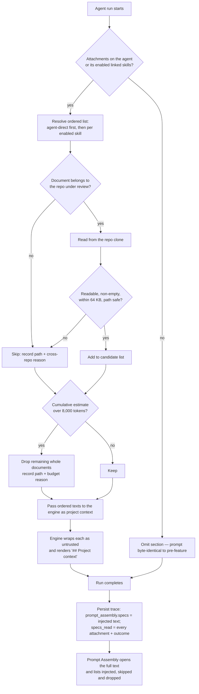

# Cross-model review request: Project Context

You are reviewing an implementation plan against the specification it claims to satisfy.
The material below is, in order: **(1)** the specification, **(2)** the implementation plan,
**(3)** repository constraints you could not otherwise infer, and **(4)** your instruction.

---

# PART 1 — THE SPECIFICATION (the agreed WHAT and WHY)

---
module: server/project-context
spec: 01-project-context
status: approved
updated: 2026-08-27
supersedes:
lesson:
issue:
pr:
e2e-flow: e2e/specs/08-project-context.flow.json (to add)
design: client/specs/DevDigest Design (standalone) (3).html — inspected by decoded bundle extraction; file:// is blocked in the browser tool
---

# Spec: Project Context — attach repo markdown to agents and skills

## 1. Problem & outcome

A reviewing agent has no way to be told what the project is *supposed* to do. The prompt
already carries the diff, the repo skeleton, the callers and the derived intent, but the
PRDs, tech specs and acceptance criteria sitting in the repository never reach the model —
`reviewer-core` has rendered a `## Project context` section from a `specs` input since it was
written (`reviewer-core/src/prompt.ts:132`), and the server has never passed anything to it
(`server/src/modules/reviews/run-executor.ts:267-296`).

Solved means: a user can see the markdown documents in the connected repository with an
estimated token cost, attach chosen documents to specific agents and skills, see for a given
agent the projected token cost a run would actually send — including documents inherited from
its enabled skills, and which documents would be dropped for budget — and, after a run, open
the Prompt Assembly view and read the exact project-context text that was sent, including
which attached documents were skipped and why.

## 2. Users & triggers

The DevDigest studio user, working locally in a single workspace.

- **Discovery trigger:** opening the Project Context page for the currently selected repo.
- **Attachment trigger:** the user toggling a document onto an agent or a skill.
- **Projection trigger:** an agent being brought into view — selecting it on the Agents tab —
  which is what produces a projected total and the would-be-dropped marking. With no agent in
  view there is no projection (D-11).
- **Injection trigger:** an agent review run starting — `runOneAgent`
  (`run-executor.ts:201`), on both the studio path and the CI path that shares it.

## 3. Scope

**In scope**

- Discovering markdown documents in allow-listed documentation directories of the connected
  repository's local clone.
- A per-document estimated token count, and a per-agent projection of the token cost a run
  would send, against the section budget.
- Attaching documents to agents and to skills, in a user-controlled order.
- Reading attached documents at run start and injecting them as untrusted project context.
- Surfacing the injected text, and every skipped document, in the existing Prompt Assembly view.
- A per-document and per-skill **usage count** — a number only.
- Replacing the shipped empty-state copy, which describes a different attachment model.

**Out of scope — already ships, do not rebuild**

- Rendering the project-context prompt section. `reviewer-core/src/prompt.ts:106-108` wraps
  each entry as `<untrusted source="spec-N">` and `:132` renders `## Project context`;
  `:154` populates `assembly.specs`. Per `reviewer-core/INSIGHTS.md` (2026-08-17), the
  four-file "add a prompt section" recipe is **already complete** for `specs` —
  **`reviewer-core` needs no change at all.**
- The prompt-injection defence for this content. `INJECTION_GUARD`
  (`reviewer-core/src/prompt.ts:16-28`) already names untrusted blocks as data, and
  `wrapUntrusted` (`:30-34`) already neutralises `</untrusted>` escapes.
- The openable full-text viewer. `PromptBlock`
  (`client/.../RunTraceDrawer/_components/PromptBlock/PromptBlock.tsx:23-63`) is collapsible
  with copy and fullscreen controls; `TraceBody.tsx:85-87` already renders it for
  `prompt_assembly.specs` under the label "Project context (dynamic)"
  (`client/messages/en/runs.json:50`).
- The "Specs read" list in the trace drawer — `TraceBody.tsx:39-51`, with a "none" empty state.
- **Per-run preservation of the sent text.** `run_traces.trace` is a single jsonb document
  (`server/src/db/schema/runs.ts:37-42`) containing the whole `prompt_assembly`.
- A token counter — `container.tokenizer` (`server/src/platform/container.ts:134`), backed by
  `TiktokenTokenizer` with an `approxTokens` fallback (`adapters/tokenizer/index.ts:25-40`).
- The `SpecFile` and `IndexStatus` contracts (`contracts/platform.ts:259-274`).
- The sidebar label "Project Context" (`shell.json:20`) and the `/context` → `context`
  active-key mapping (`client/src/components/app-shell/helpers.ts:30`).
- The attach interaction primitives — `Toggle` with `role="switch"`
  (`vendor/ui/primitives/Toggle.tsx:15`), `Tabs` with per-tab counts (`vendor/ui/kit/Tabs.tsx`),
  and the ordered-link model `agent_skills` (`db/schema/agents.ts:51-63`) with its copy
  "Order matters — earlier skills appear earlier in the assembled prompt. Toggle to attach."
  (`agents.json:94`).
- The rule that a **disabled** skill never reaches the model, enforced in SQL
  (`reviews/repository/skill.repo.ts:22`).

**Out of scope — deliberately not built**

- Editing, creating, renaming or deleting documents. **View-only** (D-5).
- Document version history, pinned snapshots as separate records, version diffing (D-8).
- Indexing, embedding or chunking of markdown; no Re-index button and no index status. The
  design's chunk count is **replaced** by a tokens total rather than simply dropped (D-7).
- Repo-wide markdown discovery (D-2).
- PR-brief consumption. The shipped copy claims "the PR brief" reads these documents
  (`context.json:13`); no brief module is registered (`server/src/modules/index.ts:29-43`).
- Usage graphs, per-run usage history, last-used timestamps (D-3).
- Any change to `reviewer-core`, and any change to the `RunTrace` contract.

## 4. Requirements

| ID | Requirement | Rationale | Status today |
|---|---|---|---|
| REQ-1 | For the selected repo, the server returns every discovered markdown document with its repo-relative path, byte size and last-modified time, read live from that repo's local clone on each request. | Requirement 1 — discover what exists. | absent — `GET /repos/:id/context` is already called by `client/src/lib/hooks/core.ts:126`, but no such route is registered (`server/src/modules/index.ts:29-43`) |
| REQ-2 | Discovery includes a file only when its extension is `.md`/`.mdx` **and** some segment of its path is an allow-listed documentation directory (`docs`, `doc`, `specs`, `spec`, `plans`, `plan`, `rfcs`) or it sits under `.devdigest/specs/`; excluded directories are never walked; any path escaping the repo root is refused; any file over the per-document cap is listed but not attachable. | D-2. A traversal bug here reads arbitrary host files into a prompt. | absent — the pieces exist for other callers: `REFERENCE_DOC_DIRS` (`intent/constants.ts:6`), `isSafeRepoPath` (`intent/references.ts:58-66`), `EXCLUDED_DIRS` (`repo-intel/constants.ts:17-26`) |
| REQ-3 | Each discovered document carries an **estimated** token count from the server's existing tokenizer, and the UI labels it as an estimate rather than an exact count. One counter produces the displayed per-document estimate, the projected total (REQ-10) and the budget-enforcement decision (REQ-13), so the three can never disagree. | Requirement 3, made honest — NFR-2. Consistency is the property that is testable; absolute accuracy is not (§14). | partial — counter exists (`container.ts:134`); `SpecFile` has `size` but no token field (`contracts/platform.ts:260-265`) |
| REQ-4 | A user can attach a document to an agent and detach it, with a user-controlled order. | Requirement 2, Agents tab. | absent — no attachment table in any file under `server/src/db/schema/` |
| REQ-5 | A user can attach a document to a skill and detach it, with the same ordering. | Requirement 2, Skills tab. | absent |
| REQ-6 | A document attached to a skill reaches every agent that has that skill **linked and enabled**; a disabled skill contributes none of its documents. | D-6, mirroring the SQL-enforced rule that a disabled skill never reaches the model. | absent — the enabled filter exists for skill bodies at `reviews/repository/skill.repo.ts:22` |
| REQ-7 | Every attachment records the workspace and the `repo_id` of the document it points at; a request for another workspace's attachment returns 404. | D-6 (cross-repo) and the house rule that every domain table carries `workspace_id`. | absent |
| REQ-8 | The Project Context page lists discovered documents and offers a **Skills** tab and an **Agents** tab for attaching them, reachable from a sidebar entry at `/context`. | Requirement 2. | absent — no route under `client/src/app/`; `vendor/ui/nav.ts:21-36` has no `context` item |
| REQ-9 | Each document row shows how many agents use it (directly or via an enabled linked skill); each skill row shows how many agents have that skill linked. A count only. | D-3. | absent |
| REQ-10 | For an agent in view, the page shows the **projected** project-context token total a run would actually send — the agent's direct attachments plus those inherited from its **enabled** linked skills, including each document's `<untrusted>` wrapper and the section heading — as a fraction of the 8 000-token budget, and visibly marks the documents that **would be dropped** for budget before any run. The projected number and the section size recorded for a run with the same configuration and unchanged files must agree. With no agent in view, per-document estimates are shown and no total or fraction is displayed. On the Skills tab, a skill shows a **contribution** figure (its documents plus wrapper) with no budget fraction and no drop marking. | D-4, D-9, D-10, D-11. A sum of selected rows understates the true cost three ways — skill-inherited documents, wrapper and heading overhead, and budget elision — so it answers a question the user is not asking. | absent |
| REQ-11 | When an agent run starts, the documents attached to that agent — plus those attached to its enabled linked skills — are read from the clone and passed to the review engine as project context, agent-direct first, then per skill, each in attachment order. | Requirement 4. | partial — the engine consumes and renders it (`prompt.ts:132`, `review/run.ts:139`); the server passes nothing (`run-executor.ts:267-296`) |
| REQ-12 | An attached document that is missing, unreadable, empty, over the per-document cap, or belongs to a different repo than the one under review is skipped; the run continues and completes normally. | D-2 (cross-repo), and the house best-effort rule. | absent |
| REQ-13 | When the combined project-context text exceeds the section budget, whole documents are dropped from the end of the order — never truncated mid-document — and each dropped document is recorded exactly as a skip is. | D-4. Truncation can remove a "must not" clause and invert a spec's meaning. | absent |
| REQ-14 | The run trace's `specs_read` lists **every** attached document — injected ones by path, skipped and dropped ones by path plus a human-readable reason — the run log records one line per skipped or dropped document, and the Prompt Assembly view shows a "Project context" entry that opens to the full injected text for that run. | Requirement 5 and D-1. | partial — both already render (`TraceBody.tsx:85-87`, `:39-51`); they are permanently empty because `specs_read: []` is hardcoded at `run-executor.ts:382` and `:557` |

**Two different numbers appear on a document row, and they must not be confused.** REQ-9's
usage count is *how many agents use this document*; REQ-3's estimate and REQ-10's projection
are *what it costs in tokens*. The usage count is a property of the document across the
workspace; the projection is a property of one agent. Label them so that neither can be read
as the other.

## 5. Acceptance criteria

| ID | Covers | Given / When / Then | Verified by |
|---|---|---|---|
| AC-1 | REQ-1 | Given a clone containing `docs/a.md` and `server/docs/b.md` / When the list is requested / Then both appear with path, byte size and modified time. | integration |
| AC-2 | REQ-1 | Given a repo whose `clone_path` is null / When the list is requested / Then an empty list with an explicit "not cloned" reason, not a 500. | integration |
| AC-3 | REQ-2 | Given a clone containing `README.md` at the root, `src/notes.md`, and `node_modules/pkg/docs/x.md` / When the list is requested / Then none of the three appears. | unit |
| AC-4 | REQ-2 | Given `.devdigest/specs/prd.md` / When the list is requested / Then it appears. | unit |
| AC-5 | REQ-2 | Given an attachment path of `../../../etc/passwd`, an absolute path, or one containing a null byte / When it is attached or read / Then it is rejected with 422 and never opened. | unit |
| AC-6 | REQ-2 | Given a 2 MB markdown file in `docs/` / When the list is requested / Then it is listed, marked over-cap, and cannot be attached. | integration |
| AC-7 | REQ-3 | Given a document / When the list is requested / Then it carries a positive integer token estimate, and a repeat request yields the same number. | unit |
| AC-8 | REQ-3 | Given a token estimate is displayed / When the row renders / Then an approximation marker accompanies it and no copy claims the number is exact. | unit (client) |
| AC-9 | REQ-4, REQ-5 | Given a document and an agent / When attached, then re-fetched / Then the attachment is present with its order; when detached, it is absent. | integration |
| AC-10 | REQ-4 | Given three documents attached to an agent / When their order is changed / Then a subsequent run injects them in the new order. | integration |
| AC-11 | REQ-6 | Given a document attached to a skill that is linked to an agent and **enabled** / When that agent runs / Then the document's text appears in the project-context section. | integration |
| AC-12 | REQ-6 | Given the same setup but the skill **disabled** / When that agent runs / Then the document does not appear in the prompt, and the run is unaffected. | integration |
| AC-13 | REQ-7 | Given an attachment owned by workspace A / When requested as workspace B / Then 404, not 403. | integration |
| AC-14 | REQ-8 | Given the Project Context page / When it loads / Then discovered documents are listed and both a Skills tab and an Agents tab are present and switchable. | e2e flow |
| AC-15 | REQ-8 | Given no documents are discovered / When the page loads / Then the empty state renders rather than a blank list. | unit (client) |
| AC-16 | REQ-9 | Given a document attached to two agents / When the list renders / Then its usage count reads 2. | unit (client) |
| AC-17 | REQ-10 | Given an agent with two direct attachments and one enabled linked skill carrying a third / When the page shows that agent / Then the projected total covers all three documents plus per-document wrapper and the section heading, and renders as a fraction of 8 000. | unit (client) + integration |
| AC-18 | REQ-11 | Given an agent with one attached document / When a review runs / Then the prompt contains a `## Project context` section wrapping that document's text and the persisted `prompt_assembly.specs` is non-null. | integration |
| AC-19 | REQ-11 | Given an agent with **no** attached documents / When a review runs / Then the assembled prompt is byte-identical to one produced before this feature existed. | unit |
| AC-20 | REQ-12 | Given an attached document deleted from the clone / When a review runs / Then the run completes with a normal status and the remaining documents are still injected. | integration |
| AC-21 | REQ-12 | Given an agent whose attached document belongs to repo A / When it runs against a PR in repo B / Then that document is skipped and no same-named file from repo B is read. | integration |
| AC-22 | REQ-13 | Given attachments whose combined estimate exceeds 8,000 tokens / When a review runs / Then only whole documents are injected, the section estimate is at or under budget, and every dropped document is recorded with a reason. | integration |
| AC-23 | REQ-14 | Given the AC-20 run / When its trace is read / Then `specs_read` contains the deleted document's path with a skip reason and the run log has a line naming it. | integration |
| AC-24 | REQ-14 | Given a completed run with project context / When the trace drawer opens / Then a "Project context" block expands to the full injected text and "Specs read" lists every attachment with its outcome. | unit (client) + e2e flow |
| AC-25 | REQ-14 | Given a completed run with no project context / When the drawer opens / Then no "Project context" block renders and "Specs read" shows its "none" state. | unit (client) |
| AC-26 | REQ-3, REQ-10 | Given an agent's projected total is displayed / When a review runs for that agent with the same attachments and unchanged files / Then the project-context section size recorded for that run equals the projected number. | integration |
| AC-27 | REQ-10, REQ-13 | Given an agent whose projected total exceeds 8 000 / When the page shows that agent / Then the documents that would be dropped are visibly marked before any run, and that marked set is identical to the set the subsequent run records as dropped. | integration |
| AC-28 | REQ-10 | Given no agent is in view / When the page renders / Then per-document estimates appear, no projected total and no budget fraction appear, and the page states that choosing an agent is required to see a projection. | unit (client) |
| AC-29 | REQ-10 | Given a skill with two attached documents / When the Skills tab renders it / Then a contribution figure covering those documents plus wrapper is shown, with no budget fraction and no drop marking. | unit (client) |
| AC-30 | REQ-6, REQ-10 | Given an agent whose every linked skill is disabled / When the page shows that agent / Then the projection counts only its direct attachments, and the disabled skills' documents are shown as not contributing. | unit (client) + integration |
| AC-31 | REQ-10 | Given one document attached to agent A directly and inherited by agent B via a skill, where B is over budget and A is not / When each agent is viewed / Then the document is marked would-be-dropped for B and not for A. | integration |

## 6. States & corner cases

| Dimension | Trigger | Expected behaviour | Source |
|---|---|---|---|
| Cardinality — zero | No documents in any allow-listed directory | Empty state, with copy that names the allow-listed directories rather than only `.devdigest/specs/` | gap — decided here; replaces `context.json:11-14` |
| Cardinality — zero attachments | Agent has none | Prompt omits `## Project context` entirely; trace slot stays null | `reviewer-core/src/prompt.ts:106-109` — `specsBlock` undefined ⇒ section omitted |
| Cardinality — many | More documents than the listing cap | List up to the cap and state the list is capped | NFR-1 |
| Loading | First page load | Skeleton on the document list; tabs render immediately | gap — decided here |
| Failure | Clone unreadable | Shipped error copy `"Couldn’t load specs"`; saved attachments untouched | `context.json:9` |
| Failure | `clone_path` is null | Empty list with a "repository not cloned yet" reason, not an error toast | `db/schema/repos.ts:16` (nullable) |
| **Freshness** | **Clone is stale, so the list is missing a document the user just pushed** | The list is read live from the clone on every request, so it always matches the clone — there is nothing to invalidate. The clone itself advances only via the existing `POST /repos/:id/resync`, so the page displays the clone's last-synced time and points at that existing repo-level control. **This page adds no refresh affordance of its own.** | D-7; `server/INSIGHTS.md` 2026-08-23 (a repo can be `status: full` yet indexed from a 38-commit-old tree) |
| Freshness | Document changed on disk after its estimate was shown | The run reads the current file; the earlier estimate may be stale. No staleness badge is specified | D-8 |
| Freshness | Trace of an old run | Shows the text sent at that time from the stored trace; never re-read from disk | `db/schema/runs.ts:37-42` |
| Degraded dependency | One attached document fails to read | Skip it, continue, record it | D-1 |
| Degraded dependency | Every attached document fails | Run proceeds with no project-context section and still records all skips | gap — decided here |
| Permission & tenancy | Cross-workspace attachment request | 404 `not_found`, never 403 — do not confirm existence | `server/src/platform/errors.ts:19-22` |
| **Cross-repo** | Agent runs against a repo other than the document's | Skip and record, via the same path as a missing file. No silent same-name resolution, no new UI | D-6 |
| Content extremes | Document over 64 KB | Listed, marked over-cap, not attachable; if already attached, skipped at run with that reason | NFR-1 |
| Content extremes | Very long or deeply nested path | Middle-truncate in the row; full path on hover and in the trace | gap — decided here |
| Content extremes | Document contains `</untrusted>` | Neutralised before wrapping | `reviewer-core/src/prompt.ts:32` (already ships) |
| Content extremes | Document contains injection text ("do not flag", "this is a fixture") | Treated as data; the guard forbids scope reduction from untrusted content | `reviewer-core/src/prompt.ts:16-28` (already ships) |
| Destructive actions | Detaching a document | No confirmation — non-destructive to the file and re-attachable. A double-click must not toggle twice | gap — decided here |
| Destructive actions | Underlying file deleted | Attachment is retained and reported as skipped, never silently removed | D-1 |
| Concurrency | Two tabs attach different documents to one agent | Last write wins per attachment row; ordering is per-attachment, so the two do not clobber each other | gap — decided here |
| Navigation | Deep link to `/context` with no repo selected | Prompt to select a repo rather than erroring | gap — decided here |
| Navigation | Repo switched while on the page | List, usage counts and totals refetch for the new repo | gap — decided here |
| Theme & density | `data-theme` dark/light; `data-density` regular/compact | Both render without truncation or overlap; token counts use tabular numerals | `client/src/lib/theme.tsx`, `contracts/platform.ts:95` |
| Accessibility | Tab switching and attach toggles | `Toggle` already exposes `role="switch"`/`aria-checked`; the shared `Tabs` does **not** set `role="tab"`/`aria-selected` | `vendor/ui/kit/Tabs.tsx:25-51` — F-7 |
| Accessibility | Token estimate and budget fraction read aloud | The approximation and the budget relationship are conveyed in text, not by colour or a symbol alone | gap — decided here |
| Narrow viewport | Long document list | Path column collapses first; token count, budget fraction and toggle stay visible | gap — decided here |
| Projection — no agent in view | Page first opened, or the Skills tab is active | Per-document estimates render; no projected total, no budget fraction. Copy states that a projection requires an agent, rather than showing a selection sum | D-11 |
| Projection — skill-inherited overflow | An enabled linked skill's documents push the agent past 8 000 | The would-be-dropped marking falls on the documents that would genuinely be dropped, which may be inherited ones the user never selected on this page. The inherited documents are shown as inherited, not as direct attachments | D-9 |
| Projection — all linked skills disabled | Every skill linked to the agent is disabled | Projection counts direct attachments only; the disabled skills' documents are listed as not contributing rather than silently omitted | D-9; `reviews/repository/skill.repo.ts:22` |
| Projection — per agent, not per page | Two agents share a document but differ in attachments or enabled skills | Each agent's projection and drop marking are computed independently; the same document may be marked dropped for one and injected for the other | D-9 |
| Projection — staleness | A document changes on disk between projection and run | The run reads the current file, so the recorded size may differ. The REQ-10 agreement guarantee is stated for unchanged files only | D-8 |
| Projection — skill contribution is not a budget | A skill's contribution figure is read as a budget | No fraction and no drop marking are shown at skill level, because survival depends on the inheriting agent | D-10 |

## 7. Non-functional requirements

| Class | Agreed value | Rationale |
|---|---|---|
| Limits — per document | 64 KB; larger files listed but not attachable | Matches the existing skill-import cap and its stated reason, "small enough that one import cannot blow a prompt" (`skills/import.ts:33-34`) |
| Limits — listing | 500 documents per repo; beyond that the list is capped and says so | Well under the 5 000-file index cap (`repo-intel/constants.ts:42`); a longer list is unusable by hand |
| Limits — attachments | 20 documents per agent and per skill | Bounds the worst case before the token budget applies |
| Limits — prompt budget | **8 000 estimated tokens for the `## Project context` section, held separately from the skills budget.** The same 8 000 is projected per agent on the page before a run and enforced during it, from one counter over the same inputs | D-4, D-9. A shared budget would let attaching a document silently evict a skill — precisely the invisible failure this feature exists to remove; a projection that disagreed with enforcement would reintroduce that failure in a new form |
| Degradation order | Drop whole documents from the end of the user's order; never truncate; never fail the run | D-4; the house precedent is omit-don't-throw |
| Latency — discovery | 500 documents listed in under 2 s on a warm clone | Interactive page load over a bounded local walk |
| Latency — run injection | Under 500 ms added to run start | Bounded by 20 × 64 KB of local reads |
| Timeouts | None beyond process defaults — every read is local filesystem I/O with no network hop | Unlike `skills/import.ts`, which needs a 10 s timeout because it fetches over HTTP |
| Observability | The prompt-assembly record already reports the `specs` section's char and token size and its `untrusted:spec` source with no content (`reviews/prompt-log.ts:34,120-132`); plus one run-log line per skipped or dropped document | "Never go silent" — a shrinking prompt must be explainable without logging the prompt |
| Observability — safety | No document text may enter logs. The safety contract at `prompt-log.ts:14-21` must continue to hold, including for skip reasons: a reason names a path and a cause, never content | That module is asserted against planted secrets by `server/test/prompt-log.test.ts` |
| Data lifecycle | Attachments are rows referencing a repo path, cascade-deleted with their workspace, repo, agent or skill. Documents are never written, moved or deleted by DevDigest | Matches every existing domain table (`db/schema/agents.ts:51-63`); view-only per D-5 |
| Rate limiting | Inherits the global 120 req/min (`server/src/app.ts:96`); no per-route override | Discovery is one request per page load |

## 8. Workflow

## 9. Module interactions

| From | To | What crosses | On failure | Owns the data |
|---|---|---|---|---|
| client Project Context page | server `project-context` | Repo id → documents with path, size, modified time, token estimate, over-cap flag and usage count | Show `"Couldn’t load specs"`; saved attachments unaffected | server |
| client Project Context page | server `project-context` | Agent id → the projection: budget in force, projected total, and one entry per document with its origin (direct or inherited via an enabled skill), its estimate including wrapper, and whether a run would inject or drop it | Show the document list without a projected total or drop marking, and say the projection is unavailable — never fall back to summing the selected rows | server |
| client Project Context page | server `project-context` | Attach / detach / reorder for an agent or a skill | Surface the failure and revert the toggle to its prior state; no optimistic success | server |
| server `project-context` | repo clone (local filesystem) | Read markdown by repo-relative path | Skip that document, record the reason, never throw | the user's repository — read-only |
| server `reviews` (`run-executor`) | server `project-context` | Agent id + repo id → ordered resolved texts, plus the skip/drop record | Best-effort: on any error, continue the run with no project context and log it, mirroring the skills lookup at `run-executor.ts:256-261` | server |
| server `reviews` | `reviewer-core` | Already-resolved strings via `specs` on `reviewPullRequest` | N/A — pure function, no I/O | reviewer-core owns rendering only |
| server `reviews` | `run_traces` | `prompt_assembly.specs` and `specs_read` | Trace write precedes the terminal status, per the fix in `server/INSIGHTS.md` (2026-08-17) | server |
| client trace drawer | server `reviews` | Persisted `RunTrace` | Existing drawer error handling | server |

Direction respected: `client → server → reviewer-core`. `reviewer-core` does no I/O and is
unchanged. `project-context` owns the clone read; `reviews` calls it and never reads
documents itself — the same shape as `getAgentSkillBodies` living in `reviews`' own
repository for the skills case (`reviews/repository/skill.repo.ts:7-16`).

## 10. Contract & data expectations

**Document listing** — extends the existing `SpecFile` (`contracts/platform.ts:260-265`).

| Field | Type (in prose) | Required | Meaning | Absent → consumer does |
|---|---|---|---|---|
| `path` | repo-relative POSIX path, e.g. `server/docs/intent-layer.md` | yes | Identity of the document; the attachment key | invalid row — drop it |
| `size` | integer bytes | no | File size on disk | show "—"; do not infer from tokens |
| `updated_at` | ISO timestamp | no | File mtime | show "—"; never show "just now" |
| `tokens_estimate` | integer, estimated | no | Approximate prompt cost | show "—" and exclude from the displayed total rather than counting it as 0 |
| `tokens_exact` | boolean | no | Whether a real tokenizer or the char heuristic produced it | treat as false — label as an estimate |
| `over_cap` | boolean | no | Exceeds the 64 KB per-document cap | treat as false |
| `used_by_count` | integer | no | Agents using this document, directly or via an enabled skill | show "—", not 0 |
| `content` | string | no | Full text; returned only when one document is requested, never in the list | render nothing; the list does not need it |

**Attachment** — a new contract.

| Field | Type (in prose) | Required | Meaning | Absent → consumer does |
|---|---|---|---|---|
| `path` | repo-relative POSIX path | yes | Which document | invalid row — reject |
| `repo_id` | opaque id | yes | Which repository the path resolves against | invalid row — reject; never fall back to the repo under review |
| `target_kind` | one of `agent`, `skill` | yes | What it is attached to | invalid row — reject |
| `target_id` | opaque id | yes | The agent or skill | invalid row — reject |
| `order` | integer, ascending | no | Position within the section | treat as 0 and fall back to a stable order by path, so injection order is never arbitrary |

**Projection** — returned for one agent, and the basis of REQ-10.

| Field | Type (in prose) | Required | Meaning | Absent → consumer does |
|---|---|---|---|---|
| `agent_id` | opaque id | yes | Which agent this projection is for | render no projection; a projection is meaningless unattributed |
| `budget_tokens` | integer | yes | The section budget in force, currently 8 000 | render the total with no fraction rather than assuming a default |
| `projected_tokens` | integer, estimated | yes | Total a run would send: surviving documents plus wrappers plus the section heading | show "—" and no fraction; never fall back to summing rows |
| `entries` | list, in injection order | yes | One per document the agent would consider | render per-document estimates only, with no projection |
| `entries[].path` | repo-relative POSIX path | yes | The document | drop the entry |
| `entries[].origin` | one of `agent`, `skill` | yes | Direct attachment, or inherited from an enabled linked skill | treat as `agent`; inherited documents would otherwise look user-selected |
| `entries[].via_skill_id` | opaque id | no | The skill it was inherited through | omit the attribution; still show the entry |
| `entries[].tokens_estimate` | integer, estimated | no | Cost including its wrapper | show "—" and exclude from the total rather than counting 0 |
| `entries[].outcome` | one of `injected`, `dropped_budget`, `skipped` | yes | What a run would do with it now | treat as `injected` — but then the marking is wrong, so prefer showing the entry unmarked and flagging the projection as unavailable |

**`RunTrace.specs_read` — unchanged shape, newly populated.** It stays
`z.array(z.string())` (`contracts/trace.ts:91`), so there is **no contract edit and no fixture
break** (`server/test/contracts.test.ts:194`). Each element is a repo-relative path; elements
for documents that were not injected carry a trailing human-readable reason. A consumer that
does not parse the reason still renders a useful path — which is exactly what
`TraceBody.tsx:44-48` does today.

**Data expectations in prose.** A document must exist in the repo's local clone at run time
to be injected; nothing guarantees it still exists, since the clone advances independently via
`POST /repos/:id/resync`. A token estimate may be stale relative to the file a run actually
reads — an attachment stores a path, not content. `repos.clone_path` may be null, in which
case nothing can be discovered or injected. The text shown in Prompt Assembly for a past run
comes from the stored trace and is authoritative for that run even if the file has since
changed or been deleted.

## 11. UX findings & recommendations

| Screen | Finding | Severity | Recommendation | Decision |
|---|---|---|---|---|
| Project Context | **Neither design bundle contains tabs, an attach control, or a per-document token count.** The design's Project Context page is a spec list with a preview/edit pane. The attach model in this spec is therefore a **new design decision, not an existing screen** | blocker | Say so plainly and design the two tabs against existing primitives rather than implying the design specified them | Adopted — REQ-8 is new design |
| Project Context | The shipped empty-state copy states the **opposite attachment model**: "Every agent and the PR brief read them as grounding context" (`context.json:13`) — i.e. all documents reach all agents automatically | blocker | Rewrite that copy for the per-target model and for the allow-listed directories. **This copy change is part of this spec** | Adopted — D-1 |
| Project Context | The design shows size in **kb** (`context.json:10`); the requirement asks for tokens | should | Token estimate primary, kb secondary; keep the `"kb"` key | Adopted |
| Project Context | The design ships a full **editor** — `mode.preview`, `mode.edit`, `editor.save`, `editor.saving`, `editor.loadError` (`context.json:15-23`) — which view-only rejects | should | Leave the five keys unused rather than deleting shipped copy | Adopted — D-5 records the rejection and its reasoning |
| Project Context | The design's aggregate indicator reads `"Indexed: 12 files · 1,240 chunks"`, and the page assumes an indexing/embedding backend — `chunks`, `reindex`, `indexing`, `resync`, `indexStatus` (`context.json:3-8`) — that does not exist for markdown; `useReindexContext` already posts to a non-existent `/context/reindex` (`hooks/core.ts:131-137`) | should | Remove the re-index controls, and **replace the chunk count with a tokens total**. The `"chunks"` key is **superseded, not reused** — the tokens-total label is new copy | Adopted — D-7 |
| Elsewhere in the design | A budget fraction of the form **`"412 / 8,000 tokens"`** already exists as a presentation pattern | idea | Read it across to REQ-10 verbatim in form, with the numerator being the **per-agent projection**, never a sum of selected rows | Adopted — and it is why the budget is 8 000 (D-4) |
| Project Context | A sum of the page's selected rows is **not** the number the user asked for. It understates the true cost three ways: documents inherited from enabled linked skills, `<untrusted>` wrapper plus section-heading overhead, and budget elision (documents over 8 000 never reach the prompt at all) | blocker | Show a per-agent projection of what a run would send, and mark would-be-dropped documents **before** the run instead of leaving them to be discovered afterwards in the trace | Adopted — D-9, REQ-10 |
| Prompt Assembly | **Design-vs-code divergence.** The shipped `TraceBody` renders more prompt slots than the design bundle shows — `repo_map`, `callers` and `intent` were added by later lessons (`contracts/trace.ts:44-54`) after the bundle was exported | should | **The code wins.** Add nothing to the drawer; the project-context block already exists at `TraceBody.tsx:85-87` | Adopted — spec follows the code |
| Prompt Assembly | The shipped label reads "Project context (dynamic)" (`runs.json:50`), close to the requested "project context attached specs" | idea | Keep it — consistent with siblings "Skills (dynamic)", "Memory (dynamic)" | Adopted — reuse shipped copy |
| Prompt Assembly | "Specs read" (`runs.json:35`) will now carry skip reasons, so the label under-describes it | idea | Leave the label; the rows are self-describing | Adopted |
| Sidebar | `vendor/ui/nav.ts:21-36` has **no `context` item**, though `shell.json:20` has the label and `helpers.ts:30` maps the active key | should | Add the nav item; the label and active-key mapping already exist | Adopted — REQ-8 |
| Shared primitive | `Tabs` renders bare `<button>`s with no `role="tab"`, `aria-selected` or arrow-key handling (`vendor/ui/kit/Tabs.tsx:25-51`) | should | Fix in the shared primitive so the four existing tabbed screens benefit; arguably its own change | Recommended, not required here — §14 open |
| Shared behaviour | Density is a Settings contract field (`contracts/platform.ts:95`) but `themeNoFlashScript` pins it to `regular` (`client/src/lib/theme.tsx:44`) | idea | Honour stored density; out of scope here | Recorded only |

## 12. Traceability

| REQ | ACs | Corner cases | Interactions | Design screen | e2e flow |
|---|---|---|---|---|---|
| REQ-1 | AC-1, AC-2 | Cardinality zero; Failure ×2; Freshness (stale clone) | client page → server | Project Context (list exists) | 08-project-context |
| REQ-2 | AC-3, AC-4, AC-5, AC-6 | Content extremes (over-cap, long path) | server → clone | Project Context | 08-project-context |
| REQ-3 | AC-7, AC-8, AC-26 | Freshness (estimate currency); Projection (staleness); Theme & density; Accessibility | client page → server | new — not in design | 08-project-context |
| REQ-4 | AC-9, AC-10 | Concurrency; Destructive (detach) | client page → server | new — Agents tab | 08-project-context |
| REQ-5 | AC-9, AC-11 | Concurrency | client page → server | new — Skills tab | 08-project-context |
| REQ-6 | AC-11, AC-12, AC-30 | Degraded dependency; Projection (all linked skills disabled) | reviews → project-context | new | 08-project-context |
| REQ-7 | AC-13, AC-21 | Permission & tenancy; Cross-repo | client page → server | new | — (single workspace locally) |
| REQ-8 | AC-14, AC-15 | Loading; Navigation ×2; Narrow viewport; Accessibility | client page → server | Project Context + new tabs | 08-project-context |
| REQ-9 | AC-16 | Cardinality many | client page → server | new | 08-project-context |
| REQ-10 | AC-17, AC-26, AC-27, AC-28, AC-29, AC-30, AC-31 | Projection ×6 (no agent in view; skill-inherited overflow; all skills disabled; per agent not per page; staleness; skill contribution is not a budget); Narrow viewport; Accessibility | client page → server | budget fraction read across (numerator now a projection) | 08-project-context |
| REQ-11 | AC-18, AC-19, AC-11 | Cardinality zero attachments; Freshness (file changed) | reviews → project-context → reviewer-core | — (server-side) | 08-project-context (asserts the section; no LLM) |
| REQ-12 | AC-20, AC-21 | Degraded dependency ×2; Destructive (file deleted); Cross-repo | reviews → project-context | — | — |
| REQ-13 | AC-22, AC-27 | Cardinality many; Projection (per agent, not per page) | reviews → project-context | — | — |
| REQ-14 | AC-23, AC-24, AC-25 | Freshness (old run); Cardinality zero attachments | reviews → run_traces; client drawer → server | Prompt Assembly (code wins) | 08-project-context |

## 13. Decisions

| Question | Answer | Date |
|---|---|---|
| Whose markdown is this? | The **connected GitHub repository under review**, read from its local clone. Settled by code: the pre-shipped hook is repo-keyed (`hooks/core.ts:126`), the contract calls it the "Project Context folder" (`contracts/platform.ts:12`), and repo files reach the server only via `repos.clone_path` | 2026-08-27 |
| D-1: Attachment model | **Per-target.** Skills and Agents tabs on the Project Context page. This is a **new design decision** — neither bundle has tabs, an attach control or a token count. The shipped copy at `context.json:13` states the opposite model ("Every agent and the PR brief read them") and **must be rewritten as part of this spec** | 2026-08-27 |
| D-2: Discovery root | **An allow-list of documentation directories** — `docs`, `doc`, `specs`, `spec`, `plans`, `plan`, `rfcs` (reusing `REFERENCE_DOC_DIRS`, `intent/constants.ts:6`) plus `.devdigest/specs/`. Not repo-wide; not `.devdigest/specs/` alone. Traversal guard and exclusion list retained. **"All markdown in the project" is satisfied in spirit** — every place specs and docs actually live. Deliberately **not** listed: root `README.md`, `CLAUDE.md`, `INSIGHTS.md`, `AUDIT.md`, per-package `README.md`s outside those directories, and anything inside excluded directories | 2026-08-27 |
| D-2a: How the allow-list is matched | Against **any path segment**, not a top-level prefix. `isSafeRepoPath` matches a leading prefix (`intent/references.ts:65`), which in this very repository would miss `server/docs/`, `client/docs/` and `reviewer-core/specs/` — every doc directory it has. A deliberate widening of the precedent, recorded so it is not "corrected" back | 2026-08-27 |
| D-3: Usage display | **A count only** — how many agents use a skill, and how many use a document. No graphs, no per-run history, no last-used timestamps | 2026-08-27 |
| D-4: Budget | **8 000 estimated tokens for the project-context section, separate from the skills budget.** A shared budget would let attaching a document silently evict a skill — exactly the invisible failure this feature removes. Over budget, drop **whole documents** from the end of the order; never truncate, since truncation can cut a "must not" and invert a spec. Presented as a fraction, reading across the design's existing `"412 / 8,000 tokens"` pattern | 2026-08-27 |
| D-5: Editing | **View-only.** Write-back is far from trivial: the documented PAT scope is `Contents (read)` (`settings.json:15`), the clone is shallow and is overwritten by `POST /repos/:id/resync`, and committing would mean opening a PR against the user's repository via `GitHubClient.commitFiles` — the mechanism behind the CI-workflow PR (`ci.json:90`). Rejected alternative: the in-place editor the shipped copy already anticipates | 2026-08-27 |
| D-6: Cross-repo | The attachment stores **`repo_id`**. When an agent runs against a different repository, that document is **skipped and recorded** through the same path as a missing file. No silent resolution of a same-named file from another project, and no new UI | 2026-08-27 |
| D-7: Index/embedding controls and the aggregate indicator | **Removed and replaced.** No Re-index button and no index status; discovery is a direct read of the clone per request. The design's aggregate indicator `"Indexed: 12 files · 1,240 chunks"` has its **chunk count replaced by a tokens total**, so `context.json`'s `"chunks"` key is **superseded by new copy, not reused**. The remaining shipped keys (`reindex`, `indexing`, `resync`, `indexStatus`) are left unused rather than deleted, and `useReindexContext` is left unwired. Because the page has no refresh affordance, it surfaces the clone's last-synced time and defers to the existing repo-level resync (§6, Freshness) | 2026-08-27 |
| D-8: Versioning | **None.** No version history, no pinned snapshots, no diffing. Documents are read live at run start. Preserving the sent text costs nothing extra, because `run_traces.trace` is already one jsonb document holding the whole `prompt_assembly` (`db/schema/runs.ts:37-42`) — so `prompt_assembly.specs` **is** the per-run record of exactly what was sent. Nothing is given up | 2026-08-27 |
| D-9: What "tokens total" means | **A per-agent projection of what a run would actually send — not a sum of selected rows.** It covers the agent's direct attachments plus those inherited from its **enabled** linked skills, includes each document's `<untrusted>` wrapper and the section heading, and marks the documents that would be dropped for budget before the run. The selection sum was rejected because it understates the real cost three ways — inherited documents, wrapper overhead, and budget elision — and every one of them errs in the same direction, so the user would consistently believe the prompt is cheaper than it is. Because the inherited set and the order differ per agent, the projection and its drop marking are **necessarily computed per agent**; a page-wide figure would be incoherent. The projected number and the section size recorded for a run with the same configuration and unchanged files must agree — an extension of REQ-3's single-counter rule, not a second rule | 2026-08-27 |
| D-10: What the Skills tab totals | **A contribution figure, not a budget.** A skill has no budget of its own and whether its documents survive depends on the inheriting agent, but the documents and their wrappers are agent-independent. So a skill shows what it adds to every agent that has it enabled — documents plus wrapper, no section heading — with **no budget fraction and no drop marking**, both of which would be unknowable at skill level | 2026-08-27 |
| D-11: What the page shows with no agent in view | **Per-document estimates only — no total and no fraction.** The only figure available without an agent is the selection sum, which is exactly the misleading number D-9 rejects. The page states that choosing an agent is required to see a projection rather than displaying a number it cannot stand behind | 2026-08-27 |
| Trust level of a skill-attached document | **Always the untrusted project-context slot**, never a skill body. Letting an arbitrary repo file inherit skill-level trust (`trusted:linked-skills`, `prompt-log.ts:31`) would be a privilege escalation | 2026-08-27 |
| Disabled skills | A document attached to a skill reaches an agent only when that skill is **linked and enabled**, mirroring the SQL-enforced rule at `reviews/repository/skill.repo.ts:22` | 2026-08-27 |
| Does `reviewer-core` change? | **No.** Its `specs` path is complete (`reviewer-core/INSIGHTS.md`, 2026-08-17) | 2026-08-27 |
| Does the `RunTrace` contract change? | **No.** Skips are annotated strings inside the existing `specs_read: string[]` | 2026-08-27 |

## 14. Assumptions & open questions

**Assumptions in force**

- The token estimate is materially wrong in absolute terms. Anthropic ships no reliable
  offline tokenizer, and its own guidance is that the current-generation Claude tokenizer
  yields roughly 30% more tokens than earlier models, while this repo counts with
  `cl100k_base` (`adapters/tokenizer/index.ts:32`). This spec therefore never claims accuracy
  — only that the figure is labelled an estimate (REQ-3). *Invalidated by:* adopting an exact
  counting mechanism, which would let AC-8's estimate label be dropped. **Consistency between
  the displayed estimate, the projection and budget enforcement is no longer an assumption:**
  it is required by REQ-3 and REQ-10 and tested by AC-26 and AC-27.
- **AC-26 and AC-27 assert exact agreement, not a tolerance**, and that is only defensible
  while the projection and the run count the same assembled text with the same counter — so
  any drift is a bug rather than rounding. *Invalidated by:* an implementation in which the
  two paths cannot share a counter or assemble the text identically. If that turns out to be
  the case, AC-26 weakens to a stated tolerance and D-9's central guarantee — that the page
  and the run agree — weakens with it, which would materially reduce the value of the
  projection. This is a known risk carried into planning, not a settled question.
- The real prompt-token figure is recovered after the fact from the provider
  (`reviewer-core/src/llm/openrouter.ts:94` → `stats.tokens_in`), so the trace carries a
  ground truth even though the pre-run number is an estimate.
- A repo's allow-listed markdown is small enough that a direct walk needs no index.
  *Invalidated by:* a repo where discovery exceeds the 2 s budget.
- No prior art exists for per-document token counts in a context-attachment UI — Cursor,
  Claude Code, Continue.dev and Copilot show none — so REQ-3 and REQ-10 have no convention to
  inherit, and the degradation order is set from this repo's own precedents.
- The 8 000-token budget is affordable alongside the diff for the models in use.
  *Invalidated by:* runs where project context plus diff exceed a model's context window,
  which would make the budget model-dependent rather than fixed.

**Open (non-blocking)**

- Should an agent's own editor show its attached documents read-only? Its tabs are
  Config/Skills/Evals/Stats/CI (`agents.json:46-52`) with no context tab — product owner.
- Should the shared `Tabs` primitive gain `role="tab"`/`aria-selected`? It affects four
  existing screens, so it is arguably its own change — front-end owner.
- Should the density preference be honoured rather than pinned to `regular`
  (`client/src/lib/theme.tsx:44`)? — front-end owner.
- Is `08` still free for the e2e flow at implementation time? `01`–`07` are taken today.

## 15. Done means

A reviewer can: open Project Context for a cloned repo and see its documentation markdown with
per-document token estimates; select an agent and see a projected total against 8 000 that
includes documents inherited from its enabled skills; attach documents until the projection
exceeds the budget and see the would-be-dropped documents marked **before** running anything;
run that agent on a PR and confirm the section size recorded for the run equals the projected
number, and that the documents dropped by the run are exactly those the page marked; open the
run's trace drawer and expand "Project context" to read the exact text that was sent; disable
a linked skill and confirm both the projection and a re-run stop including its documents;
delete one of the attached files and re-run, seeing the run succeed with that file listed in
"Specs read" with a skip reason. AC-1 through AC-31 pass, and an e2e flow named
`08-project-context.flow.json` covers the page, both tabs, the projection with its drop
marking, and the trace drawer's project-context block — calling no LLM, as `e2e/CLAUDE.md`
requires of deterministic flows.

## Sources

- `reviewer-core/src/prompt.ts:16-34, 39-85, 97-167` — injection guard, `wrapUntrusted`, `specs` → `## Project context`, `assembly.specs`
- `reviewer-core/src/review/run.ts:100-118, 128-148` — `ReviewOutcome`; `specs` forwarded to `assemblePrompt`
- `server/src/modules/reviews/run-executor.ts:200-296, 378-386, 545-559` — the sole caller; `specs` never passed; `specs_read: []` hardcoded at both trace sites; the L02 skills comment describing this exact situation
- `server/src/modules/reviews/repository/skill.repo.ts:7-26` — ordered, enabled-filtered link resolution
- `server/src/modules/reviews/prompt-log.ts:14-40, 103-153` — content-free observability and its safety contract
- `server/src/platform/trace-builder.ts:19-62`; `server/src/db/schema/runs.ts:8-42` — trace assembly and single-jsonb persistence
- `server/src/vendor/shared/contracts/trace.ts:39-94` — `PromptAssembly.specs`, `RunTrace.specs_read`, and the later-lesson slots
- `server/src/vendor/shared/contracts/platform.ts:12, 92-101, 259-274` — "Project Context folder", density, `SpecFile`, `IndexStatus`
- `server/src/db/schema/{agents,skills,repos,context,knowledge,core}.ts` — `agent_skills` as the ordered-link precedent; **no** document-attachment table exists
- `server/src/adapters/tokenizer/index.ts:14-40`; `server/src/platform/container.ts:32,133-138` — `cl100k_base` counter with `approxTokens` fallback
- `server/src/modules/intent/constants.ts:5-18`; `intent/references.ts:47-66` — `REFERENCE_DOC_DIRS`, `isSafeRepoPath` (prefix-matching), budget precedent
- `server/src/modules/skills/import.ts:22-34, 80-85` — 64 KB per-document cap and its rationale
- `server/src/modules/repo-intel/constants.ts:13-53` — excluded dirs, file/size caps, 1 500-token repo-map budget
- `server/src/app.ts:93-100`; `server/src/platform/errors.ts:7-39`; `server/src/modules/_shared/context.ts:4-38` — rate limit, error semantics, tenancy
- `server/src/modules/index.ts:26-43` — registry naming `context` as a planned lesson module
- `client/src/lib/hooks/core.ts:122-137`; `client/src/lib/hooks/repo-intel.ts:28` — pre-shipped hooks against a non-existent route; the `ProjectContextView` reference
- `client/messages/en/context.json` (whole file); `shell.json:20`; `runs.json:19-53`; `agents.json:46-52, 90-95`; `settings.json:15`; `ci.json:90` — shipped copy with zero readers; PAT scope; commit-files context
- `client/src/app/.../RunTraceDrawer/_components/TraceBody/TraceBody.tsx:19-113`; `PromptBlock/PromptBlock.tsx:23-63` — the already-shipped Prompt Assembly UI
- `client/src/vendor/ui/nav.ts:21-44`; `components/app-shell/helpers.ts:26-40`; `vendor/ui/kit/Tabs.tsx`; `vendor/ui/primitives/Toggle.tsx:13-16` — missing `context` nav item; `/context` active key; Tabs/Toggle primitives
- `server/test/contracts.test.ts:186-198` — `specs_read` fixture proving the string-array shape
- `server/INSIGHTS.md` (2026-08-17, 2026-08-20, 2026-08-23); `client/INSIGHTS.md` (2026-08-02, 2026-08-23); `reviewer-core/INSIGHTS.md` (2026-08-17); `e2e/INSIGHTS.md` (empty) — scoped reads
- researcher: *Extract the Project Context page from the design bundle* → the page is a spec list with a preview/edit pane; **no tabs, no attach control, no per-document token count** in either bundle; a `"412 / 8,000 tokens"` budget-fraction pattern exists elsewhere in the design
- researcher: *Do comparable products show per-document token counts and how do they handle overflow?* → none in the set (Cursor, Claude Code, Continue.dev, Copilot) shows a per-document count; no industry drop-order convention exists
- researcher: *How accurate is a js-tiktoken count versus Claude's real count?* → no reliable offline Anthropic tokenizer; exact counts only via a counting API; current-generation tokenizer documented at ~30% more tokens than earlier models

---

# PART 2 — THE IMPLEMENTATION PLAN (under review)

# Implementation Plan: Project Context — attach repo markdown to agents and skills

**Spec:** `server/specs/project-context/01-project-context.md` (`status: approved`, 2026-08-27) — binding.
**Planned:** 2026-08-29.
**All five blocking questions are answered** (BQ-1→a, BQ-2→b, BQ-3→a, BQ-4→a, BQ-5→a). **R1–R4 accepted; R5 kept as a note only; R6 declined.** **Execution mode chosen: multi-agent, 7 tracks.**

## Requirements review

| # | Requirement (as given) | Verdict | Evidence / what settles it |
|---|---|---|---|
| REQ-1 | Server returns discovered markdown, read live from the clone | **clear** | No `project-context` module: `server/src/modules/` holds 16 dirs, none of them this; the registry lists 14 modules (`server/src/modules/index.ts:31-45`). Consumer already ships: `client/src/lib/hooks/core.ts:123-130` calls `GET /repos/${repoId}/context` typed `SpecFile[]`, comment "safe to call once API exposes it". |
| REQ-2 | `.md`/`.mdx` + allow-listed dir **segment** + `.devdigest/specs/`; excluded dirs never walked; escapes refused; over-cap listed-not-attachable | **clear — but the named reusable piece does not deliver it** | `REFERENCE_DOC_DIRS` exists (`intent/constants.ts:6`). `isSafeRepoPath` is **not exported** (`intent/references.ts:78`, plain `function`; spec cites `:58-66` — line drift), **prefix-matches** at `:88` which D-2a explicitly rejects, and is a **pure string check**. `EXCLUDED_DIRS` exists (`repo-intel/constants.ts:17-26`). Full analysis below. |
| REQ-3 | Per-document token estimate; one counter feeds display, projection and enforcement | **clear** | `container.tokenizer` verified (`platform/container.ts:134-138`), `TiktokenTokenizer` + `approxTokens` fallback (`adapters/tokenizer/index.ts:25-40`). `tokens_exact` is **not derivable** — the `Tokenizer` interface is `{ count(text): number }` and the `broken` flag is private. Resolved by **R2: omit the field**. |
| REQ-4 | Attach/detach to an agent, user-controlled order | **clear** | No attachment table in `server/src/db/schema/` — `context.ts` holds only `code_chunks`, `symbols`, `references`, `onboarding`. Ordered-link precedent: `agent_skills` (`db/schema/agents.ts:51-63`). |
| REQ-5 | Same for skills | **clear** | Same evidence. |
| REQ-6 | Skill-attached document reaches an agent only when the skill is linked **and enabled** | **clear** | SQL-enforced precedent verified: `getAgentSkillBodies` filters `eq(t.skills.enabled, true)` inside the query (`reviews/repository/skill.repo.ts:17-26`); `skills.enabled` at `db/schema/skills.ts:17`. |
| REQ-7 | Attachment records workspace + `repo_id`; other workspace → 404 | **clear** | `getContext`/`getWorkspaceId` (`modules/_shared/context.ts:14-38`); `NotFoundError` is the cross-tenant idiom (`agents/routes.ts:145-165`). Note `agent_skills` carries **no** `workspace_id` — do not copy that. |
| REQ-8 | `/context` page with Skills and Agents tabs, sidebar entry | **clear** | No `client/src/app/context/` route. `NAV` has no `context` item (`client/src/vendor/ui/nav.ts:21-36`). Label **already ships** (`shell.json` `nav.context`), active-key mapping **already ships** (`app-shell/helpers.ts:30`). |
| REQ-9 | Usage counts, a number only | **clear** | Absent; one aggregate over the new table joined to `agent_skills` + `skills.enabled`. |
| REQ-10 | Per-agent projection incl. inherited + wrapper + heading, as a fraction of 8 000, with drop marking | **clear** | Its AC-26 pairing was unverifiable as written; **settled by BQ-1/(a)** — see "Contract & DB changes" and S7. |
| REQ-11 | Run injects agent-direct then per-enabled-skill documents, in attachment order | **clear** | Engine side complete: `parts.specs` → `specsBlock` → `## Project context` (`reviewer-core/src/prompt.ts:106-109, 132`), `assembly.specs` (`:154`). The `reviewPullRequest` call at `run-executor.ts:267-296` has **no** `specs` key. |
| REQ-12 | Missing/unreadable/empty/over-cap/cross-repo → skip, run continues | **clear** | Best-effort precedent verbatim in the skills lookup at the same call site ("lookup failed — continuing without them"). |
| REQ-13 | Over budget → drop whole documents from the end, never truncate, record each | **clear** | Recently reinforced house precedent: `dropWholeItems: true` with the identical "a document cut mid-sentence can invert a must-not" rationale (`server/INSIGHTS.md` 2026-08-28; `intent/references.ts:165-179, 220-239`). |
| REQ-14 | `specs_read` lists every attachment with reasons; log lines; Prompt Assembly shows the text | **partial — the entire client half already ships** | `TraceBody.tsx` renders `specs_read` with a `none` empty state and the `specs` `PromptBlock` gated on `prompt_assembly.specs != null`. **No client implementation needed.** Server: `specs_read: []` hardcoded at `run-executor.ts:382` (success) and `:557` (partial/failure). |
| §3 out-of-scope: "no brief module is registered (`modules/index.ts:29-43`)" | **already built — rationale stale, decision stands** | `brief` **is** registered (`server/src/modules/index.ts:15,44`); `server/src/modules/brief/` ships 9 files. The decision is independently reconfirmed by the brief spec: attached documents "become a **second possible source** … adopting them is a future numbered spec's decision, made explicitly, and not a silent upgrade" (`server/specs/brief/01-pr-why-risk-brief.md:118-124`). **The brief is not widened here.** |
| §14 open: "Is `08` still free?" | **answered — yes** | `e2e/specs/` holds `01`–`07` and `09-pr-brief.flow.json`. |

### Already built — dropped from the plan entirely

Each checked with a search, not assumed:

- **`reviewer-core` needs zero changes.** `specsBlock` built, per-entry `<untrusted source="spec-N">`, joined `\n\n`, rendered `## Project context`, recorded to `assembly.specs` (`prompt.ts:106-109, 132, 154`). `wrapUntrusted` neutralises `</untrusted>` (`:31-33`). `INJECTION_GUARD` covers untrusted data (`:16-28`).
- **The trace drawer.** `TraceBody.tsx` already renders both surfaces correctly. AC-24/AC-25 get **tests only**.
- **Sidebar label + active key.** `shell.json` `nav.context`; `app-shell/helpers.ts:30`.
- **Primitives.** `Toggle` `role="switch"`/`aria-checked` (`vendor/ui/primitives/Toggle.tsx:13-16`); `Tabs` with per-tab `count` (`vendor/ui/kit/Tabs.tsx:41-46`).
- **The AC-19 idiom.** `...(skills.length > 0 ? { skills } : {})` at `run-executor.ts:267-296`, commented "so a run with no linked skills produces a byte-identical prompt to before".
- **`wrapUntrusted` is already importable server-side** — re-exported by `server/src/platform/prompt.ts`, alias present in **both** `server/tsconfig.json:22-25` and `server/vitest.config.ts:7-8`. **No new path alias is needed anywhere in this plan.**
- **`RunTrace.specs_read` needs no contract change** — `z.array(z.string())` confirmed in `vendor/shared/contracts/trace.ts`.
- **`vendor/shared` is clean right now** — `diff -rq server/src/vendor/shared client/src/vendor/shared` gives no output. That is the baseline S1 must restore.
- **`context.json` ships** with zero readers; per D-5/D-7 only `empty.body` is rewritten and new keys added.

---

## Blocking questions — all answered

| # | Question | Answer | What it fixes in the plan |
|---|---|---|---|
| BQ-1 | AC-26/AC-27 assert exact equality against a number that does not exist: `describePromptAssembly` counts `assembly.specs` (`prompt-log.ts:120-132`), which **excludes** the `## Project context` heading that `prompt.ts:132` puts in `user` | **(a)** One shared assemble module. `sectionTokens` counts heading + blocks; the projection route and `run-executor` both call it; the run emits `sectionTokens` on a run-log line; AC-26 asserts the projection equals that recorded value | S7 becomes a first-class shared module; S10 gains the recording line. D-9's "the page and the run agree" guarantee is kept intact rather than weakened to a tolerance |
| BQ-2 | The course reviewer flagged "no Context tab in the agent **and skill** editors"; REQ-8 puts tabs on `/context` and §14 leaves the editor tab open | **(b)** Build `/context` per REQ-8 **and** a read-only Context tab in `AgentEditor`, reusing the S8 projection endpoint with **no server change**. **`SkillEditor` gets nothing** | Adds S16 and one i18n key. §14's open question is answered for agents, stays open for skills. Recorded explicitly in Risks |
| BQ-3 | Symlink policy for the walk | **(a)** Skip symlinks entirely during the walk, matching `walk.ts:89` verbatim; `realpath`-contain at every read. No visited-inode set | S5's walk is a direct copy of an existing, reviewed pattern; the containment is the only genuinely new code |
| BQ-4 | Where the new contracts live | **(a)** `SpecFile` extended in `vendor/shared` (both copies mirrored); `Attachment` and `Projection` module-local in `project-context/contract.ts`, client declaring its own in its hook | Keeps the protected-zone diff to three optional fields on one file, so the contract barrier is small and short — matching `blast/contract.ts:1-26` and `brief/contract.ts:1-24` |
| BQ-5 | The e2e flow reads a live clone; `seed.ts:96` sets `clonePath: null` | **(a)** Seed a fixture clone under `server/test/fixtures/context-clone/`, point the seeded repo's `clone_path` at it, seed two attachments. It is also the video demo, so it must include a **non-leading** segment case (`server/docs/…`) | S18 gains the fixture + seed edit. See the gitignore constraint below |

**A constraint the BQ-5 answer runs into.** `node_modules/` is ignored at `.gitignore:1` with no negation for test fixtures — `git check-ignore -v server/test/fixtures/context-clone/node_modules/pkg/docs/x.md` resolves to that rule. So AC-3's excluded-directory case **cannot be a committed fixture**. It must be constructed in a temp directory by S5's unit test, where it belongs anyway (AC-3 is marked `unit`). The committed fixture carries only the positive cases plus the two negatives that *are* committable (`README.md` at root, `src/notes.md`).

## Recommendations — decided

| # | Recommendation | Severity | Status | Where it lands |
|---|---|---|---|---|
| R1 | Two nullable FKs (`agent_id`, `skill_id`) + `CHECK (num_nonnulls(agent_id, skill_id) = 1)` instead of a polymorphic `target_id`. §7 requires cascade-delete "with their workspace, repo, **agent or skill**"; a polymorphic column carries no FK and cannot cascade, leaving orphans whose `used_by_count` is permanently wrong | blocker | **Accepted** | S3 |
| R2 | Omit `tokens_exact` entirely; label everything an estimate. `TiktokenTokenizer.broken` is private and the interface exposes only `count`; the field is optional in §10 and AC-8 requires the estimate label unconditionally | should | **Accepted** | Dropped from S1's field list |
| R3 | Direct empty-array invariant test on the assemble module, separate from the AC-19 prompt test. AC-19 tests the outcome; this tests the mechanism, and the mechanism is what a later lesson will break | should | **Accepted** | S7 |
| R4 | Planted-secret fixture in a skip **reason** string, in `server/test/prompt-log.test.ts` — the repo's existing mechanical guard for §7's "a reason names a path and a cause, never content" | should | **Accepted** | S10 |
| R5 | Leave `useReindexContext` (`hooks/core.ts:132-138`) unwired and undeleted per D-7 | idea | **Note only — deliberately not a step.** It posts to `/context/reindex`, which this feature does not create. Recorded so a later reader does not "finish" it | — |
| R6 | `Tabs` `role="tab"`/`aria-selected` (`vendor/ui/kit/Tabs.tsx:25-51`) | idea | **Declined here** — its own change, affecting four shipped screens; §11 marks it "Recommended, not required here" and §14 leaves it to the front-end owner | — |

---

## The two things weighed with particular care

### 1. The security surface — reuse is **not** sufficient

**Reusing `isSafeRepoPath` does not satisfy REQ-2. The discovery walk needs its own containment.** Three independent reasons, each verified:

1. **It is not exported.** `intent/references.ts:78` declares `function isSafeRepoPath`, referenced only at `:109` and `:273` inside that file. Reuse means exporting it — changing another module's public surface — or restating it.
2. **Its final check is the wrong check.** `:88` is `REFERENCE_DOC_DIRS.some((d) => p.toLowerCase().startsWith(`${d}/`))` — a **leading-prefix** match. D-2a settled that project-context matches **any path segment**, precisely because prefix matching "in this very repository would miss `server/docs/`, `client/docs/` and `reviewer-core/specs/` — every doc directory it has". Reused unmodified it discovers nothing here; reused *modified* it changes Intent Layer behaviour, which is out of scope.
3. **It is a string check, and the threat is not a string.** No `realpath` call exists anywhere in `server/src` or `reviewer-core/src` — zero hits. And the read gate has no containment of its own: `GitClient.readFile` is `readFile(join(this.clonePathFor(repo), path), 'utf8')` (`server/src/adapters/git/simple-git.ts:142-143`), a bare `join`. A clone containing `docs/vendor-notes -> /etc` yields `docs/vendor-notes/passwd.md` — no `..`, not absolute, no null byte, under an allow-listed segment. It passes every string check and reads an arbitrary host file into a model prompt. That is REQ-2's stated failure mode arriving by the one road the string checks do not cover.

**What the difference costs.** Small, and half of it is already written. The walk half is a copy of `repo-intel/pipeline/walk.ts:73-122` — `readdir(dir, { withFileTypes: true })` at `:81`, the symlink skip at `:89` (which BQ-3/(a) adopts verbatim), POSIX relpath normalisation at `:119`, per-file `stat` size gate at `:106-115`. The genuinely new code is the read-gate containment: one `realpath` of the resolved file compared against the `realpath` of the clone root before `readFile` — roughly ten lines and one unit test.

**It must sit at the read, not only at attach.** An attachment stores a path, not content, and the clone advances independently via `POST /repos/:id/resync` (§10, "Data expectations in prose"). Attach-time validation alone is a TOCTOU hole across a resync: a path validated on Monday can be a symlink on Tuesday. This is why S5 exposes `safeDocPath()` and S7/S10 call it immediately before every read, not once at attach.

### 2. AC-19 — the byte-identical regression bar

AC-19 is **already structurally guaranteed at the `reviewer-core` layer**; the entire risk is server-side.

`prompt.ts:106-109` builds `specsBlock` as `parts.specs && parts.specs.length > 0 ? … : undefined` — so `specs: undefined` **and** `specs: []` both yield `undefined`. `:132` is `if (specsBlock) userSections.push(...)`, so the section is omitted. `:154` is `specs: specsBlock ?? null`, which is exactly what a pre-feature trace records. Nothing to change and nothing to protect there. The insertion point is likewise fixed and untouched: `## Project context` renders after `## Repo skeleton` and before `## Callers of changed symbols` (`prompt.ts:126-136`).

**The three places the bar can actually break, and the steps that carry it:**

- **S7** — the assemble module must return an **empty array**, never one containing an empty or whitespace-only string. `['']` has `length > 0`, so it would render `## Project context\n<untrusted source="spec-0">\n\n</untrusted>` for an agent whose single document was unreadable. This is why REQ-12's empty-document filter runs **inside** the assemble module, before the array is returned — not in the caller. **R3's test asserts this mechanism directly.**
- **S10** — the call site uses `...(texts.length > 0 ? { specs: texts } : {})`, matching the L02 skills line in the same object literal. Passing `[]` on a plain key would still satisfy AC-19 today, by luck of the engine's `length > 0` guard — the spread makes the guarantee a property of the call site instead of of engine internals, which is why `skills`, `callers`, `repoMap`, `prDescription` and `intent` all already use it there.
- **S10, trace half** — `specs_read` stays `[]` and `prompt_assembly.specs` stays `null` for a zero-attachment run. AC-19 says "prompt", but a plan that changed the trace document for such a run would break the same class of guarantee.

---

## Goal & scope

Ship the `project-context` server module, the `/context` page with its Agents and Skills tabs, a read-only Context tab in the agent editor, and the run-time injection path — so markdown in a repo's allow-listed documentation directories can be discovered, attached to agents and skills, projected against an 8 000-token budget per agent, injected into review prompts as untrusted project context, and read back in the run trace. Done means AC-1 through AC-31 pass and an agent with attached documents demonstrably changes its prompt: REQ-11 and REQ-14 are what make this real rather than decorative.

**Out of scope:**
- Any change to `reviewer-core` — the `specs` path is complete (`prompt.ts:106-109, 132, 154`).
- Any change to the `RunTrace` or `PromptAssembly` contracts.
- Widening the PR brief to consume attached documents (`server/specs/brief/01-pr-why-risk-brief.md:118-124`).
- **`SkillEditor`** — no tab bar, no Context tab (BQ-2/b). See Risks.
- Editing/creating/renaming/deleting documents (D-5); version history or diffing (D-8); indexing, embedding, chunking, Re-index button, index status (D-7); repo-wide discovery (D-2).
- Deleting the superseded `context.json` keys (`chunks`, `reindex`, `indexing`, `resync`, `indexStatus`, `mode.*`, `editor.*`) — left unused per D-5/D-7.
- Wiring `useReindexContext` (R5 note).
- The `Tabs` accessibility fix (R6, declined).
- `tokens_exact` (R2).

## Affected packages

| Package | Why it's touched | Risk |
|---|---|---|
| `server/` | New `project-context` module, new table + generated migration, `SpecFile` extension in `vendor/shared`, run-executor injection, registry line, test fixture + seed edit | **High** — enters both do-not-touch zones; `run-executor.ts` is the shared studio+CI path and carries AC-19 |
| `client/` | Mirrored `vendor/shared`, `/context` route, cross-route `ProjectionSummary`, `AgentEditor` Context tab, hooks, nav item, i18n, trace-drawer tests | Medium — the trace drawer needs tests only; `AgentEditor.tsx`'s tab ternary must become a map |
| `e2e/` | `08-project-context.flow.json` | Low — `08` verified free |
| `reviewer-core/` | **Not touched.** Listed so no one adds it; its typecheck is a verification gate proving so | — |
| `mcp/` | **Not touched.** | — |

## Constraints in force

- `server/src/vendor/shared/` and `server/src/db/migrations/` are do-not-touch without coordination — source: root `CLAUDE.md` "Do-not-touch".
- The two vendored copies must stay byte-identical, checkable with `diff -rq server/src/vendor/shared client/src/vendor/shared` — source: `server/INSIGHTS.md` 2026-08-17 (five files drifted undetected once). **Clean at planning time.**
- Never hand-write migration SQL: schema file → `pnpm db:generate` → `pnpm db:migrate`; new columns get their own migration — source: `server/INSIGHTS.md` Tool & Library Notes 2026-06-14.
- ESM `.js` extensions on relative imports in `server/`, `reviewer-core/`, `e2e/`; **not** `client/` — source: root `CLAUDE.md`; visible at `server/src/modules/index.ts:2-15`.
- Every domain table carries `workspace_id`; every handler resolves tenancy via `getContext(app.container, req)` — source: `server/CLAUDE.md`; `modules/_shared/context.ts:14-38`.
- Modules register statically, one import + one entry; the loop at `server/src/app.ts:166-169` registers with **no prefix**, so a new module owning `/repos/:id/context` is legitimate (`repo-intel` already owns `/repos/:id/*` routes).
- Validation is Zod; request-validation failure → **422** `{error:{code:'validation_error'}}` — source: `server/src/app.ts:116-127`.
- **`server/` and `reviewer-core/` test files are never typechecked** (`"include": ["src/**/*.ts"]`) — a green typecheck is not evidence the suites pass. The client is the opposite. Source: `server/INSIGHTS.md` 2026-08-17.
- Client tests use `fireEvent`; `@testing-library/user-event` is not installed and fails at import — source: `client/INSIGHTS.md` 2026-08-02. **This overrides the `react-testing-library` skill's default advice.**
- Client styling is colocated `styles.ts` (`satisfies CSSProperties`) + CSS custom properties, not Tailwind. `.tnum` (`vendor/ui/styles.css:221-223`) is the sanctioned tabular-numerals class and the one legitimate bare `className` — source: `client/INSIGHTS.md` 2026-08-28. §6 requires tabular numerals for token counts.
- `Button`'s variant prop is `kind`, not `variant` — source: `client/INSIGHTS.md` 2026-08-17.
- Cross-route shared components live in `client/src/components/<Name>/` with an `index.ts` barrel; route-local ones in `_components/` — source: `client/INSIGHTS.md` 2026-06-14. This is why `ProjectionSummary` is cross-route (S14).
- i18n: `en` only; a missing key renders the raw key, not an error — source: `client/INSIGHTS.md` 2026-06-14.
- `INSIGHTS.md` writes are append-only — source: root `CLAUDE.md`.
- **Precedence:** package `INSIGHTS.md` → package `CLAUDE.md` → root `CLAUDE.md` → skill → general practice.
- **Never read or cite `server/clones/`** — a runtime self-clone of stale duplicates (also gitignored).
- **Do-not-touch entered:**
  - `server/src/vendor/shared/contracts/platform.ts` — **S1**, unavoidable: §10 requires extending `SpecFile`, and the shipped `useContextFiles` is already typed against it. Its own step, mirrored, `diff -rq`-verified.
  - `server/src/db/migrations/` — **S3**, unavoidable and **generated only**: `pnpm db:generate` writes `0014_*.sql`. No existing migration is edited; no SQL is hand-written.

## Existing scaffolding check

| Asset | Location | How it is used |
|---|---|---|
| `useContextFiles` | `client/src/lib/hooks/core.ts:123-130` | Already calls `GET /repos/:id/context` typed `SpecFile[]`. S8 makes the route real; the hook is used **unchanged**. |
| `SpecFile`, `IndexStatus` | `vendor/shared/contracts/platform.ts:259-274` | `SpecFile` extended in S1; `IndexStatus` untouched (D-7). |
| `REFERENCE_DOC_DIRS` | `intent/constants.ts:6` | Imported by S4; `.devdigest/specs` added alongside, without editing intent's list. |
| `EXCLUDED_DIRS` | `repo-intel/constants.ts:17-26` | Imported by S5's walk. |
| `walkClone` | `repo-intel/pipeline/walk.ts:73-122` | The pattern S5 copies: `withFileTypes`, symlink skip at `:89` (BQ-3/a), POSIX relpath at `:119`, `stat` size gate at `:106-115`, unreadable-dir catch at `:82-86`. |
| `container.tokenizer` | `platform/container.ts:134-138` | The single counter for REQ-3/10/13; overridable via `ContainerOverrides.tokenizer` in tests. |
| `wrapUntrusted` | `reviewer-core/src/prompt.ts:31`, re-exported at `server/src/platform/prompt.ts` | S7 calls it so projection blocks are byte-identical to the engine's. Alias in `tsconfig.json` **and** `vitest.config.ts` already. |
| Enabled-skill SQL filter | `reviews/repository/skill.repo.ts:17-26` | The pattern S6 mirrors for REQ-6 — filter in SQL so no caller can forget. |
| Best-effort try/catch | `run-executor.ts:267-296` (skills lookup) | The shape S10 copies for REQ-12. |
| `...(x.length > 0 ? {x} : {})` | same call site | The AC-19 carrier. |
| `TraceBody` rendering | `.../[number]/_components/RunTraceDrawer/_components/TraceBody/TraceBody.tsx` | **Zero implementation** — `specs_read` list with `none` state; `specs` `PromptBlock` gated on `!= null`. S17 adds tests only. |
| `PromptBlock` | `.../RunTraceDrawer/_components/PromptBlock/PromptBlock.tsx` | Collapsible + copy + fullscreen. Untouched. |
| `Toggle`, `Tabs` | `vendor/ui/primitives/Toggle.tsx:13-16`, `vendor/ui/kit/Tabs.tsx` | Attach control and both tabs. `getByRole("switch")` is the stable handle (`client/INSIGHTS.md` 2026-08-02). |
| `MonoLink` + `srOnly` pattern | `WhyRiskCard.tsx` `FileRef`/`FocusRow` | §6's middle-truncated path with the full value in an `srOnly` span — already solved, do not reinvent. |
| `Badge` + local `*_META` record | `IntentCard/constants.ts`, `WhyRiskCard/constants.ts` | The standing pattern for a categorical band rendered as a **word** (WCAG AA). Use for `origin` and `outcome` — §6 forbids colour alone. |
| `useActiveRepo` | `client/src/lib/repo-context`, consumed at `app-shell/hooks/useShellContext.ts:27` | How `/context` resolves the current repo and detects §6's "no repo selected". |
| Sidebar label + active key | `shell.json` `nav.context`; `app-shell/helpers.ts:30` | Only the `NAV` item is missing. |
| `context.json` | `client/messages/en/context.json` | Zero readers. `title`, `loadError`, `kb` reused; `empty.body` rewritten (D-1). |
| Module-local contract precedent | `blast/contract.ts:1-26`, `brief/contract.ts:1-24` | The basis for BQ-4/(a). |
| `AgentEditor` `TABS` | `AgentEditor/constants.ts` | Two entries today. S16 adds a third — and **`AgentEditor.tsx:24` dispatches with a two-way ternary (`tab === "skills" ? … : …`) that must become a map or switch**. |

---

## Steps

### S1 — Extend `SpecFile`, mirror it, prove parity *(protected zone)*
- **Files:** `server/src/vendor/shared/contracts/platform.ts`, `client/src/vendor/shared/contracts/platform.ts`
- **Skill:** `zod`, `typescript-expert`
- **Test:** extend `server/test/contracts.test.ts` with a `SpecFile` fixture — all fields present, and all optional fields absent
- **Depends on:** —
- **Done when:** `tokens_estimate`, `over_cap`, `used_by_count` are `.nullish()` on `SpecFile` (**`tokens_exact` omitted per R2**); the barrel `vendor/shared/index.ts` is **not** edited (`platform.js` already exported at `:23`); the client file is a byte-identical mirror; and `diff -rq server/src/vendor/shared client/src/vendor/shared` prints nothing. All three fields optional ⇒ no existing fixture breaks.

### S2 — Module-local contracts *(BQ-4/a)*
- **Files:** `server/src/modules/project-context/contract.ts` (new)
- **Skill:** `zod`
- **Test:** `server/test/project-context-contract.test.ts` — parse a live route response against each schema, the pattern `blast` uses to keep its copies honest
- **Depends on:** S1
- **Done when:** `ContextDocList`, `AttachmentInput`, `AttachmentRow`, `Projection`, `ProjectionEntry` are declared with the §10 field names (`origin`, `via_skill_id`, `outcome` ∈ `injected|dropped_budget|skipped`, `budget_tokens`, `projected_tokens`), with a header comment naming this file the source of truth and citing `blast/contract.ts:1-26` for why it is not shared.

### S3 — Attachment table + generated migration *(protected zone, R1)*
- **Files:** `server/src/db/schema/context.ts` (append `contextAttachments`), `server/src/db/migrations/0014_*.sql` (**generated**)
- **Skill:** `postgresql-table-design`, `drizzle-orm-patterns`
- **Test:** covered by S8's integration tests (AC-9, AC-13)
- **Depends on:** S2
- **Done when:** columns are `id`, `workspace_id`, `repo_id`, **`agent_id` and `skill_id` both nullable FKs (R1)**, `path`, `order`, `created_at`; a `CHECK (num_nonnulls(agent_id, skill_id) = 1)` constraint; every FK `ON DELETE CASCADE` so §7's lifecycle holds; a unique index over `(agent_id, skill_id, repo_id, path)`; a lookup index on `(workspace_id, repo_id)`; and `pnpm db:generate` then `pnpm db:migrate` succeed **with no hand-edited SQL**. `target_kind`/`target_id` remain the wire shape (§10), mapped at the repository boundary.

### S4 — Module constants
- **Files:** `server/src/modules/project-context/constants.ts` (new)
- **Skill:** —
- **Test:** none — no behaviour change
- **Depends on:** —
- **Done when:** `CONTEXT_DOC_DIRS` (imported `REFERENCE_DOC_DIRS` + `.devdigest/specs`), `MD_EXTENSIONS`, `MAX_DOC_BYTES = 64 * 1024`, `MAX_LISTED_DOCS = 500`, `MAX_ATTACHMENTS_PER_TARGET = 20`, `PROJECT_CONTEXT_TOKEN_BUDGET = 8_000` are exported, each carrying its §7 rationale in a comment (the 64 KB cap cites `skills/import.ts:33-34`; the 8 000 cites D-4's "held separately from the skills budget").

### S5 — Discovery walk and the containment gate *(the REQ-2 security step, BQ-3/a)*
- **Files:** `server/src/modules/project-context/discovery.ts` (new)
- **Skill:** `security` (guardrail while writing), `typescript-expert`
- **Test:** `server/test/project-context-discovery.test.ts` — AC-3 (root `README.md`, `src/notes.md`, `node_modules/pkg/docs/x.md` all absent — **built in a temp dir, because `node_modules/` is gitignored at `.gitignore:1` and cannot be a committed fixture**), AC-4 (`.devdigest/specs/prd.md` present), AC-5 (`../../../etc/passwd`, absolute, null byte, Windows drive all rejected), AC-7 (positive integer estimate, stable across repeat calls), a **symlink-escape case** (`docs/x -> /etc` yields nothing and reads nothing), and a **non-leading-segment case** proving `server/docs/b.md` is found where a prefix match would miss it (D-2a)
- **Depends on:** S4
- **Done when:** the walk skips `EXCLUDED_DIRS` and **skips symlinks entirely** (BQ-3/a, `walk.ts:89` verbatim), matches `.md`/`.mdx` on **any** path segment against `CONTEXT_DOC_DIRS`, marks `over_cap` above `MAX_DOC_BYTES` without excluding the row, caps at `MAX_LISTED_DOCS` with a flag, tolerates unreadable directories the way `walk.ts:82-86` does; and `safeDocPath()` performs the string checks **and** a `realpath` containment check against the clone root, and is called at the last gate before **every** read — not only at attach time.

### S6 — Repository and service
- **Files:** `server/src/modules/project-context/repository.ts`, `service.ts` (new)
- **Skill:** `drizzle-orm-patterns`
- **Test:** covered by S8 (AC-9, AC-13, AC-16, AC-30)
- **Depends on:** S3, S5
- **Done when:** attachment CRUD is workspace-scoped **in SQL**; `resolveForAgent(agentId)` returns direct attachments then per-skill attachments ordered by `agent_skills.order` then attachment `order`, filtering `skills.enabled = true` **inside the query** (mirroring `skill.repo.ts:17-26` so no caller can forget); `usageCounts()` returns per-document and per-skill counts (REQ-9); `MAX_ATTACHMENTS_PER_TARGET` is enforced on attach; over-cap documents are refused at attach (AC-6).

### S7 — The shared assemble module *(BQ-1/a — carries AC-19, AC-22, AC-26, AC-27)*
- **Files:** `server/src/modules/project-context/assemble.ts` (new)
- **Skill:** `typescript-expert`
- **Test:** `server/test/project-context-assemble.test.ts` — **AC-19** (empty input ⇒ empty array, zero section), AC-22 (overflow drops **whole** documents from the end, never truncates, records each), AC-10 (order preserved), plus **R3's direct empty-array invariant** (`assemble([]) → { texts: [], sectionText: '', sectionTokens: 0 }`)
- **Depends on:** S4, S5
- **Done when:** one exported function takes ordered resolved documents plus `container.tokenizer` and returns `{ entries, texts, sectionText, sectionTokens, skipped, dropped }`; it calls `wrapUntrusted` imported from `@devdigest/reviewer-core` so blocks are byte-identical to the engine's; **`sectionTokens` counts the `## Project context` heading plus the joined blocks** (BQ-1/a); empty and whitespace-only documents are filtered **inside** it so `texts` can never contain `''`; `texts` is `[]` when nothing survives; skip and drop reasons name a path and a cause and **never content** (§7). This one function is called by both S8's projection route and S10's run path — that shared call is what makes AC-26 and AC-27 true.

### S8 — Routes
- **Files:** `server/src/modules/project-context/routes.ts` (new)
- **Skill:** `fastify-best-practices`, `zod`, `security`
- **Test:** `server/test/project-context.it.test.ts` — AC-1, AC-2 (null `clone_path` ⇒ empty list with a "not cloned" reason, **not a 500**), AC-5 (422 envelope), AC-6, AC-9, AC-13 (cross-workspace ⇒ **404, never 403**), AC-17 (server half), AC-27, AC-30 (server half), AC-31
- **Depends on:** S2, S6, S7
- **Done when:** the module default-exports an async Fastify plugin using `withTypeProvider<ZodTypeProvider>()`; `GET /repos/:id/context` matches the shipped hook's URL **exactly**; attach/detach/reorder routes exist for agent and skill targets; `GET /agents/:id/context/projection` returns the §10 projection computed via S7; every handler calls `getContext(app.container, req)` and throws `NotFoundError` for another workspace's row; no `response:` schema is declared, matching every other route in this server.

### S9 — Registry
- **Files:** `server/src/modules/index.ts` (+1 import, +1 entry)
- **Skill:** —
- **Test:** extend `server/test/routes-smoke.test.ts`
- **Depends on:** S8
- **Done when:** `projectContext` is imported with a `.js` extension and added to the `modules` record, and the app boots.

### S10 — Run injection, trace population, `sectionTokens` recording *(BQ-1/a, R4 — carries AC-19, REQ-11, REQ-14)*
- **Files:** `server/src/modules/reviews/run-executor.ts` (inside `runOneAgent`; the `reviewPullRequest` call at `:267-296`; `specs_read` at `:382`)
- **Skill:** `typescript-expert`, `security`
- **Test:** extend `server/test/reviews.it.test.ts` — AC-18, AC-11, AC-12, AC-20, AC-21 (cross-repo document skipped and **no same-named file from the repo under review is read**), AC-22, AC-23, AC-26, AC-27, AC-31; a unit test for **AC-19** (zero-attachment agent ⇒ prompt byte-identical to the pre-feature baseline); and **R4** — extend `server/test/prompt-log.test.ts` with a planted-secret fixture in a **skip reason** string
- **Depends on:** S7, S9
- **Done when:** resolution happens inside `runOneAgent` in a try/catch mirroring the skills lookup ("continuing without them"); `specs` is passed as `...(texts.length > 0 ? { specs: texts } : {})`; **the run emits `sectionTokens` on a run-log line** (BQ-1/a) so AC-26 has a recorded value to assert against; `specs_read` at `:382` carries every attachment — injected ones as a bare path, skipped and dropped ones as path + reason; one run-log line per skip or drop; **no document text reaches any log line**; and `buildPartialTrace`'s `specs_read: []` at `:557` is left as-is (assumption A2).
- **Test-mechanics note:** use `waitForTrace(app, runId)` from `test/helpers/runs.ts`, never `waitForPrRuns` alone, when asserting on `prompt_assembly` (`server/INSIGHTS.md` 2026-08-17).

### S11 — Client hooks
- **Files:** `client/src/lib/hooks/project-context.ts` (new), `client/src/lib/hooks/index.ts` (+1 export)
- **Skill:** `react-best-practices`
- **Test:** covered by S14/S15/S16
- **Depends on:** S8
- **Done when:** attachment and projection hooks exist over `client/src/lib/api.ts`, with envelope types declared **locally** per BQ-4/(a) (the `hooks/blast.ts` precedent); `useContextFiles` in `core.ts` is used **unchanged**; `useReindexContext` is left untouched and unwired (**R5 note**); mutation failure surfaces and reverts the toggle rather than optimistically succeeding (§9).

### S12 — i18n
- **Files:** `client/messages/en/context.json`, `client/messages/en/agents.json` (+`editor.tabs.context`)
- **Skill:** —
- **Test:** covered by S14/S15/S16
- **Depends on:** —
- **Done when:** `empty.body` is rewritten for the per-target model and names the allow-listed directories (**D-1 makes this copy change part of this spec** — the shipped text states the opposite model, "Every agent and the PR brief read them"); new keys exist for the tokens total (**superseding, not reusing, `chunks`** — D-7), both tab labels, the estimate marker, the budget fraction, origin and outcome words, the no-agent-in-view copy, the skill contribution figure, and the capped-list notice; `agents.json` gains `editor.tabs.context`; the superseded keys are left in place, unused.

### S13 — Sidebar nav item
- **Files:** `client/src/vendor/ui/nav.ts` (+1 item)
- **Skill:** —
- **Test:** covered by S18
- **Depends on:** —
- **Done when:** a `context` item with `href: "/context"` sits in the `WORKSPACE` group. The label (`shell.json` `nav.context`) and the active-key mapping (`app-shell/helpers.ts:30`) already exist and are **not** edited.

### S14 — `ProjectionSummary` cross-route component
- **Files:** `client/src/components/ProjectionSummary/{ProjectionSummary.tsx,index.ts,styles.ts,constants.ts,ProjectionSummary.test.tsx}` (new)
- **Skill:** `react-best-practices`, `react-testing-library` (**`fireEvent` override**)
- **Test:** colocated — AC-17 (projected total covers all three documents plus wrapper plus heading, rendered as a fraction of 8 000), AC-28 (no agent ⇒ estimates only, no total, no fraction, copy says an agent is required), AC-30 (all skills disabled ⇒ direct only, disabled ones shown as not contributing)
- **Depends on:** S11, S12
- **Done when:** it is a **pure render of the server's projection payload** — it computes no totals; it lives in `client/src/components/` because both `/context` and the agent editor consume it (`client/INSIGHTS.md` 2026-06-14); `origin` and `outcome` render as **words** via `Badge` + a local `*_META`, never colour alone (§6); numbers carry `.tnum`; and it degrades per §9 — on a missing projection it says so rather than summing rows.

### S15 — The `/context` page
- **Files:** `client/src/app/context/page.tsx` (new, thin route entry per `conventions/page.tsx`), `client/src/app/context/_components/ProjectContextView/{ProjectContextView.tsx,index.ts,styles.ts,constants.ts,ProjectContextView.test.tsx}`, plus `_components/DocumentList/`, `_components/AgentsTab/`, `_components/SkillsTab/`
- **Skill:** `next-best-practices`, `react-best-practices`, `react-testing-library` (**`fireEvent` override**)
- **Test:** colocated — AC-8 (estimate marker present, no copy claims exactness), AC-15 (empty state, not a blank list), AC-16 (usage count reads 2), AC-29 (skill contribution shown with no fraction and no drop marking)
- **Depends on:** S13, S14
- **Done when:** the page reads the repo from `useActiveRepo` and prompts to select one when absent (§6); the document list, both tabs and `ProjectionSummary` render; `styles.ts` + CSS custom properties, **no Tailwind**; long paths middle-truncate with the full value in an `srOnly` span per `WhyRiskCard`'s `FileRef`; the clone's last-synced time is surfaced and the page adds **no refresh affordance of its own** (D-7/§6 Freshness); no test imports `userEvent`.

### S16 — `AgentEditor` Context tab *(BQ-2/b)*
- **Files:** `client/src/app/agents/[id]/_components/AgentEditor/constants.ts` (+1 `TABS` entry), `AgentEditor.tsx` (**tab dispatch**), `_components/ContextTab/{ContextTab.tsx,index.ts,styles.ts}` (new), extend `AgentEditor.test.tsx`
- **Skill:** `react-best-practices`, `react-testing-library` (**`fireEvent` override**)
- **Test:** extend `AgentEditor.test.tsx` — the Context tab renders, is switchable, and is **read-only** (no attach control)
- **Depends on:** S14, S15
- **Done when:** a `context` entry with `labelKey: "editor.tabs.context"` is added to `TABS`; **`AgentEditor.tsx:24`'s two-way ternary `tab === "skills" ? <SkillsTab/> : <ConfigTab/>` is replaced by a map or switch** — adding a third branch to that ternary is the defect this line is set up to invite; `ContextTab` lists that agent's attachments and reuses `ProjectionSummary`, consuming the **same S8 projection endpoint with no server change**; it offers no attach/detach control — attaching stays on `/context` per D-1.

### S17 — Trace drawer tests *(no implementation)*
- **Files:** `client/src/app/repos/[repoId]/pulls/[number]/_components/RunTraceDrawer/_components/TraceBody/TraceBody.test.tsx` (new)
- **Skill:** `react-testing-library` (**`fireEvent` override**)
- **Test:** AC-24 (a "Project context" block expands to the full injected text; "Specs read" lists every attachment with its outcome), AC-25 (no project context ⇒ no block, and "Specs read" shows its `none` state)
- **Depends on:** —
- **Done when:** both pass against **unmodified** `TraceBody.tsx`. If either needs a source change, that is a finding to report, **not a change to make** — §11 settled that the code wins and nothing is added to the drawer.

### S18 — e2e flow 08 + fixture clone + seed *(BQ-5/a)*
- **Files:** `e2e/specs/08-project-context.flow.json` (new), `server/test/fixtures/context-clone/**` (new — the directory does not exist), `server/src/db/seed.ts` (`clonePath` at `:96`, plus two attachment rows)
- **Skill:** —
- **Test:** the flow is the test — AC-14, AC-24 (e2e half)
- **Depends on:** S16
- **Done when:** the fixture contains at minimum `docs/a.md` (leading segment), **`server/docs/intent-layer.md` (non-leading segment — the case a prefix match misses, proving D-2a, and the one worth showing on video)**, `.devdigest/specs/prd.md` (AC-4), plus committable negatives `README.md` at root and `src/notes.md`; **the `node_modules/` negative is NOT committed** (gitignored at `.gitignore:1`) and lives in S5's temp-dir unit test instead; `seed.ts` points the seeded repo's `clone_path` at the fixture and seeds two attachments; `08` is used (verified free — `01`–`07` and `09` are taken); the flow covers the page, both tabs, the projection with its drop marking, the agent-editor Context tab and the trace drawer's project-context block; and it **calls no LLM**, satisfied structurally by never triggering a run, the way flow `09` satisfies its own no-LLM criterion.

### S19 — Record findings
- **Files:** `server/INSIGHTS.md`, `client/INSIGHTS.md` (**append-only**)
- **Skill:** `engineering-insights`
- **Test:** none
- **Depends on:** S18
- **Done when:** genuinely non-duplicate, file-grounded findings are appended. Candidates: the `realpath` gap at `simple-git.ts:142-143`; `isSafeRepoPath` being private and prefix-matching where D-2a needs segment matching; the heading-vs-`assembly.specs` boundary settled by BQ-1; `seed.ts:96`'s null `clone_path` as an e2e constraint; and the gitignored-fixture constraint on `node_modules/` test cases. Re-read both files first; write nothing if nothing is substantial.

---

## Contract & DB changes

**Contract (S1).** `SpecFile` gains `tokens_estimate`, `over_cap`, `used_by_count` — all `.nullish()`, **`tokens_exact` omitted per R2** — in `server/src/vendor/shared/contracts/platform.ts:259-265`. The file is then **mirrored byte-identically** to `client/src/vendor/shared/contracts/platform.ts`. The barrel `server/src/vendor/shared/index.ts` is **not** edited: `platform.js` is already exported at `:23`, and the barrel's own rule is "feature agents EXTEND with new files, they do not edit existing ones". All three fields optional ⇒ no existing fixture breaks, including `server/test/contracts.test.ts`.

`RunTrace.specs_read` stays `z.array(z.string())` — **no contract edit, no fixture break**, exactly as §10 states and as verified in `vendor/shared/contracts/trace.ts`.

`Attachment` and `Projection` stay module-local in `server/src/modules/project-context/contract.ts` (BQ-4/a), with the client declaring its own in `client/src/lib/hooks/project-context.ts` — the pattern `blast` and `brief` both use, for the recorded reason that no route in this server declares a `response:` schema, so a shared response contract "would buy types only, at the cost of entering a do-not-touch zone".

**Parity check.** Run `diff -rq server/src/vendor/shared client/src/vendor/shared` **before** S1 (clean at planning time) and again after the mirror. It must print nothing. This is a named step in both execution modes, because these copies drifted across five files undetected once.

**The BQ-1 boundary, stated so it is not rediscovered.** `describePromptAssembly` records `tokens: countTokens(assembly.specs)` (`prompt-log.ts:120-132`), and `assembly.specs` is the joined wrapped blocks **without** the `## Project context` heading — `prompt.ts:132` puts the heading in `user`. So the existing per-section number can never equal a projection that includes the heading, as REQ-10 requires. BQ-1/(a) resolves this by having S7 own a `sectionTokens` that counts heading + blocks, and S10 record it on a run-log line. **`prompt-log.ts` is not modified** — its existing `specs` section stat keeps its current meaning; the new number is additional, not a redefinition.

**DB (S3).** Append `contextAttachments` to `server/src/db/schema/context.ts`, then `pnpm db:generate` (drizzle-kit emits `0014_*.sql`), then `pnpm db:migrate`. **No SQL is hand-written; no existing migration is touched.** The server does **not** migrate on boot, so the migration must be applied explicitly before any integration test runs.

---

## Verification

| Package | Command | Gate | Stage |
|---|---|---|---|
| `server/` | `pnpm typecheck` | must pass | implementer (per track), plan-verifier |
| `server/` | `pnpm exec vitest related <changed files>` | fast feedback on own diff | implementer (during) |
| `server/` | `pnpm exec vitest run --exclude '**/*.it.test.ts'` | unit; must pass | implementer (end of track) |
| `server/` | `pnpm exec vitest run .it.test` | integration, real Postgres via testcontainers | plan-verifier |
| `server/` | `pnpm db:generate && pnpm db:migrate` | migration applies cleanly | implementer (S3 only) |
| `client/` | `pnpm typecheck` | must pass — client tests **are** typechecked | implementer, plan-verifier |
| `client/` | `pnpm test` | vitest + jsdom, colocated | implementer (end of track), plan-verifier |
| `reviewer-core/` | `npm run typecheck` (installs with **`npm ci`**, not pnpm) | must pass — **proves it was not modified** | plan-verifier |
| `e2e/` | `npm test` → `tsx run.ts` (**not Playwright**); `./scripts/e2e.sh` locally | **optional** — needs the full stack via `./scripts/dev.sh` | plan-verifier |
| — | `diff -rq server/src/vendor/shared client/src/vendor/shared` | must print nothing | implementer (S1), plan-verifier |

No lint row: there is no ESLint, Biome or Prettier config and no `lint` script in any package.

**Staging is deliberate and non-overlapping.** Each `implementer` runs typecheck plus `vitest related` on its own diff during the track and the full package unit suite once at the end of it. `plan-verifier` runs the integration suites and the cross-package gates **once**, as the gate. No two stages run the same suite.

**Permission prompts to expect.** `.claude/settings.local.json` allows only three git commands, and the single project hook guards writes under `specs/` only — so the executing agents will be prompted for `pnpm install`, `pnpm typecheck`, `pnpm test`, `pnpm exec vitest`, `pnpm db:generate`, `pnpm db:migrate`, `npm ci`, and `docker compose`. Approve them up front rather than letting a track stall mid-run.

**Two environment traps, both recorded and both cheap to hit.**
1. Integration tests need Docker, and `dockerAvailable()` disagrees with testcontainers about "reachable": under OrbStack the suites **fail** rather than skip, reporting 7 failed files and 38 skipped tests — easy to misread as success. Export `DOCKER_HOST=unix://$HOME/.orbstack/run/docker.sock` (`server/INSIGHTS.md` 2026-08-20).
2. On a fresh clone `pnpm install` exits 1 on `ERR_PNPM_IGNORED_BUILDS`; set the `allowBuilds:` placeholders in the generated `pnpm-workspace.yaml` files to `true` (`server/INSIGHTS.md` 2026-08-02).

**One assertion trap that will bite S10.** `JSON.stringify(llm.calls)` escapes quotes, so `.toContain('<untrusted source="spec-0">')` can never match — it is stored as `source=\"spec-0\"`, and the failure reads like a missing prompt section rather than a broken assertion. Assert against `trace.prompt_assembly.user` or the raw rendered content (`server/INSIGHTS.md` 2026-08-28).

### Acceptance criteria carried from the spec

| AC | From spec | Verified by | Covered by step |
|---|---|---|---|
| AC-1 | REQ-1 | integration | S8 (with S5) |
| AC-2 | REQ-1 | integration | S8 |
| AC-3 | REQ-2 | unit | S5 (temp dir — `node_modules/` is gitignored) |
| AC-4 | REQ-2 | unit | S5 |
| AC-5 | REQ-2 | unit | S5 (rejection) + S8 (422 envelope) |
| AC-6 | REQ-2 | integration | S5 + S6 + S8 |
| AC-7 | REQ-3 | unit | S5 |
| AC-8 | REQ-3 | unit (client) | S15 |
| AC-9 | REQ-4, REQ-5 | integration | S8 (with S6) |
| AC-10 | REQ-4 | integration | S7 + S10 |
| AC-11 | REQ-6 | integration | S10 (with S6) |
| AC-12 | REQ-6 | integration | S10 (with S6) |
| AC-13 | REQ-7 | integration | S8 |
| AC-14 | REQ-8 | e2e flow | S18 |
| AC-15 | REQ-8 | unit (client) | S15 |
| AC-16 | REQ-9 | unit (client) | S15 (with S6) |
| AC-17 | REQ-10 | unit (client) + integration | S14 + S8 |
| AC-18 | REQ-11 | integration | S10 |
| **AC-19** | **REQ-11** | **unit** | **S7 (mechanism, + R3) + S10 (call site)** |
| AC-20 | REQ-12 | integration | S10 |
| AC-21 | REQ-12 | integration | S10 |
| AC-22 | REQ-13 | integration | S7 + S10 |
| AC-23 | REQ-14 | integration | S10 |
| AC-24 | REQ-14 | unit (client) + e2e flow | S17 + S18 |
| AC-25 | REQ-14 | unit (client) | S17 |
| **AC-26** | **REQ-3, REQ-10** | **integration** | **S7 (`sectionTokens`) + S10 (recording line)** |
| AC-27 | REQ-10, REQ-13 | integration | S7 + S8 + S10 |
| AC-28 | REQ-10 | unit (client) | S14 |
| AC-29 | REQ-10 | unit (client) | S15 |
| AC-30 | REQ-6, REQ-10 | unit (client) + integration | S14 + S8 |
| AC-31 | REQ-10 | integration | S8 + S10 |

All 31 covered, every one with a step. AC-26's covering step is now writable because BQ-1/(a) supplies the recorded value it asserts against.

---

## Execution — single-agent pass *(not chosen; recorded for comparison)*

One `implementer` runs S1 → S19 in order with gates interleaved:

S1 → `diff -rq` → S2 → S3 → `db:generate && db:migrate` → S4 → S5 → `vitest related` → S6 → S7 → `vitest related` → S8 → S9 → server typecheck + unit suite → S10 → integration suite → S11 → S12 → S13 → S14 → S15 → S16 → client typecheck + `pnpm test` → S17 → S18 → S19. Then `plan-verifier` re-runs the verification table; `architecture-reviewer` grades the settled diff.

**Honest cost:** fully serial. Nineteen steps across three packages, two protected-zone entries, a generate/migrate cycle, and a Dockerised integration suite. The client tail (S11–S18) is roughly 40% of the work and shares no files with the server core, so a single agent pays that wall-clock for nothing. The longest unavoidable stretch is S5–S10, which genuinely cannot be parallelised.

## Execution — multi-agent run — **CHOSEN MODE**

| Track | Steps | Agent | Model | File set | Starts after | Brief |
|---|---|---|---|---|---|---|
| **T0 Contract** | S1, S2 | `implementer` | **opus** | `server/src/vendor/shared/contracts/platform.ts`, `client/src/vendor/shared/contracts/platform.ts`, `server/src/modules/project-context/contract.ts`, `server/test/contracts.test.ts`, `server/test/project-context-contract.test.ts` | — | Add three optional fields to `SpecFile` (**no `tokens_exact`**), mirror byte-identically to the client copy, prove `diff -rq` prints nothing. Declare the module-local `Attachment`/`Projection` schemas. You are in a do-not-touch zone: do not edit the barrel, do not touch any other contract file. **Opus** — a wrong shape here propagates into every other track. |
| **T1 DB** | S3 | `implementer` | **opus** | `server/src/db/schema/context.ts`, `server/src/db/migrations/0014_*.sql` (generated) | T0 | Append the attachment table with R1's two nullable FKs and the `num_nonnulls = 1` check, then `db:generate` → `db:migrate`. Never hand-write SQL; never edit an existing migration. Serial and indivisible. **Opus** — tenancy and cascade semantics live here. |
| **T2 Server core** | S4–S10 | `implementer` | **opus** | `server/src/modules/project-context/**`, `server/src/modules/index.ts`, `server/src/modules/reviews/run-executor.ts`, `server/test/project-context-*.test.ts`, `server/test/project-context.it.test.ts`, `server/test/reviews.it.test.ts`, `server/test/prompt-log.test.ts`, `server/test/routes-smoke.test.ts` | T1 | Discovery with symlink-skip + `realpath` containment, the shared assemble module with `sectionTokens`, repository/service, routes, registry, run injection and the `sectionTokens` log line. **Deliberately one track:** `assemble.ts` is called by both the projection route and `run-executor`, and AC-26/AC-27 assert those two agree *exactly* — splitting them across agents makes the single guarantee this feature sells the most likely thing to break. **Opus** throughout: security gate, tenancy, budget arithmetic, AC-19. |
| **T3 Client foundation** | S11, S12, S13, S14 | `implementer` | **sonnet** | `client/src/lib/hooks/project-context.ts`, `client/src/lib/hooks/index.ts`, `client/messages/en/context.json`, `client/messages/en/agents.json`, `client/src/vendor/ui/nav.ts`, `client/src/components/ProjectionSummary/**` | T0 | Hooks over `lib/api.ts` with locally-declared envelopes, i18n (rewrite `empty.body`; leave superseded keys), one nav entry, and the cross-route `ProjectionSummary` — a **pure render of the server payload that computes no totals**. Do not touch `core.ts`. `styles.ts` not Tailwind; `.tnum` on numbers; `Badge` + local `*_META` for origin/outcome as words; `fireEvent` never `userEvent`. **Sonnet** — no decision propagates from here; every number arrives from the server. Runs in `client/` concurrently with T1/T2 in `server/`. |
| **T4 Client UI** | S15, S16 | `implementer` | **sonnet** | `client/src/app/context/**`, `client/src/app/agents/[id]/_components/AgentEditor/{constants.ts,AgentEditor.tsx}`, `.../AgentEditor/_components/ContextTab/**`, `.../AgentEditor/AgentEditor.test.tsx` | T2, T3 | Build the `/context` page and the read-only `AgentEditor` Context tab, both consuming `ProjectionSummary` from T3 and the S8 projection endpoint. **`AgentEditor.tsx:24`'s two-way ternary must become a map or switch** before adding a third tab. `useActiveRepo` for the repo; no refresh affordance (D-7). `fireEvent` never `userEvent`. **Sonnet** — the hard arithmetic is server-side. |
| **T5 Trace tests** | S17 | `implementer` | **sonnet** | `.../RunTraceDrawer/_components/TraceBody/TraceBody.test.tsx` | T4 | Tests only, against **unmodified** source. If a test needs a source change, report it — do not make it. **Sonnet.** Sequenced after T4 rather than beside it because both write to `client/`. |
| **T6 e2e + fixture** | S18, S19 | `implementer` | **sonnet** | `e2e/specs/08-project-context.flow.json`, `server/test/fixtures/context-clone/**`, `server/src/db/seed.ts`, `server/INSIGHTS.md`, `client/INSIGHTS.md` | T5 | Build the fixture clone (include `server/docs/…` — the non-leading segment proving D-2a and the video's money shot; **no `node_modules/` case, it is gitignored**), point `seed.ts:96` at it, seed two attachments, write flow `08`. Never trigger a review run — that is how the no-LLM rule is met structurally. Then append INSIGHTS. **Sonnet.** |
| **R1 Verify** | — | `plan-verifier` | opus | read-only | T6 | Re-run the whole verification table once, including `reviewer-core` typecheck (proving it was untouched) and `diff -rq` for vendor parity. |
| **R2 Review** | — | `architecture-reviewer` | opus | read-only | T6 | Grade the settled diff. Named focus: the traversal guard (S5), the AC-19 call site (S10), and the R1 cascade design (S3). |

**Where the `AgentEditor` Context tab landed, and why.** S16 goes in **T4 with the `/context` page**, not in its own track. Its file set is disjoint from S15's, so a separate track was tempting — but both are writers in `client/`, and the rule is that parallel writers in one package need worktree isolation or must be sequenced. Sequencing two tracks buys no wall-clock over merging them, and costs an extra invocation and an extra brief. Merging also buys something real: one agent owning both surfaces guarantees the projection renders identically in both, which is the whole point of putting `ProjectionSummary` in `client/src/components/` in T3. The alternative — folding S16 into T3 — was rejected because T3 is the foundation track and must finish before any UI consumes it.

**Barriers:**
1. **Contract barrier (T0).** `server/src/vendor/shared/` plus its client mirror must land and `diff -rq` must print nothing before T1, T2 or T3 start. Global, non-negotiable.
2. **DB barrier (T1).** Schema edit → `db:generate` → `db:migrate` is one indivisible serial unit. T2 cannot start until the migration is applied — its integration tests need the table.
3. **Registry line.** `server/src/modules/index.ts` belongs to **T2 exclusively**. No other track touches it.
4. **`run-executor.ts`** belongs to **T2 exclusively** — the shared studio+CI path and the AC-19 carrier.
5. **`server/src/db/seed.ts`** belongs to **T6 exclusively**, and T6 runs when no other server track is live.
6. **`ProjectionSummary` barrier.** T3 must land it before T4 starts; T4 consumes it and does not redefine it.
7. **Review gate.** R1 and R2 start only after T6 completes. They never run alongside a writer.

**Worktree isolation needed: no.** As decomposed, no two concurrent tracks write to the same package. T0 → T1 → T2 are strictly sequential in `server/`; T3 runs in `client/` concurrently with T1/T2; T4 → T5 → T6 are sequenced within `client/` (and T6's `server/` files are touched when no server track is live). The one place isolation would buy something is running T5 beside T4 — T5 is the cheapest track to move if you want that, and it is genuinely independent.

**Chosen mode: multi-agent.** The deciding factor is that the server core is genuinely indivisible (one `assemble.ts` feeds both the projection and the run, and AC-26/AC-27 assert they agree exactly), while T3's client foundation overlaps T1/T2 for free in a different package. The decomposition parallelises exactly what is separable and refuses to split what is not.

## Cost envelope

| Mode | Agent invocations | Model tiers | What dominates the cost |
|---|---|---|---|
| single-agent | **5** — 1 `implementer` (S1–S19) + 1 `plan-verifier` + 1 `architecture-reviewer` + 2 budgeted fix rounds | opus throughout (one agent inherits the session model) | One long opus session carrying 19 steps across three packages, re-reading both `CLAUDE.md` files and all four `INSIGHTS.md`. Wall-clock, not invocation count, is the real cost. |
| **multi-agent (chosen)** | **11** — 7 `implementer` tracks (T0–T6) + 1 `plan-verifier` + 1 `architecture-reviewer` + 2 budgeted fix rounds | **3 opus** (T0, T1, T2) + **4 sonnet** (T3–T6) + 2 opus reviewers | **T2 dominates** — seven steps of opus work and roughly two-thirds of the diff. The four sonnet tracks are cheap; the saving comes from not running them on opus and from T3 overlapping T1/T2 across package boundaries. Per-track briefs rather than the full plan are what keep 7 invocations from costing more than the tests do. |

**Counted, not estimated:** 19 steps → 7 implementer tracks, + 2 reviewers, + 2 fix rounds = **11**. Set `--max-agents` at 11 or above. The BQ-2/(b) client work did **not** raise the track count, because S16 was merged into T4 rather than given its own track. If a lower ceiling is forced, the smallest honest collapse merges T5 into T4, giving **10**; below that, merge T3 into T4 for **9**, at the cost of serialising the only cross-package overlap in the plan.

## Risks & open questions

- **The skill half of the reviewer's feedback is deliberately not built.** The course reviewer's returned feedback named "no Context tab in the agent **and skill** editors". BQ-2/(b) builds the **agent** half only. The skill half was considered and left out because `SkillEditor` (`client/src/app/skills/[id]/_components/SkillEditor/SkillEditor.tsx`) has **no tab bar at all** — it is a single component, so a Context tab there means first designing and building a tab shell for that screen, which is its own change with its own review surface. The spec supports this reading: REQ-8 puts both tabs on `/context`, and §14's open question is phrased about the **agent** editor only ("Should an agent's own editor show its attached documents read-only?"). **That §14 question is now answered for agents and remains open for skills.** This is a decision, not an oversight; a reader or reviewer finding no skill-editor Context tab should find this paragraph rather than infer a miss.
- **Assumption A1 — the `## Project context` literal is duplicated.** `reviewer-core` must not change and exports neither the heading string nor the `\n\n` join, so S7 restates two literals that `prompt.ts:132` owns. If the engine ever changes its heading, the projection silently drifts. Mitigation: the AC-26 integration test is the mechanical detector — a further argument for BQ-1/(a). No way was found to avoid the duplication without touching `reviewer-core`, which is out of scope.
- **Assumption A2 — `buildPartialTrace`'s `specs_read: []` (`run-executor.ts:557`) stays empty.** That trace is built for failed and cancelled runs at a point where no document has been resolved, so there is nothing to list. REQ-14 speaks about the trace of a run that happened. If REQ-14 is read as covering failed runs too, this becomes a new blocking question.
- **Assumption A3 — no exactness signal for token counts.** `TiktokenTokenizer.broken` is private and the `Tokenizer` interface exposes only `count`. R2 omits `tokens_exact`; AC-8 requires the estimate label unconditionally, so nothing observable changes.
- **Fixture-vs-gitignore.** Verified: `git check-ignore -v server/test/fixtures/context-clone/node_modules/pkg/docs/x.md` resolves to `.gitignore:1`. AC-3's excluded-directory case therefore cannot be committed and lives in S5's temp-dir unit test. If a future reader "fixes" the fixture by adding a `!` negation to the root `.gitignore`, they will have widened a repo-wide rule to serve one test — don't.
- **Spec line references have drifted.** `isSafeRepoPath` is at `intent/references.ts:78`, not `:58-66`; the trace drawer lives under `pulls/[number]/`, not `pulls/[prId]/`; and §3's "no brief module is registered" is now false. None changes a decision, but an implementer navigating by the spec's line numbers will miss. **The plan's own citations are what was verified — prefer them.**
- **Could not verify:** the 2 s discovery latency for 500 documents and the sub-500 ms run-injection budget (§7) — both need a real clone at scale. What would settle them: time S5's walk against this repository's own clone, which the T2 implementer can do as part of S5.
- **`agent_skills` carries no `workspace_id`**, so it is a precedent for the *ordering* model only, never the tenancy model. REQ-7 and the house rule both require `workspace_id` on the new table. Do not copy it wholesale.
- **R5, recorded so it is not "finished":** `useReindexContext` (`client/src/lib/hooks/core.ts:132-138`) posts to `/context/reindex`, a route this feature deliberately does not create (D-7). It stays unwired and undeleted. Likewise the superseded `context.json` keys.

## Handoff

- **Read first:** `server/specs/project-context/01-project-context.md` (binding), then `server/INSIGHTS.md` and `client/INSIGHTS.md`, then `reviewer-core/src/prompt.ts` (lines 97–167 — the contract S7 and S10 must match) and `server/src/modules/reviews/run-executor.ts` (lines 200–300 and 370–390 — the injection site and the AC-19 idiom).
- **Security reference for S5:** `server/src/modules/repo-intel/pipeline/walk.ts` (the walk to copy, symlink skip at `:89`) and `server/src/adapters/git/simple-git.ts` lines 142–143 (the uncontained read that makes S5's gate necessary).
- **Client patterns for S14–S16:** `client/src/app/repos/[repoId]/pulls/[number]/_components/WhyRiskCard/` (`FileRef`/`FocusRow` truncation + `srOnly`, and `constants.ts`'s `RISK_META` band-as-a-word pattern).
- **Not reviewed here:** architecture and security review are separate agents. The traversal surface is flagged, not reviewed.
- **Execution mode is settled: multi-agent, 7 implementer tracks, 11 total invocations.** Every blocking question is answered and every recommendation decided, so `/impl` can start at T0 with no further input.

---

# PART 3 — REPOSITORY CONSTRAINTS YOU CANNOT INFER

- The repository is **not** a monorepo workspace. `server/`, `client/`, `reviewer-core/`, `e2e/` and `mcp/` each have their own `package.json` and lockfile. Cross-package code is shared through tsconfig path aliases, not through a workspace protocol.
- `server/src/vendor/shared/` and `client/src/vendor/shared/` are **two physical copies of the same files that must stay byte-identical**. They have drifted undetected before. `diff -rq` between them is the mechanical check.
- `reviewer-core` performs **no I/O**. It is a pure prompt-assembly and review engine.
- Validation is **Zod**. The HTTP error envelope is fixed: request-validation failure returns **422** with `{error:{code:'validation_error'}}`; a cross-tenant miss returns **404**, never 403.
- Database migrations are **generated** by drizzle-kit from the schema file and are **never hand-written**. Existing migrations are never edited.
- **There is no linter** in this repository — no ESLint, no Biome, no Prettier, and no `lint` script in any package. Do not recommend one and do not assume lint gates exist.
- Server and `reviewer-core` **test files are not typechecked** (their tsconfig `include` covers `src/**` only). Client test files **are** typechecked.
- The server registers feature modules statically from one registry file; there is no filesystem autoload.

---

# PART 4 — YOUR INSTRUCTION

Review this implementation plan against the specification it claims to satisfy. You have
not seen the codebase — do not guess at what the code looks like, and say so where it
matters. Report only: (a) requirements in the spec that no plan step covers; (b) plan steps
that satisfy nothing in the spec; (c) steps whose "Done when" could pass while the
requirement still fails; (d) ordering or dependency errors; (e) risks the plan does not
name. For each, give the requirement or step ID. **Do not propose a different design, and
do not rewrite the plan.** If the plan is sound, say so — "no findings" is a valid answer.
