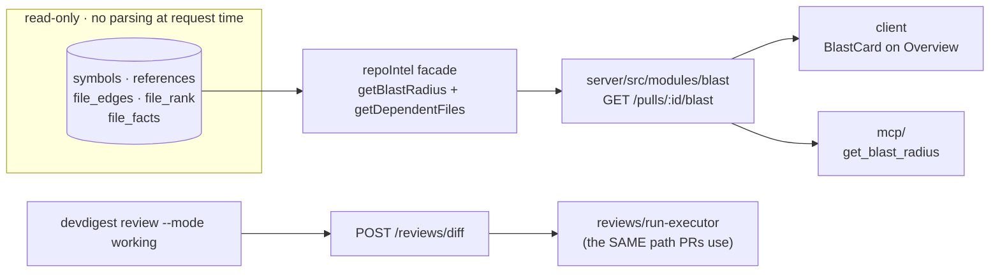

# L04 (revised) — Blast Radius end to end + `devdigest-mcp` + pre-push CLI

Supersedes `l04-mcp-server-plan.md` in the places listed under
[What is superseded](#what-is-superseded). Everything not listed there stands —
in particular that file's **normative Tool copy** section, which remains the
source of truth for the tool strings.

## Goal

Ship **Blast Radius** — a legible map of what a diff can touch — as a server
route, a card on the PR Overview tab, an MCP tool, and (bonus) a pre-push CLI.
The map is built **only by reading the existing repo-intel index**: no AST parse,
no import-graph rebuild, no LLM call on the main path.

**Done** means an **open PR** with an implementation description and a **1–3
minute demo video** that opens the demo-PR, shows the impact map, and navigates
from a caller to the corresponding line of code. Without the video the work is
not accepted — so the demo is a planned step, not an afterthought.



## Locked decisions (owner; not re-opened)

1. **UI is a CARD on the existing Overview tab**, beside the Intent card — not a
   new tab. The mockup wins over the assignment's wording.
2. **All four mockup extras are in scope:** cron badges, Tree/Graph toggle,
   "Prior PRs touching these files", and the optional one-call LLM summary.
3. **The CLI lives in `mcp/` and reaches the reviewer through a NEW server route
   that accepts a raw diff** and runs the same `run-executor` path. `mcp/` holds
   no business logic and no DB access; importing `reviewer-core` directly would
   bypass the grounding gate, agent config and persistence — the second
   implementation the assignment forbids.
4. Carried over: stdio-only MCP transport; `mcp/` speaks REST only;
   `@devdigest/shared` is `import type` only in `mcp/` (zod 4.4.3 vs 3.25.76);
   no committed `.mcp.json` (local-scope `claude mcp add`); `run_review` polls
   because `POST /pulls/:id/review` is fire-and-forget.

## New design decisions (each grounded)

- **BD1 — the blast route serves from the persistent index only, and never
  renders a degraded result as data.** `RepoIntelService.getBlastRadius` has a
  fallback branch calling `readClone()` + `extractEndpoints()` per caller file
  (`server/src/modules/repo-intel/service.ts:290-294`) — that *is* parsing during
  the request and would fail the acceptance criterion. The blast service checks
  `getIndexState` first and treats any `BlastResult` with `degraded === true` as
  "no data", never as content.
- **BD2 — the caller cap must become per-symbol.** The facade sorts by rank then
  applies `callers.slice(0, MAX_CALLERS_PER_SYMBOL)` **globally**
  (`service.ts:386`); the assignment requires 20 **per symbol**. The persistent
  path also does **not** exclude the declaring file — the ripgrep path does
  (`service.ts:273`) but `getResolvedCallers` (`repository.ts:503-531`) filters
  only on `declFile`/`toSymbol`. Both fixed in the facade.
- **BD3 — endpoints come from a REVERSE traversal, depth 2.** The only existing
  graph walk, `getCriticalPaths` (`service.ts:663-700`), walks **forward**
  (importer → imported) — the wrong direction, and graph direction is an explicit
  grader check. A new facade read walks `file_edges` backwards using the index
  the schema comment says exists for exactly this
  (`server/src/db/schema/repo-intel.ts:70-72`: *"the reverse-lookup index
  (repoId, toFile) is what blast uses to walk 'who depends on this file?'"*).
  `BFS_DEPTH = 2` already exists (`repo-intel/constants.ts:49`).
- **BD4 — caller links resolve against the INDEX sha, not the PR head.** The
  index is built from the clone at `IndexState.lastIndexedSha`; a caller's line
  number is only valid there. Changed-symbol links use the PR head sha, caller
  links use the indexed sha. This is what the grader clicks.
- **BD5 — the LLM summary is a separate `POST` route.** A lazily-derived summary
  inside `GET` would violate "the main scenario makes no LLM call". The GET is
  provably model-free; the POST makes exactly one call.
- **BD6 — no DB migration.** The summary is returned, not persisted; "Prior PRs"
  is a read over existing `pr_files` + `pull_requests`.
- **BD7 — NO new shared contract. The envelope is local to each consumer; the map
  itself is the already-shared `BlastRadius`.** (R1, decided 2026-08-23.) Two facts
  settle it. First, **no route in this repository declares a Zod `response:`
  schema** — `grep -rn "response:" server/src/modules` returns nothing; responses
  are typed by TypeScript return annotations only and are never validated at
  runtime on the way out. A shared Zod contract for a *response* therefore buys no
  validation, only types. Second, the counter-precedent is not an analogy but the
  same case: `client/src/lib/hooks/repo-intel.ts` declares `RepoIntelState` — the
  response shape of `GET /repos/:id/index-state`, with the **same
  `full|partial|degraded|failed` vocabulary blast needs** — locally and on purpose:
  *"kept local — not in @devdigest/shared, since repo-intel types live
  server-side."* Blast is repo-intel-shaped data; it follows that precedent.
  The cost is small because the substantive shape is already shared: only a
  seven-field envelope is declared three times. **Consequence: this plan never
  enters `server/src/vendor/shared/`.**

## Affected packages

| Package | Why it's touched | Risk |
|---|---|---|
| `server/` | New `blast/` module + 2 routes; repo-intel facade fixes; new diff-review route | Medium — changes a facade with existing tests; **no protected zone entered** (R1) |
| `client/` | New `BlastCard` on Overview, hook, types re-export; Tree/Graph toggle; prior-PRs block | Medium — largest net-new UI in the lesson |
| `mcp/` | Whole package (previous plan) + `get_blast_radius` becomes real + the `devdigest` CLI | Medium |
| repo root | `README.md`, `CLAUDE.md`, `TESTING.md`, `scripts/verify-l04.sh`, `docs/research/`, the PR + video | Low |
| `reviewer-core/`, `e2e/` | **Untouched** | — |

## Constraints in force

- **Do-not-touch:** `server/src/vendor/shared/` and `server/src/db/migrations/`
  (root `CLAUDE.md:25`). **Since R1 was decided for local types, this plan enters
  NEITHER.** Both remain pure regression checks in `verify-l04.sh`.
- **The two vendored copies must stay byte-identical** —
  `diff -rq server/src/vendor/shared client/src/vendor/shared` prints nothing
  (`server/INSIGHTS.md:18`; mechanised at `scripts/verify-l03.sh:52`).
- **The shared barrel is extended with new files, never edited in place** —
  `server/src/vendor/shared/index.ts` header: *"The barrel is stable — feature
  agents EXTEND with new files, they do not edit existing ones."* So
  `contracts/brief.ts` is **read, never modified**.
- **repo-intel is reached only through `container.repoIntel.*`**
  (`server/src/modules/repo-intel/README.md`; getter at
  `platform/container.ts:120-124`). The blast module must not import the
  repository or the pipeline.
- **Every handler resolves tenancy via `getContext(container, req)`**; every
  domain read is workspace-scoped.
- **Validation is Zod**; 422 / `AppError` / 500 envelope
  (`contracts/platform.ts:284-291`).
- **Client styling is colocated `styles.ts` objects + CSS custom properties, not
  Tailwind**; `@testing-library/user-event` is **not installed** — use
  `fireEvent` (`client/INSIGHTS.md`).
- **ESM `.js` on relative imports** in `server/`, `reviewer-core/`, `e2e/`,
  `mcp/` — not `client/`.
- **No linter exists.** Gates are typecheck + tests. `INSIGHTS.md` writes are
  append-only.
- Precedence: package `INSIGHTS.md` → package `CLAUDE.md` → root `CLAUDE.md` →
  skill → general practice.

## Existing scaffolding — read before writing anything

This lesson is unusually well-scaffolded. Missing any of these causes duplicate
work or an avoidable contract change.

1. **`BlastRadius` ALREADY EXISTS as a shared contract, in both copies, in
   exactly the mockup's shape** — `server/src/vendor/shared/contracts/brief.ts:44-70`:
   `ChangedSymbol {name,file,kind}`, `BlastCaller {name,file,line}`,
   `DownstreamImpact {symbol, callers[], endpoints_affected[], crons_affected[]}`
   — **grouped per symbol with per-symbol endpoint and cron attribution**, which
   is precisely the mockup's `rateLimit()` → 4 callers → 3 endpoint badges → 1
   cron badge — and `BlastRadius {changed_symbols[], downstream[], summary}`,
   already composed into `PrBrief` (`:145`). **The contract step is an envelope
   around an existing type, not a new type. Do not redesign this shape.**
2. **`client/messages/en/blast.json` already exists and nothing reads it** —
   `stat.symbols|callers|endpoints|crons`, `view.tree|graph`,
   `callerCount: "{count} callers"`, `noDownstream`, `graph.empty`,
   `graph.ariaLabel`. It is the card's copy, including the Tree/Graph labels and
   the empty state. Third instance of the pattern in `server/INSIGHTS.md:50` and
   `client/INSIGHTS.md` (2026-08-02) — scaffolding survives the part-0 strip with
   zero producers. **Use these keys; do not invent new ones.**
3. **`getBlastRadius` is implemented**, including the persistent path
   (`service.ts:220-390`). `tryPersistentBlast` (`:315-390`) reads symbols,
   resolved callers, `file_rank` and `file_facts` straight from Postgres and
   returns `degraded: false` with `factsByFile`. Its own comment: *"NO clone
   parsing on the hot path"*.
4. **`file_facts` is precomputed per file** (`schema/repo-intel.ts:73-88`) with
   `endpoints` and `crons`, written by the indexer (`pipeline/full.ts:186-187,247`).
   The table comment says it exists *"so the blast service doesn't have to
   re-parse the clone on every request"* — **cite this in the PR description; it
   is the mechanism satisfying the no-AST-rebuild criterion.**
5. **`file_edges` carries the reverse index** (`schema/repo-intel.ts:70-72`);
   `BFS_DEPTH = 2` and `MAX_CALLERS_PER_SYMBOL = 20` are already constants
   (`repo-intel/constants.ts:49, :29`). The assignment's "two levels" and "20 per
   symbol" are the repo's own numbers.
6. **`extractEndpoints` matches this repo's own route style**
   (`adapters/codeindex/extract.ts:182-195`), so `app.get('/agents', …)` becomes
   `GET /agents` in `file_facts`. This is why the D1 demo candidate works.
7. **`githubBlobUrl(repoFullName, sha, file, startLine, endLine)`** already
   exists (`client/src/lib/github-urls.ts`) and pins the link to a sha. The
   clickable `file:line` needs no new helper.
8. **The colocated component convention is fixed**:
   `_components/<Name>/{<Name>.tsx,index.ts,styles.ts,constants.ts,<Name>.test.tsx}`
   — see the sibling `IntentCard/`. `OverviewTab.tsx` is 30 lines and takes
   props; the card slots in beside `<IntentCard/>`.
9. **`client/src/lib/hooks/repo-intel.ts` is the counter-precedent** — it
   declares `RepoIntelState` locally with the comment *"kept local — not in
   @devdigest/shared, since repo-intel types live server-side"*. See Risk R1.
10. **`ReviewRepository.getPrFiles(prId)`** already reads a PR's changed files;
    `parseUnifiedDiff` exists at `adapters/git/diff-parser.ts`. The CLI route
    needs neither written from scratch.
11. **`Agent.ci_fail_on`** (`contracts/knowledge.ts:208`) and run-executor's
    *"deterministic blocker count (severity ≥ the agent's gate)"*
    (`run-executor.ts:351`) already define "blocking". The CLI's exit code reuses
    that definition rather than inventing one.
12. **`scripts/demo-reset.sh`** is the precedent for a pre-record reset script and
    names the real demo repo: `REPO_FULL=sergyinfo/neoversity-dev-digest` (`:8`).

### Verified live, 2026-08-23 (this session, against the running stack)

- `sergyinfo/neoversity-dev-digest` — `status: full`, 316 files,
  `indexerVersion: 2`, `lastIndexedSha` from **2026-08-20**. **A `resync` is
  required before recording** or the map will not see new symbols.
- `acme/payments-api` — `status: degraded`, `reason: "no_data"`, 0 files. **The
  degraded scenario needs no construction; it is already in the seed.**
- Demo-helper candidate `getContext` (`server/src/modules/_shared/context.ts`):
  imported by **12 files, all of which register HTTP routes — 51 routes total**
  (`agents` 11, `reviews` 10, `skills` 7, `settings`/`repos`/`conventions`/`pulls`
  4 each, `repo-intel`/`intent` 2, `polling`/`workspace`/`smart-diff` 1). Far
  above the "≥2 callers, ≥1 endpoint" criterion, and it exercises the per-symbol
  cap on real data.

## Contract & DB changes

**DB: none.** No schema edit, no `db:generate`, no `db:migrate`, nothing under
`server/src/db/migrations/`. Everything reads existing tables (`symbols`,
`references`, `file_edges`, `file_rank`, `file_facts`, `pr_files`,
`pull_requests`). Asserted by `git status --porcelain server/src/db` printing
nothing.

**Shared contract: none either (R1, decided — see BD7).** `server/src/vendor/shared/`
is **not entered**. The map is the already-shared `BlastRadius`
(`contracts/brief.ts:44-70`, byte-identical in both copies today); only the thin
HTTP envelope is declared per consumer:

| Where | What | Form |
|---|---|---|
| `server/src/modules/blast/contract.ts` | source of truth | module-local **Zod** (so tests can `BlastResponse.parse(body)`), composing the shared `BlastRadius` |
| `client/src/lib/hooks/blast.ts` | consumer | local `interface`, using the shared `BlastRadius` type, carrying the same "kept local" comment as `repo-intel.ts` |
| `mcp/src/tools/get-blast-radius.ts` | consumer | local `import type` interface (zod 3/4 barrier makes a runtime import impossible anyway) |

The envelope, identical in all three:

- `BlastState = 'ok' | 'partial' | 'degraded'`
- `map: Omit<BlastRadius, 'summary'>` — `brief.ts` is never touched and `PrBrief`
  is unaffected
- `PriorPr = { number, title, author, updated_at, overlapping_files: string[] }`
- `BlastResponse = { pr_id, repo_full_name, head_sha, indexed_sha: string|null,
  state, reason: string|null, counts: {symbols,callers,endpoints,crons}, map,
  prior_prs: PriorPr[] }`
- `BlastSummaryResponse = { summary, model, cost_usd: number|null }`

`PrHistoryItem` (`brief.ts:90-98`) was considered for `prior_prs` and rejected:
its `merged_at` is required and wrong for open PRs.

**Residual risk this decision accepts:** three declarations can drift with no
automatic check, since responses are never validated at runtime. Mitigations —
the drift surface is seven fields, not a whole payload; the server schema is the
named source of truth; B5's route test parses a live response against it; and any
missing field surfaces at the use site in the consumers' typecheck. Module-local
request schemas are already the house style (`CreateAgentBody` in
`agents/routes.ts`, `PatchConventionBody` in `conventions/routes.ts`).

## Steps

**M** = the previous plan's `mcp/` steps (retained by their old numbers),
**B** = Blast Radius, **C** = CLI, **D** = demo and delivery.

### Phase 0 — orientation

**B0 — Read the insights and the scaffolding.** Read root `CLAUDE.md`;
`server/INSIGHTS.md` (13, 18, 21, 32, 35, 50); `client/INSIGHTS.md`;
`repo-intel/README.md`; `TESTING.md`; `contracts/brief.ts:44-70`;
`client/messages/en/blast.json`. Skill `consult-insights`.
**Done when:** you can state without re-reading (a) that `BlastRadius` already
exists and its three fields, (b) that `blast.json` already holds the card's copy,
(c) the byte-identity invariant and its check, (d) why `POST /pulls/:id/review`
cannot be awaited. **Never read or cite `server/clones/`.**

### Phase 1 — the envelope (module-local; the protected zone is NOT entered)

**B1 — Declare the blast envelope in `server/src/modules/blast/contract.ts`.**
Files: `server/src/modules/blast/contract.ts` (new) **only**. Module-local Zod for
`BlastState`, `PriorPr`, `BlastResponse`, `BlastSummaryResponse`, importing
`BlastRadius` (and `ChangedSymbol`/`BlastCaller` if needed) from `@devdigest/shared`
for the map. **Nothing under `server/src/vendor/shared/` or
`client/src/vendor/shared/` is created or edited, and `brief.ts` is not touched.**
Skills `zod`, `typescript-expert`.
**Done when:** `git status --porcelain server/src/vendor/shared client/src/vendor/shared`
prints nothing; `diff -rq server/src/vendor/shared client/src/vendor/shared` prints
nothing (unchanged regression check); `cd server && pnpm typecheck` exits 0;
`cd server && pnpm exec vitest run test/contracts.test.ts` green (unchanged).

### Phase 2 — server

**B2 — Fix the facade: per-symbol cap, declaring-file exclusion.**
Edit `tryPersistentBlast`: (a) drop callers whose `fromPath` is the symbol's own
declaring file; (b) replace the global `slice(0, MAX_CALLERS_PER_SYMBOL)` at
`:386` with group-by-`viaSymbol`, top-20-by-rank each. Keep rank-descending order
within each group. Depends on B0.
**Done when:** tests assert a reference from the declaring file is absent; two
symbols × 25 callers → 20 **each** (40 total), not 20 overall; ordering is
rank-descending; `test/repo-intel-facade-degraded.test.ts` still passes unchanged.

**B3 — Facade: reverse dependents, depth 2.**
`repository.getImporters(repoId, files)` selects `file_edges` where
`toFile IN (?)` — the `(repoId,toFile)` index path. `service.getDependentFiles(repoId, files, depth = BFS_DEPTH)`
BFSs **backwards**, dedupes, never revisits, returns each file with its hop count.
Returns `[]` when `repoIntelEnabled` is false. Depends on B2.
**Done when:** over fixture `A → B → C`, `getDependentFiles(['C.ts'])` returns
**B at depth 1 and A at depth 2**, and `getDependentFiles(['A.ts'])` returns
**neither**; a 3-hop dependent is excluded; a cycle terminates.

**B4 — The `blast/` module: service.** `BlastService.forPull(workspaceId, prId)`:
1. load PR + repo (workspace-scoped); changed paths from `pr_files`;
2. `getIndexState(repoId)` — if `failed`/`degraded` or repo-intel disabled, return
   `state:'degraded'` + `reason` + empty map, **having called nothing else** (BD1);
3. else `getBlastRadius(repoId, changedFiles)`; **if the result carries
   `degraded: true`, discard it** and return the degraded envelope;
4. `getDependentFiles` → union with caller files → endpoints/crons from
   `factsByFile` plus a facade read for the extra files;
5. map `BlastResult` → `BlastMap`: group `callers` by `viaSymbol` into
   `DownstreamImpact[]`, attribute endpoints/crons per symbol from that symbol's
   caller files;
6. `state:'partial'` when the index is partial or `filesSkipped > 0`, else `'ok'`;
7. `prior_prs`: other PRs whose `pr_files.path` intersects, newest first, cap 5;
8. `indexed_sha` from `IndexState.lastIndexedSha`.
**Zero LLM calls in this path.** Depends on B1, B3.
**Done when:** stubbed-`repoIntel` tests assert degraded index → `state:'degraded'`,
empty map, **`getBlastRadius` never called**; a `degraded:true` result → data
discarded; `partial` → `state:'partial'` **with data**; one `DownstreamImpact` per
changed symbol; `counts` equal the rendered arrays;
`rg -n "llm|complete\(" server/src/modules/blast/service.ts` returns nothing.

**B5 — Route `GET /pulls/:id/blast` + registry + the log line.**
Default-exported Fastify plugin, `ZodTypeProvider`, `params: IdParams`, tenancy via
`getContext`. Emits exactly one structured line —
`req.log.info({ prId, state, indexedSha, symbols, callers, endpoints, source: 'index' }, 'blast: served from index')`
— because a grader check reads the logs. Skills `fastify-best-practices`, `zod`.
**Done when:** `routes-smoke.test.ts` still passes; a route test asserts 200 with a
`BlastResponse.parse()`-valid body and 404 for an unknown id;
`curl -s localhost:3001/pulls/<id>/blast | jq .state` returns one of the three
states; the log shows the single line and no clone activity.

**B6 — Route `POST /pulls/:id/blast/summary` (exactly one LLM call).**
Builds the map, renders a compact text block, makes **one** completion through the
existing provider plumbing. The prompt states nodes and edges are given and **must
not be invented**; the block is wrapped as untrusted data, mirroring
`<untrusted source="pr-intent">` (`server/INSIGHTS.md:51`). Per-route rate limit.
Returns **409** with an actionable message when `state === 'degraded'` — never
summarise a map with no data. Depends on B5.
**Done when:** a mock-provider test counts **exactly one** `complete*` per request
and **zero** for the GET; the response carries the model id; the degraded case
returns 409, not a fabricated paragraph.

### Phase 3 — client

**B7 — Hook and local envelope type.** `useBlast(prId)` over `client/src/lib/api.ts`
and `useBlastSummary(prId)` as a mutation. Per R1 the envelope `interface` is
declared **here, locally**, carrying the same rationale comment as
`hooks/repo-intel.ts`; the `map` field uses the **shared** `BlastRadius` type from
`@/lib/types`, which is not re-declared. Depends on B1, B5.
**Done when:** client typecheck exits 0; the file imports `BlastRadius` from the
shared types rather than restating its fields; `git status --porcelain
client/src/vendor/shared` prints nothing.

**B8 — `BlastCard` — tree view, counters, expandable symbols.**
Colocated component beside `IntentCard/`, slotted into `OverviewTab.tsx`. Header
`BLAST RADIUS` + counters using `blast.stat.*`; expandable symbol rows with
`blast.callerCount`; endpoint badges; cron badges **hidden when zero**. Styling via
`styles.ts` + CSS custom properties, **not Tailwind**. Copy from `blast.json` via
`useTranslations("blast")`. Skills `react-best-practices`, `react-testing-library`
(**`fireEvent`, never `userEvent`**). Depends on B7.
**Done when:** tests cover counters from `counts`; expand/collapse via `fireEvent`;
`blast.noDownstream` for an empty `downstream`; nothing broken while loading.

**B9 — Clickable `file:line`, pinned to the right sha.**
Caller links → `githubBlobUrl(repo_full_name, indexed_sha, file, line)`;
changed-symbol links → the same with `head_sha` (BD4). `target="_blank"
rel="noopener noreferrer"`. When `indexed_sha` is null, render plain text with a
tooltip rather than a link that lands on the wrong lines. Depends on B8.
**Done when:** a test asserts the caller anchor's href contains the **indexed** sha
and `#L<line>`, the changed-symbol anchor the **head** sha, and a null
`indexed_sha` renders no anchor. Manually: clicking opens the exact line — this is
the video's central moment.

**B10 — Tree/Graph toggle + degraded/partial/empty states.**
`Tree | Graph` using `blast.view.tree|graph`; the graph is a dependency-free SVG
(changed symbols left, caller files middle, endpoints right) with `aria-label` from
`blast.graph.ariaLabel` and `blast.graph.empty` when there is nothing to draw.
Three visually distinct non-data states: **empty** (indexed, genuinely no
downstream), **partial** (data + a banner naming what is missing), **degraded** (no
data + why + a "Re-analyze" action pointing at the existing `POST /repos/:id/resync`).
**The degraded state must never look like "no impact".** Depends on B8.
**Done when:** tests assert the three states render distinct text; toggling to Graph
renders the aria-labelled element and back; the degraded text does **not** contain
the empty-state copy.

**B11 — "Prior PRs touching these files".** Collapsed by default, header with the
count, each row links to the PR detail route and lists overlapping paths; hidden
when empty. Depends on B8.
**Done when:** a test asserts collapsed-initially, expands on `fireEvent.click`, and
absent when `prior_prs` is `[]`.

### Phase 4 — MCP

**M1–M9, M11–M19 — unchanged** from `l04-mcp-server-plan.md`, including the
normative Tool copy, the polling `run_review`, the context-budget gate, the
security pass, the no-committed-`.mcp.json` decision and the standalone runbook.

**B12 — `get_blast_radius` becomes real (supersedes prev S10).**
**Normative replacement description — 207 chars, copy verbatim:**

```text
Impact analysis for a pull request: which symbols it changes, which call sites across the repository depend on them, and which HTTP endpoints those callers serve. Reads the prebuilt code index — no LLM call.
```

Parameter copy unchanged (`repo`, `pr`). **No `format` parameter** — the tool
always renders the concise map; the detailed map lives in the UI.
Build: `resolvePr` → `GET /pulls/:id/blast` → render capped via `format.ts`: a
counters line, then per symbol its top callers as `file:line` and its endpoints,
then a pointer to the PR page. Annotations `{ readOnlyHint: true, openWorldHint:
false }`. **`state` handling is the design point:** `ok` → normal result;
`partial` → successful result whose **first line** says the index is partial;
`degraded` → **`isError: true`** saying the impact is UNKNOWN and must not be read
as "no impact", naming the resync action. The old stub's principle survives, now
applied to missing index data instead of a missing feature. Depends on B5, M11.
**Done when:** mocked-`fetch` tests assert one `GET /pulls/:id/blast` after
resolution; `ok` renders symbols, callers, endpoints; `partial` is `isError:false`
**and** flags incompleteness first; `degraded` is `isError:true` and contains
"UNKNOWN"; output stays under `MAX_CHARS`.

**B13 — Re-measure the context budget and republish the numbers.** The new
description is 17 chars longer than the stub's. Depends on B12.
**Done when:** `cd mcp && pnpm test` passes the budget assertions unchanged
(`instructions` 400–600, every description < 2048, `tools/list` ≤ 4200, no
`outputSchema`, every parameter described); the printed numbers appear verbatim in
`mcp/README.md`.

### Phase 5 — the pre-push CLI (bonus)

**C1 — Server route `POST /reviews/diff`.** Body (module-local Zod, **no contract
change**): `{ repo, diff, label?, agentId?, all? }`. Resolve the repo by
`full_name` in the workspace → **upsert a synthetic local PR** (`number: 0`,
`title: label ?? 'Working tree'`, `branch/base: 'HEAD'`, `headSha: 'working'`),
idempotent on `pr_repo_number_uq` (`db/schema/pulls.ts:61`) → `parseUnifiedDiff`
→ replace that PR's `pr_files` → call the **existing** `ReviewService.runReview`.
Returns `{ pr_id, runs: ReviewRunTarget[] }`.
*Why this reuses rather than reimplements:* `loadDiff` tries `git diff base...head`
first and falls through when it yields zero files, then reconstructs from
`pr_files` (`reviews/diff-loader.ts:19-29, 31-43`). With `base === head ===
'working'` the git attempt cannot produce files, so the executor reviews exactly
the CLI's diff — through the unchanged grounding gate, agent selection, run trace
and persistence. Body-size cap + per-route rate limit. Depends on B0.
**Done when:** a test asserts the route creates/reuses PR number 0, writes
`pr_files` matching the parsed diff, returns `runs[]` with ≥1 `run_id`, and that
**`run-executor.ts` is unmodified**; calling twice creates no second pseudo-PR.

**C2 — Extract the run-wait helper (one implementation, two callers).** Move the
poll-until-terminal-then-read logic out of `run_review` into `mcp/src/review-wait.ts`,
used by both the tool and the CLI. Depends on M7.
**Done when:** `run-review.ts` has no polling loop of its own; the existing
`run_review` tests pass unchanged against the extracted helper.

**C3 — `devdigest review --mode working`.**
- `git.ts`: repo root via `git rev-parse --show-toplevel`, `owner/name` from
  `origin`, changes from `git diff HEAD`. **Untracked files are honestly
  excluded**: count them (`git ls-files --others --exclude-standard`) and print
  `N untracked file(s) were NOT reviewed — run 'git add -N <path>' to include
  them`, and say the same in `--help`.
- `index.ts`: `--mode working` only, parsed through a `ReviewMode` union whose
  other members exit with `not implemented in this release`.
- Calls `POST /reviews/diff`, then `review-wait.ts` — **the same waiting logic as
  the MCP tool**.
- `render.ts`: grouped by severity, each line `SEVERITY  path:line  title`, then a
  summary and the exit-code explanation.
- **Exit contract, documented in `--help`:** `0` no blocking findings; `1`
  blocking findings (severity ≥ the agent's `ci_fail_on` gate — the same
  definition `run-executor.ts:351` uses); `2` the review could not run.
- `bin/devdigest.mjs`: `#!/usr/bin/env node` shim re-execing the local `tsx` and
  **forwarding the child's exit code unchanged**. Keep CLI code strictly out of
  `src/index.ts`.
Depends on C1, C2.
**Done when:** `--help` prints the modes, the untracked caveat and the three exit
codes; mocked git+fetch tests assert exit `0` clean, `1` on a CRITICAL with the
gate at `critical`, `2` when fetch rejects; `--mode staged` exits 2 with "not
implemented"; `rg -n "reviewer-core" mcp/src` returns nothing.

**C4 — CLI docs.** `mcp/README.md` (+CLI section) and `mcp/CLAUDE.md` (+the reuse
rule naming the run-executor path and forbidding a second implementation).

### Phase 6 — demo, video, PR (delivery-critical)

**D1 — Prepare and verify the demo-PR.** The change must be to a **genuinely
shared helper**. Verified candidate: **`server/src/modules/_shared/context.ts`** —
`getContext` is imported by 12 route modules registering 51 Fastify routes that
`extractEndpoints` matches. Second candidate: `reviews/helpers.ts`. Make a small
honest change (e.g. add a narrowly-typed `getWorkspaceId` wrapper and use it in one
caller).
Pre-flight, in order: repo imported → cloned → `POST /repos/:id/resync` and wait
for `index-state` to reach `full` (the live index is from 2026-08-20 and is stale)
→ PR pushed and polled → **`GET /pulls/:id` once** (the diff warm-up,
`server/INSIGHTS.md:13`) → `curl -s localhost:3001/pulls/<id>/blast | jq`.
Depends on B5, B9.
**Done when:** the JSON shows `state: "ok"`, **≥ 2 callers** across **≥ 1 changed
symbol**, and **≥ 1 entry in `endpoints_affected`**; two callers are
**hand-verified against the source**; every `file:line` link opens the correct
line; the degraded scenario renders on `acme/payments-api` (already
`degraded: no_data` in the seed — no construction needed).

**D2 — Record the video (1–3 minutes).** Shot list, in order (1–4 mandatory):
1. `0:00–0:15` the demo-PR open in DevDigest, Overview; one sentence on the change.
2. `0:15–0:45` the Blast card: counters, expand the changed symbol, the callers.
3. `0:45–1:10` **click a `file:line`** → the file opens at that exact line; point
   out the call is really there. *(The assignment's "navigate from a caller to the
   corresponding line of code" — do not rush it.)*
4. `1:10–1:30` endpoint badges; Tree → Graph toggle.
5. `1:30–1:45` Prior PRs; optionally "Explain this map" (one LLM call).
6. `1:45–2:15` `get_blast_radius` via the MCP Inspector or Claude Code; compare the
   numbers with the UI on screen.
7. `2:15–2:45` `devdigest review --mode working` on a local edit; `echo $?`.
8. `2:45–3:00` the degraded state on `acme/payments-api`.
If it will not fit, cut 5 and 8 first; **never cut 3.** Depends on D1, B12, C3.

**D3 — Open the PR with the implementation description.** Body covers: what was
built and why; the **graph-direction** decision with the `file_edges` reverse-index
citation; the **no-AST-rebuild** proof (the `file_facts` comment + the single log
line); the three states; the per-symbol cap and declaring-file fixes; the contract
addition and the `diff -rq` gate; the MCP tool; the CLI and its exit contract; the
video link; re-runnable verification commands.
**Done when:** the PR is **open** (not draft), the body contains the video link,
and `verify-l04.sh` output is pasted or referenced.

### Phase 7 — docs, verification, insights

**D4 — Docs and repo registration.** `server/src/modules/blast/README.md` (new,
stating the direction rule and the no-parse guarantee with citations),
`repo-intel/README.md` (+the two new facade reads), root `README.md`,
root `CLAUDE.md`, `TESTING.md` (+the `mcp` suite row), `mcp/README.md`,
`mcp/CLAUDE.md`.

**D5 — `scripts/verify-l04.sh` and CI.** Independent checks, exit status = number
of failures (`verify-l03.sh:14-15` contract): vendored-copy parity;
`git status --porcelain server/src/db` empty; typecheck for all five packages;
`server` unit tests; `client` tests; `mcp` tests; `git ls-files .mcp.json` empty;
`grep -n mcp scripts/dev.sh` empty. `.github/workflows/mcp.yml` mirrors
`client.yml` with `paths:` covering `mcp/**` and `server/src/vendor/shared/**`.

**D6 — Insights (append-only).** Strong candidates: `BlastRadius` and `blast.json`
already existing with zero producers (a **third** instance of the
scaffolding-survives-the-strip pattern); the facade's global-vs-per-symbol cap and
missing declaring-file exclusion; `getCriticalPaths` walking the opposite direction
from blast; the indexed-sha vs head-sha link distinction; the synthetic PR-0
technique.

## Traceability — acceptance criterion → step → proof

| # | Criterion / grader check | Step | The check that proves it |
|---|---|---|---|
| 1 | Open PR with an implementation description | D3 | PR open; body covers the design decisions |
| 2 | Demo video 1–3 min: opens the PR, shows the map, caller → code | D2 | Shots 1–4 present; ≤ 3:00 |
| 3 | Demo-PR on a shared helper: ≥2 real callers, ≥1 endpoint | D1 | `jq` on the route; two callers hand-verified |
| 4 | Clicking `file:line` opens the corresponding line | B9, D1 | Test: href = indexed sha + `#L<line>`; manual click-through |
| 5 | No AST / import-graph rebuild during the request | B4, B5 | `getBlastRadius` not called when the index is unusable; `degraded` discarded; one `blast: served from index` line |
| 6 | Clear empty state | B10 | Test: `blast.noDownstream` for an indexed PR with no downstream |
| 7 | Separate `partial`/`degraded` state | B4, B10, B12 | Service test on three states; UI test on three renders; MCP `degraded` → `isError` |
| 8 | Main path no LLM; optional summary exactly one | B4, B6 | `rg` finds no LLM import; mock counts 0 for GET, 1 for POST |
| 9 | `get_blast_radius` concise structured result over MCP | B12 | Tool tests for the three states; under `MAX_CHARS`; budget gate green |
| 10 | Graph direction — dependents, not dependencies | B3 | Fixture `A → B → C`: `C` yields B(1), A(2); `A` yields neither |
| 11 | Scenario with an incomplete index | B4, B10 | `partial` shows data + banner; `degraded` shows no data + cause |
| 12 | Scenario with no links found | B10 | Empty state distinct from degraded |
| 13 | Logs show an index read, not a re-parse | B5 | The single structured line; no clone I/O |
| 14 | MCP Inspector **and** Claude Code match the UI | B12, D2 | Same PR, same counts in both surfaces, on camera |
| 15 | CLI: reused reviewer, documented exit codes | C1, C3 | `--help`; exit-code tests; `run-executor.ts` unmodified; no `reviewer-core` import |
| 16 | CLI: untracked files handled or honestly excluded | C3 | Counted and stated, in output and `--help` |
| 17 | CLI: room for `staged`/`branch` without implementing | C3 | Union type exists; both exit 2 "not implemented" |
| 18 | Repo invariant: vendored copies identical | B1 | `diff -rq` prints nothing AND `git status --porcelain …/vendor/shared` prints nothing — the zone is never entered (R1) |

## Verification

| Scope | Command | Gate |
|---|---|---|
| repo | `diff -rq server/src/vendor/shared client/src/vendor/shared` | prints nothing |
| repo | `git status --porcelain server/src/db` | prints nothing |
| repo | `git diff --stat …/brief.ts …/run-executor.ts` | no changes to either |
| `server/` | `pnpm typecheck` | 0 errors |
| `server/` | `pnpm exec vitest run --exclude '**/*.it.test.ts'` | unit lane green |
| `server/` | `pnpm exec vitest run .it.test` | integration green (Docker; on OrbStack `export DOCKER_HOST=unix://$HOME/.orbstack/run/docker.sock`) |
| `client/` | `pnpm typecheck && pnpm test` | green |
| `mcp/` | `pnpm typecheck && pnpm test` | green; no Docker, no network |
| `reviewer-core/` | `npm run typecheck && npm test` | green |
| `e2e/` | `npm run typecheck` | green (**suite not run — no new flow**) |
| repo | `./scripts/verify-l04.sh` | exits 0 |
| manual | `curl -s localhost:3001/pulls/<id>/blast \| jq '{state, counts}'` | `ok`, ≥2 callers, ≥1 endpoint |
| manual | API log during that request | one `blast: served from index`, no parse |
| manual | `cd mcp && pnpm inspect` → `get_blast_radius` | matches the UI |
| manual | `cd mcp && ./bin/devdigest.mjs review --mode working; echo $?` | findings printed; exit code per contract |

**No lint row: this repository has no linter.**

## Out of scope

- Streamable HTTP / SSE / WebSocket MCP transport, any `/mcp` endpoint in Fastify,
  remote hosting, OAuth, plugin/marketplace packaging.
- **A DB migration of any kind.** No `blast` table; the summary is not persisted.
- **Any write under `server/src/vendor/shared/` or `client/src/vendor/shared/`** —
  including `contracts/brief.ts`. R1 decided local envelopes; the zone stays shut.
- **`--mode staged` and `--mode branch`** — architecture leaves room; the code does
  not implement them (assignment-mandated).
- **A second review implementation for the CLI.**
- **Changing `run-executor.ts`.**
- **e2e coverage** for blast — the deterministic flows run on seeded data with no
  index, so a flow would assert the degraded state and nothing more. Recorded gap.
- Persisting or caching the LLM summary; **inventing cron data** when
  `file_facts.crons` is empty.
- A repo-level `/repos/:id/blast` route — PR-scoped only.
- Re-indexing from the blast route — the card links to the existing resync.

## What is superseded

| Superseded (from `l04-mcp-server-plan.md`) | Replaced by |
|---|---|
| "Out of scope: **any modification to `server/src`**" | `server/src` is the main worksite (B1–B6, C1). The "byte-for-byte unchanged" goal is gone |
| "Out of scope: implementing blast radius (a later lesson)" | It **is** this lesson |
| "Out of scope: client UI — no Next.js surface" | B7–B11 |
| "**Contract & DB changes: None**" | Still none — **on both counts**. R1 decided local envelopes, so no shared contract file is added either |
| **S10** stub + its "NOT IMPLEMENTED YET" normative description | **B12**, with the replacement string above |
| **S13** measured budget numbers | **B13** — re-measure |
| Risk 9's "`mcp.yml` need not trigger on server routes" | Weaker now: `get_blast_radius` depends on a route this lesson authors. See R6 |

**Retained unchanged:** the whole `mcp/` package (M1–M9, M11–M19), the normative
Tool copy for the other four tools, the polling `run_review` and its Field
verification, the no-committed-`.mcp.json` decision, the standalone runbook, the
security pass, and Risks 1–8 and 10.

## Risks & open questions

| # | Risk / question | Decision needed |
|---|---|---|
| **R1** | ~~Should the blast envelope be a shared contract?~~ **DECIDED 2026-08-23: NO — local envelopes.** No route in the repo declares a Zod `response:` schema, so a shared response contract buys types only; and `client/src/lib/hooks/repo-intel.ts` already keeps `RepoIntelState` — the same subsystem, the same `full\|partial\|degraded\|failed` vocabulary — local on purpose. The map stays the shared `BlastRadius`; only a seven-field envelope is declared three times | **Closed.** Residual drift risk accepted and mitigated in *Contract & DB changes* |
| **R2** | **The demo-PR may not produce resolvable callers.** `getResolvedCallers` counts only references whose `decl_file` resolved (`service.ts:311-313`). If the index leaves `decl_file` NULL for the chosen helper, the map is empty and criterion 3 fails | Run D1's pre-flight **early** — right after B5, not after the UI. Fallbacks: `reviews/helpers.ts`, then any symbol confirmed by `SELECT … FROM references WHERE decl_file IS NOT NULL`. **The single biggest schedule risk** |
| **R3** | **Crons will probably be empty.** `extractCrons` needs a string literal (`extract.ts:202-214`); this repo enqueues with constants. The mockup shows "1 cron" | Accepted: counter and badges hide at zero. **Do not fabricate.** Note it as a mockup-only element in the PR body |
| **R4** | Changing the facade's caller cap affects future consumers | Accepted; today `getBlastRadius` has no non-test consumer. B2's tests pin the semantics; `repo-intel/README.md` updated in D4 |
| **R5** | **The synthetic PR number 0 becomes visible in the web UI** | Decide in C1: accept it as a visible "Working tree" row (recommended — it makes CLI runs inspectable), or filter `number > 0` in the list route. Do **not** hide it with a status the UI does not model |
| **R6** | **No automated test binds `mcp/` to the blast route's shape** | Compensating: D1's manual check and grader check 14. Recommend `mcp.yml` **does** trigger on `server/src/modules/blast/**`, unlike the general case |
| **R7** | CLI packaging (`bin`) is unverified; `mcp/` is `private` | C3 uses a node shim re-execing local `tsx` and forwarding the exit code. Fallback: documented `pnpm devdigest review --mode working` |
| **R8** | `git diff HEAD` on a large tree may exceed the route's body cap | Set the cap explicitly in C1; the CLI reports "diff too large, review a subset" with exit 2 rather than a truncated review |
| **R9** | Unverifiable from the repo: whether the grader's Claude Code session accepts local-scope registration (we commit no `.mcp.json`); whether resync reliably reaches `full` in demo-friendly time | Both settle in D1's pre-flight. Record after a warm index and say so in the PR body |
| **R10** | Assignment items unverifiable: "one paragraph" implies no length contract (B6 caps it in the prompt, not the schema); "tab" conflicts with the mockup's card | Mention the card-vs-tab choice, with the mockup as justification, in the PR body |

## Handoff

**Read first:** `docs/research/l04-mcp-server-plan.md` (retained `mcp/` steps +
the normative Tool copy) · `server/INSIGHTS.md` (13, 18, 21, 32, 35, 50, 51) ·
`client/INSIGHTS.md` · `server/src/modules/repo-intel/README.md` ·
`server/src/vendor/shared/contracts/brief.ts:44-70` (**the contract you already
have**) · `client/messages/en/blast.json` (**the copy you already have**).

**Primary worksites:** `repo-intel/service.ts` (220–390 `getBlastRadius`/
`tryPersistentBlast`; 663–700 `getCriticalPaths` — the wrong-direction walk **not**
to copy) · `repo-intel/repository.ts` (503–545, 432–436) ·
`db/schema/repo-intel.ts` (68–88, the two comments to cite) · `modules/index.ts`
(registry) · `client/.../_components/OverviewTab/` and the sibling `IntentCard/` ·
`client/src/lib/github-urls.ts` · `mcp/src/tools/get-blast-radius.ts` (rewrite).

**Order that de-risks the schedule:** B0 → B1 → B2 → B3 → B4 → B5 → **run D1's
pre-flight immediately** (R2 is the biggest unknown) → B6–B11 → M-steps +
B12/B13 → C1–C4 → D2–D6.

**Never read or cite `server/clones/`.** Architecture and security review are
separate agents; this plan has had neither.
