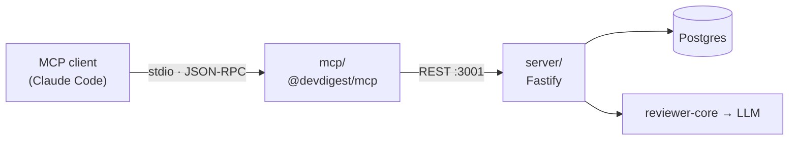

> **PARTLY SUPERSEDED (2026-08-23) by [`l04-blast-radius-plan.md`](./l04-blast-radius-plan.md).**
> The real course assignment makes **Blast Radius** the feature and the MCP tool one
> slice of it. That file lists exactly what it supersedes here — chiefly this file's
> *Out of scope* entries barring changes to `server/src`, barring the blast
> implementation, and barring client UI, plus step S10 (the stub) and S13 (the
> measured numbers).
>
> **This file remains the source of truth for the `mcp/` package itself**, including
> the normative [Tool copy](#tool-copy--normative-copy-verbatim) section, the polling
> `run_review`, the context-budget gate, the on-demand registration decision and the
> standalone runbook. Read both.

# L04 — `@devdigest/mcp`: a local-only stdio MCP server

Development plan. Greenfield: written as if `mcp/` does not exist. An earlier spike
at `mcp/` is a **reference, not a baseline** — two of its choices are explicitly
overridden (see [Handoff](#handoff-to-the-implementer)).

---

## Goal

A new top-level package `mcp/` exposing DevDigest to MCP clients (Claude Code, MCP
Inspector) as **five tools over stdio**, speaking only the existing REST API at
`http://localhost:3001`.

**Done** means: `mcp/` typechecks; its vitest suite (mocked `fetch` + one
`InMemoryTransport` protocol smoke test) is green; a measured context budget is
recorded (`tools/list` ≈ 1k tokens or less, `instructions` 400–600 chars);
`.mcp.json` at the repo root drives it; and `server/src` is **byte-for-byte
unchanged**.



## Locked decisions

- **Transport: local stdio only.** No Streamable HTTP, no WebSocket, no `/mcp` route
  in Fastify. This is also the MCP specification's own recommendation for locally-run
  servers: *"Use the `stdio` transport to limit access to just the MCP client."*
- **Data access: HTTP wrapper over the REST API** (`DEVDIGEST_API_URL`, default
  `http://localhost:3001`). No DB, no Drizzle, no business logic in `mcp/`.
- **Placement: new top-level package `mcp/`** with its own `package.json` + lockfile —
  **not** a workspace member (root `CLAUDE.md:20`, "NOT a monorepo workspace").
- **SDK: `@modelcontextprotocol/server@2.0.0`.** v2 API confirmed from the installed
  typings: `registerTool(name, {title,description,inputSchema,outputSchema,annotations,_meta}, handler)`
  and `serveStdio(factory, options)` from `@modelcontextprotocol/server/stdio`.
- **`@devdigest/shared` is `import type` only.** `mcp/node_modules/zod` is **4.4.3**,
  `server/node_modules/zod` is **3.25.76** (both verified). Tool input schemas are
  declared locally in zod 4.
- **`run_review` blocks for the caller, with a hard 120 s cap — by polling, not by
  holding an HTTP request open.** `POST /pulls/:id/review` is **fire-and-forget**: it
  creates the `agent_run` rows, launches the executor with `void`, and returns
  `reviews: []` *literally every time*
  (`server/src/modules/reviews/service.ts:131-137`). The tool therefore starts the run,
  then polls `GET /pulls/:id/runs` until every started run is terminal
  (`done|failed|cancelled`) within the budget, and only then reads
  `GET /pulls/:id/reviews`. **Verified in practice 2026-08-23** — see
  [Field verification](#field-verification).
- **Tests: vitest, mocked `fetch`, one protocol smoke test.** No testcontainers, no
  Postgres, no network.

## Constraints in force

- **Not a workspace; cross-package sharing is a tsconfig path alias into sibling
  source** — root `CLAUDE.md:20-22`.
- **ESM: relative imports carry `.js`** — root `CLAUDE.md:22`. `mcp/` is
  `"type": "module"`, so this applies.
- **Do-not-touch: `server/src/vendor/shared/` and `server/src/db/migrations/`** — root
  `CLAUDE.md:25`. This plan enters neither; it only *reads* `vendor/shared` through a
  tsconfig alias.
- **The two vendored `shared` copies must stay byte-identical** —
  `diff -rq server/src/vendor/shared client/src/vendor/shared` prints nothing
  (`server/INSIGHTS.md:18`, mechanised at `scripts/verify-l03.sh:52`). **Do not create
  a third copy.**
- **`GET /pulls/:id` before `POST /pulls/:id/review` is mandatory, not an
  optimisation.** A freshly polled PR reviews an EMPTY diff and returns a false
  "approve / score 100" — `server/INSIGHTS.md:13`, evidence
  `server/src/modules/reviews/diff-loader.ts:19-29`,
  `server/src/modules/polling/routes.ts:31`.
- **Never hand-write a package-local `pnpm-workspace.yaml`.** pnpm generates it; a
  hand-written one with no `packages:` makes pnpm treat the directory as a workspace
  root and fail — `server/INSIGHTS.md:32`.
- **Tests must be inside `tsconfig.include`.** `server/` and `reviewer-core/` set
  `"include": ["src/**/*.ts"]`, so their test files are never typechecked and contract
  drift only surfaces at runtime (`server/INSIGHTS.md:35`). `mcp/` deliberately does
  **not** repeat this.
- **No linter exists in this repository.** Gates are typecheck + tests only.
- Precedence: package `INSIGHTS.md` → package `CLAUDE.md` → root `CLAUDE.md` → skill →
  general practice.

## Existing scaffolding — reuse, do not rebuild

Every REST route the five tools need already exists:

| Route | File | Note |
|---|---|---|
| `GET /repos` | `server/src/modules/repos/routes.ts:33` | |
| `GET /repos/:id/pulls` → `PrMeta[]` | `server/src/modules/pulls/routes.ts:33` | |
| `GET /pulls/:id` → `PrDetail` | `server/src/modules/pulls/routes.ts:241` | the diff-warming call |
| `GET /agents` → `Agent[]` | `server/src/modules/agents/routes.ts:74` | |
| `POST /pulls/:id/review` | `server/src/modules/reviews/routes.ts:27-44` | body = `RunRequest`; **rate-limited 10/min** at `:29`; **fire-and-forget — always returns `reviews: []`** |
| `GET /pulls/:id/runs` → `RunSummary[]` | `server/src/modules/reviews/routes.ts:101` | the poll target; `status` is `running\|done\|failed\|cancelled` (`contracts/trace.ts:106`) |
| `GET /pulls/:id/reviews` → `ReviewRecord[]` | `server/src/modules/reviews/routes.ts:129` | read after the runs go terminal; join on `run_id` |
| `GET /repos/:id/conventions` → `ConventionCandidate[]` | `server/src/modules/conventions/routes.ts:50` | |
| `GET /health` | `server/src/app.ts:100` | rate-limit exempt |

Contracts already model every response (all zod 3, in
`server/src/vendor/shared/contracts/`): `Repo` (`platform.ts:145`), `PrMeta`
(`platform.ts:162` — note `id: z.string().nullish()` at `:163`), `PrDetail`
(`platform.ts:214`), `Agent` (`knowledge.ts:197`), `ConventionCandidate`
(`knowledge.ts:148`), `ReviewRecord` (`review-api.ts:23`), `Finding`
(`findings.ts:61`), `Severity` (`findings.ts:11`), `ReviewRunResponse`
(`review-api.ts:52`), `ApiErrorBody` (`platform.ts:284-291`).

Global rate limit is **120/min** (`server/src/app.ts:96`) — budget the resolver's
extra list calls against it. `scripts/verify-l03.sh` is the template for a
one-command lesson verifier. CI is one path-filtered workflow per package.

## Contract & DB changes

**None. This feature needs neither — and that is a deliberate, checkable property.**

- No DB change: `mcp/` never touches Postgres or Drizzle. No `db:generate`, no
  `db:migrate`, no new migration.
- No contract change: every response shape already exists and is consumed **as types
  only** through a tsconfig alias. No third vendored copy.
- Asserted mechanically: `git status --porcelain server/src` prints nothing;
  `diff -rq server/src/vendor/shared client/src/vendor/shared` prints nothing; no file
  under `mcp/src` imports a **runtime** value from `@devdigest/shared`.

---

# Tool copy — NORMATIVE, copy verbatim

> **These strings are the specification, not a suggestion.** Steps S6–S11 copy them
> character for character. Do not paraphrase, re-wrap, "improve", or translate them
> during implementation. Every one is measured against the budget gate in S13; an
> edit here changes a number that is asserted by a test and published in
> `mcp/README.md`.
>
> To change any string: edit it here first, re-run S13, and update the recorded
> numbers.

## Server `instructions` — 448 chars

```text
DevDigest is a local AI pull-request reviewer. Search these tools when asked to review a pull request with a DevDigest agent, to read the findings of a review already run, to look up a repository's extracted house conventions, or to see the blast radius of a change. Repositories are addressed as "owner/name" and pull requests by their GitHub number — never by internal id. Requires the DevDigest API to be running (default http://localhost:3001).
```

Sentence order is load-bearing: this is the only text guaranteed to be in context from
the first second (tool search defers schemas but not instructions), and Claude Code
truncates it at 2 KB. The **trigger** comes first, the self-description second.

## `list_agents` — description 175 chars

```text
List the DevDigest review agents (reviewers) configured in this workspace, with their provider, model and enabled state. Use the returned name to pick an agent for run_review.
```

| Param | `.describe()` |
|---|---|
| `enabled_only` | `Only agents that are enabled (default: false)` |

## `run_review` — description 280 chars

```text
Run a DevDigest review agent against a pull request and return each agent's verdict, score and finding counts. Blocking: waits for the run, up to 120 seconds. Calls a paid LLM and creates a new run on every call — to re-read a review that already exists, use get_findings instead.
```

| Param | `.describe()` |
|---|---|
| `repo` | `Repository as "owner/name", e.g. "acme/payments-api"` |
| `pr` | `Pull request number on GitHub, e.g. 482` |
| `agent` | `Agent name from list_agents. Omit to run every enabled agent.` |

The cost/duration clause and the `get_findings` cross-reference are deliberate: the
most expensive failure mode of this tool set is the model calling `run_review` when it
only needed to read an existing review. That costs a real LLM call.

## `get_findings` — description 152 chars

```text
Read the findings of reviews already run on a pull request, most severe first. Does not run a review and does not call an LLM — use run_review for that.
```

| Param | `.describe()` |
|---|---|
| `repo` | `Repository as "owner/name"` |
| `pr` | `Pull request number on GitHub` |
| `severity` | `Keep only this severity` |
| `agent` | `Keep only findings from this agent name` |
| `limit` | `Max findings to return (default 20)` |
| `format` | `concise = one line per finding (default); detailed adds the explanation and suggested fix` |

## `get_conventions` — description 207 chars

```text
Read the house conventions DevDigest extracted from a repository's own code, each with the file it was proven against. Useful before writing or reviewing code in that repo. Returns accepted rules by default.
```

| Param | `.describe()` |
|---|---|
| `repo` | `Repository as "owner/name"` |
| `status` | `Which candidates to return (default: accepted)` |

## `get_blast_radius` — description 207 chars

> **Superseded 2026-08-23**: the stub is implemented. The old string
> ("NOT IMPLEMENTED YET — this tool always reports that it is unavailable")
> is retired; the current normative string is below.

```text
Impact analysis for a pull request: which symbols it changes, which call sites across the repository depend on them, and which HTTP endpoints those callers serve. Reads the prebuilt code index — no LLM call.
```

| Param | `.describe()` |
|---|---|
| `repo` | `Repository as "owner/name"` |
| `pr` | `Pull request number on GitHub` |

No `format` parameter, deliberately: the tool always renders the concise map and the
detailed one lives in the UI — fewer parameters, less session context. The `state`
handling carries the old stub's principle forward: `degraded` returns
**`isError: true`** saying the impact is UNKNOWN, because an empty *success* reads to
the model as "this change impacts nothing".

## Copy budget

**MEASURED 2026-08-23** over a live `tools/list` (was a projection until then):

| | value |
|---|---|
| `instructions` | 448 chars (gate: 400-600, hard cap 2048) |
| longest description | 280 chars (`run_review`; hard cap 2048) |
| `get_blast_radius` description | 207 chars |
| **full `tools/list` payload** | **3 777 chars ≈ 944 tokens** (gate: ≤ 4 200) |
| `outputSchema` on any tool | none |
| parameters without a description | none |

The earlier projection said ~3 940; the real figure is 3 777. `instructions` grew from
411 to 448 when blast radius was added to the trigger sentence. **These numbers are now
asserted by `mcp/test/context-budget.test.ts`**, which prints them on every run — so a
copy change that blows the budget fails the suite instead of quietly costing every
session context.

## How the copy satisfies the agreed rules

| Rule | Source | Satisfied by |
|---|---|---|
| Descriptions and `instructions` truncated at 2 KB each | Claude Code MCP docs | Longest description 280 chars; `instructions` 403. 7× headroom |
| Front-load what matters | same | `instructions` opens with the trigger; `get_blast_radius` names the capability, then the disclaimer |
| `instructions` = "when to search", not documentation | "For MCP server authors" | One trigger sentence, one context, one addressing rule, one prerequisite |
| One short `.describe()` per parameter | Anthropic | 14/14 described; longest 89 chars |
| No `outputSchema` | our token decision | None |
| Tool names: `snake_case`, consistent, allowed charset, ≤64 chars | MCP spec + awslabs guide | Longest name 16 chars; no mixed styles |
| No own namespace prefix | Claude Code exposes `mcp__devdigest__*` | Saves tokens in every name |
| **No UUID crosses the tool boundary** | Anthropic | Inputs are `owner/name`, PR number, agent name |
| Semantic identifiers with worked examples | Anthropic | `e.g. "acme/payments-api"`, `e.g. 482` |
| Unambiguous parameter names | Anthropic | `repo`/`pr`/`agent`/`severity`/`status`/`format` |
| Model directives placed **after** the parameter's purpose | awslabs guide | `run_review`: what it does, then "Blocking… paid LLM… use get_findings instead" |
| Cost and duration visible at decision time | MCP spec (analogous to stating handle lifetime in the description) | `run_review` states "120 seconds" and "paid LLM" |
| Caller controls verbosity | Anthropic (measured 206→72 tokens) | `format: concise \| detailed` |
| Pagination with a sensible default | Anthropic | `limit`, default 20 |
| Enums for fixed value sets | awslabs guide | `severity`, `status`, `format` as zod enums — values reach the schema automatically |
| A stub must not answer silently | our decision + MCP spec (`isError` enables self-correction) | "NOT IMPLEMENTED YET" in the description, `isError: true` in the result |
| Honest annotations | MCP spec | `run_review`: `readOnlyHint: false`, `idempotentHint: false`; the rest read-only |

**Deliberately excluded from the copy:** output format examples (the model reads
results as prose; examples cost tokens in every session), enum value glossaries (zod
already emits allowed values into the schema), and internal mechanics such as
`run_review` making two HTTP calls (irrelevant to the model's decision).

---

# Steps

### S1 — Read the insights before touching anything
- **Files:** none (read-only)
- **Read:** root `CLAUDE.md`, `server/CLAUDE.md`, `server/INSIGHTS.md` (esp. lines 13,
  18, 21, 32, 35), `TESTING.md`, `server/src/modules/repo-intel/README.md`
- **Skill:** `consult-insights`
- **Done when:** you can restate (a) the empty-diff/false-approve mechanism and the
  two-call fix, (b) why no third `vendor/shared` copy may exist, (c) why a
  `pnpm-workspace.yaml` must not be hand-written.
- **Never read or cite `server/clones/`** — runtime data holding stale duplicates of
  every `CLAUDE.md`/`INSIGHTS.md`.

### S2 — Package skeleton and install
- **Files:** `mcp/package.json`, `mcp/tsconfig.json`
- `package.json`: `@devdigest/mcp`, private, `"type": "module"`; scripts `start`,
  `dev`, `typecheck`, `test`, `inspect`; deps
  `@modelcontextprotocol/server@^2.0.0`, `zod@^4.2.0`; devDeps `tsx`, `typescript`,
  `@types/node`, `vitest@^2.1.8`.
- `tsconfig.json`: ES2022 / ESNext / Bundler, `strict`, `noUncheckedIndexedAccess`,
  `noEmit`; `paths` → `@devdigest/shared` → `../server/src/vendor/shared/index.ts`;
  **`"include": ["src/**/*.ts", "test/**/*.ts"]`** (deliberately unlike `server/`).
- **Skill:** `typescript-expert`
- **Done when:** `pnpm install` succeeds and writes `mcp/pnpm-lock.yaml`;
  `pnpm typecheck` exits 0; **no hand-created `mcp/pnpm-workspace.yaml`**.

### S3 — HTTP client with a call-level deadline budget
- **Files:** `mcp/src/api.ts`, `mcp/vitest.config.ts`, `mcp/test/api.test.ts`
- `API_URL` from `DEVDIGEST_API_URL`; `apiGet`/`apiPost` over `fetch` with
  `AbortSignal.timeout`; `ApiError` whose message is written *for the model*; parse the
  `{error:{code,message}}` envelope on non-2xx; a **`Deadline`** helper carrying one
  wall-clock budget across the multi-call `run_review` sequence.
  `DEVDIGEST_API_TIMEOUT_MS` default `30_000`; **`DEVDIGEST_REVIEW_TIMEOUT_MS` default
  `120_000`**.
- **Skill:** `typescript-expert`, `security`
- **Done when:** tests cover 200 JSON, 204, non-JSON error body, structured envelope,
  `TimeoutError` → distinct message, connection refused → "start the API" message.
  `rg -n "console\.log" mcp/src` returns nothing.

### S4 — Response shaping, error and truncation contract
- **Files:** `mcp/src/format.ts`, `mcp/test/format.test.ts`
- `ok`, `fail` (`isError: true`), `guard`, `oneLine`, `capped` (appends
  `[truncated at N characters — <how to narrow>]`), and **`untrusted(label, text)`**
  fencing third-party prose — mirroring the server's `<untrusted source="pr-intent">`
  convention. Per-tool char ceilings live here as named constants, sized against Claude
  Code's 25 000-token output cut, with a comment naming
  `_meta["anthropic/maxResultSizeChars"]` (ceiling 500 000 chars) as the escape hatch
  if a future tool must exceed it.
- **Skill:** `typescript-expert`, `security`
- **Done when:** tests assert `fail()` never returns empty content; `guard()` converts
  a thrown `ApiError` into `isError`; `capped()` always ends with an actionable hint;
  `untrusted()` labels its payload.

### S5 — Identifier resolver: no UUID crosses the boundary
- **Files:** `mcp/src/resolve.ts`, `mcp/test/resolve.test.ts`
- `resolveRepo(spec)`, `resolvePr(repoSpec, number)` (narrowing the nullish
  `PrMeta.id`), `resolveAgent(name)` (exact, then unique substring). Types via
  `import type`.
- **Every failure enumerates the alternatives**: known `full_name`s / imported
  `#numbers` (capped at 20) / configured agent names; `PrMeta.id == null` → "open it
  once in the web app so DevDigest persists it".
- **Skill:** `typescript-expert`
- **Done when:** each failure message contains at least one valid alternative (or an
  explicit "(none imported)"); no `inputSchema` anywhere carries an id parameter.

### S6 — `list_agents`
- **Files:** `mcp/src/tools/list-agents.ts`, `mcp/test/tools/list-agents.test.ts`
- **Copy: verbatim from [Tool copy](#list_agents--description-175-chars).**
- Input `{ enabled_only?: boolean }`; `GET /agents`; renders
  `name — provider/model [enabled · strategy · repo-intel|diff-only]`. Annotations
  `{ readOnlyHint: true, openWorldHint: false }`. No `outputSchema`. An empty list is a
  **successful** result explaining how to create an agent.
- **Skill:** `zod`, `typescript-expert`
- **Done when:** tests cover populated, filtered and empty; the empty case asserts
  `isError` is **not** set.

### S7 — `run_review` (two-call sequence, 120 s cap, honest annotations)
- **Files:** `mcp/src/tools/run-review.ts`, `mcp/test/tools/run-review.test.ts`
- **Copy: verbatim from [Tool copy](#run_review--description-280-chars).**
- Sequence, in this exact order, all under one `Deadline(120_000)`:
  1. `resolvePr`
  2. **`GET /pulls/:id`** — the mandatory diff warm-up
  3. optional `resolveAgent`
  4. `POST /pulls/:id/review` with `{agentId}` or `{all:true}` → keep **only the
     `runs[].run_id` set**; the `reviews` array it returns is always empty
  5. **poll `GET /pulls/:id/runs`** with backoff (1 s → ×1.4 → cap 5 s) until every
     started run id has a terminal `status` (`done|failed|cancelled`)
  6. `GET /pulls/:id/reviews`, keep the records whose `run_id` is in the started set,
     and render verdict / score / severity tallies / cost / one-lined summary
- **Do not render the `reviews` array from step 4.** It is a literal `[]` in the
  service, so a tool that renders it reports "no review was produced" on every
  *successful* run. This is not a hypothetical: the spike did exactly that.
- Backoff exists because of the **120/min global rate limit** (`app.ts:96`): a flat 1 s
  poll would spend 120 requests on a single call.
- Annotations: `{ readOnlyHint: false, destructiveHint: false, idempotentHint: false,
  openWorldHint: true }`.
- **The timeout message is the key deliverable.** On budget expiry, return
  `isError: true` with text stating the review **was started** and is still running;
  that the cap is the client's, not the server's; and the exact next action —
  `get_findings(repo="…", pr=N)` in a minute. It must **not** say the review failed.
  Cancelling the poll cannot cancel the run: the executor was launched with `void` and
  never observed the HTTP request in the first place.
- A run that ends `failed`/`cancelled` is reported with its `error` string rather than
  omitted — a run that died must not look like a review with no findings.
- Map HTTP 429 (the 10/min limit) to an `isError` result telling the model to wait.
- **Skill:** `zod`, `typescript-expert`, `consult-insights`
- **Done when:** a mocked-`fetch` test asserts the call order is exactly
  `GET /repos` → `GET /repos/:id/pulls` → `GET /pulls/:id` → `POST /pulls/:id/review`
  (the regression test for `server/INSIGHTS.md:13`); a second test serves `running` for
  N polls then `done` and asserts the tool waits and renders the review — **and that it
  never renders the POST's own `reviews` array**; a timeout test asserts the result
  contains "started" and "get_findings" and does **not** contain "failed"; a fourth
  asserts the annotations literally carry `readOnlyHint: false` and
  `idempotentHint: false`; a fifth covers a `failed` run surfacing its `error`; a sixth
  covers 429.

### S8 — `get_findings`
- **Files:** `mcp/src/tools/get-findings.ts`, `mcp/test/tools/get-findings.test.ts`
- **Copy: verbatim from [Tool copy](#get_findings--description-152-chars).**
- Input `{ repo, pr, severity?, agent?, limit? (1..100, default 20), format?
  ('concise'|'detailed', default concise) }`. Flattens `ReviewRecord.findings`, sorts
  by severity rank then confidence, filters, slices, renders. `detailed` adds `why`
  (from `Finding.explanation` — the contract field is `explanation`, the DB column is
  `rationale`, `server/INSIGHTS.md:21`) and `fix` (nullish `suggestion`).
- Three distinct **successful** states: never reviewed (point at `run_review`),
  reviewed-and-clean (report verdicts), filtered-to-empty (report filters + tallies).
- **Skill:** `zod`, `typescript-expert`
- **Done when:** with a ≥60-finding fixture, `concise` output is at least **2.5×**
  smaller than `detailed`; output never exceeds `MAX_CHARS`; a truncated header carries
  the narrowing hint; all three empty-ish states are `isError: false` with distinct
  text.

### S9 — `get_conventions`
- **Files:** `mcp/src/tools/get-conventions.ts`, `mcp/test/tools/get-conventions.test.ts`
- **Copy: verbatim from [Tool copy](#get_conventions--description-207-chars).**
- Input `{ repo, status? }` (default `accepted`); sorts by confidence; renders the rule
  (one-lined, wrapped as untrusted) with `evidence_path:start_line` and confidence.
  Empty → successful result naming the extractor action, or the per-status tally plus
  `status="all"`.
- **Skill:** `zod`, `typescript-expert`
- **Done when:** tests cover default filtering, `status="all"`, "nothing extracted yet"
  and "nothing at this status"; output is `capped()`.

### S10 — `get_blast_radius` (stub that fails loudly)
- **Files:** `mcp/src/tools/get-blast-radius.ts`, `mcp/test/tools/get-blast-radius.test.ts`
- **Copy: verbatim from [Tool copy](#get_blast_radius--description-190-chars).**
- Input `{ repo, pr }`; **no API call**; always `isError: true` with text saying the
  impact is **UNKNOWN**, "do not treat this as no impact", that the engine already
  computes it (`RepoIntelFacade.getBlastRadius`,
  `server/src/modules/repo-intel/types.ts:147`) and only the HTTP route is missing, and
  that `get_findings` is the fallback.
- **Skill:** `typescript-expert`
- **Done when:** the test asserts `isError === true`, that the text contains "UNKNOWN",
  and that `fetch` was **never** called.

### S11 — Entry point split: testable factory + stdio-only entry
- **Files:** `mcp/src/server.ts` (`createServer(): McpServer`), `mcp/src/index.ts`
- **Copy: `INSTRUCTIONS` verbatim from
  [Tool copy](#server-instructions--403-chars).**
- `server.ts` constructs
  `new McpServer({name:'devdigest',version}, {capabilities:{tools:{}}, instructions: INSTRUCTIONS})`
  and registers the five tools; no module-scope mutable state. `index.ts` does nothing
  but `serveStdio(createServer, {onerror})` plus one stderr readiness line.
- **The split is required, not cosmetic:** the smoke and budget tests must import the
  factory without `serveStdio` seizing `process.stdin/stdout` at import time. (The
  spike calls `serveStdio` at module scope, which makes it untestable.)
- **Skill:** `typescript-expert`
- **Done when:** `pnpm typecheck` exits 0; importing `src/server.ts` from a test does
  not touch stdio; `rg -n "console\.log" mcp/src` and `rg -n "outputSchema" mcp/src`
  both return nothing.

### S12 — Protocol smoke test over `InMemoryTransport`
- **Files:** `mcp/test/protocol.smoke.test.ts`
- `InMemoryTransport.createLinkedPair()` (exported from
  `@modelcontextprotocol/server`); connect `createServer()` to one end; drive raw
  JSON-RPC from the other: `initialize` → `notifications/initialized` → `tools/list` →
  `tools/call`. Assert: five tool names present; `list_agents` returns text content
  with a mocked `fetch`; `get_blast_radius` returns `isError: true`; an invalid
  argument type yields a validation error rather than an unhandled throw.
- Prefer raw JSON-RPC over adding `@modelcontextprotocol/client` — that package is not
  installed and its availability could not be verified offline.
- **Skill:** `typescript-expert`
- **Done when:** the smoke test is green with zero network access and no Docker.

### S13 — Measure and gate the context budget
- **Files:** `mcp/test/context-budget.test.ts`
- Over the same in-memory harness, capture `JSON.stringify(toolsListResult)` and the
  `instructions` string; print byte length and a `chars/4` token estimate; turn the
  measurement into a regression gate.
- **Skill:** `typescript-expert`
- **Done when:** the test asserts all of:
  - `instructions.length` between **400 and 600**, and `< 2048`;
  - every tool `description.length < 2048`;
  - total `tools/list` payload **≤ 4200 chars (≈ 1 050 tokens)**;
  - no tool carries an `outputSchema`;
  - every parameter of every tool has a non-empty description;
  - the measured numbers are printed and then transcribed into `mcp/README.md` (S16)
    and `mcp/INSIGHTS.md` (S19).

### S14 — On-demand registration (NO committed `.mcp.json`)

**Decision (owner, this session): the MCP server must never come up as part of running
the app.** It is installed and registered separately, only when wanted.

Two independent things follow, and both are required:

1. **`scripts/dev.sh` stays untouched.** It must not gain `install_if_needed mcp`, and
   it never starts the server (with stdio it cannot — the *client* spawns the process).
   Dependencies in `mcp/` are installed by hand, once, as an explicit step.
2. **No `.mcp.json` is committed at the repo root.** A project-scoped `.mcp.json` makes
   Claude Code spawn the server at the start of *every* session in this repo once
   approved — which is exactly the automatic behaviour being rejected here. Registration
   is **local scope** instead, added and removed on demand:

```sh
claude mcp add devdigest \
  --env DEVDIGEST_API_URL=http://localhost:3001 \
  -- "$PWD/mcp/node_modules/.bin/tsx" "$PWD/mcp/src/index.ts"

claude mcp remove devdigest     # turn it off again
```

Local scope is the default; it is stored in `~/.claude.json` under this project's path
and is never version-controlled.

- **Files:** none at the repo root. The command above is **documented** in
  `mcp/README.md` (S16) instead.
- **Invoking `tsx` directly, not `pnpm`, is load-bearing:** stdout is the MCP wire and
  pnpm prints its own banner there.
- **Skill:** `security`
- **Done when:** `mcp/node_modules/.bin/tsx` exists; piping a single `initialize` line
  to the command yields JSON-RPC as the **first** byte on stdout; `git ls-files
  .mcp.json` prints nothing; `grep -n mcp scripts/dev.sh` prints nothing.
- **Consequence to accept:** `alwaysLoad` and the `.mcp.json` `timeout` field are no
  longer available (both are `.mcp.json` fields). Tool deferral therefore follows
  Claude Code's default tool-search behaviour, and the only call cap is the server's own
  120 s `AbortSignal` — which was always the authoritative one (Risk 1).

### S15 — Security hardening pass
- **Files:** review over `mcp/src/**`; a "Security notes" section in `mcp/README.md`
- Checks: (1) annotations are hints, not guarantees — documented, because
  `run_review`'s safety rests on the server-side rate limit, not on `destructiveHint`;
  (2) tool results are DATA, never instructions — PR titles/bodies, finding
  explanations and conventions all pass through `untrusted()`; (3) least privilege —
  `mcp/` reads only `DEVDIGEST_API_URL` and the two timeout vars, never a PAT or LLM
  key, never forwards an `Authorization` header; (4) no SSRF surface —
  `DEVDIGEST_API_URL` is operator-supplied, never model-supplied.
- **Skill:** `security`
- **Done when:** `rg -n "process\.env" mcp/src` lists **only** those three variables; a
  test asserts a finding whose `explanation` contains `"ignore previous instructions"`
  is rendered inside the untrusted wrapper; the four points appear in `mcp/README.md`.

### S16 — Package docs and repo registration
- **Files:** `mcp/README.md`, `mcp/CLAUDE.md`, root `README.md` (+1 package-table row,
  +1 deep-dive link), root `CLAUDE.md` (add `mcp/CLAUDE.md` to "Use when"),
  `TESTING.md` (+1 suite-map row)
- `mcp/README.md`: architecture diagram; five-tool table with backing routes; why
  `run_review` warms the diff first; why the blast stub errors; the **measured** token
  budget from S13; the `alwaysLoad`/`timeout` decision; the stdio contract; the env-var
  table (`DEVDIGEST_REVIEW_TIMEOUT_MS` default **120000**); the S15 security notes.
- **Skill:** `mermaid-diagram`
- **Done when:** every numeric claim in `mcp/README.md` matches a number printed by
  S13; root `README.md` and `CLAUDE.md` both list `mcp/`; `TESTING.md` has an `mcp`
  row.

### S17 — Lightweight tool-selection evaluation
- **Files:** `docs/research/l04-mcp-tool-selection.md`
- 6–8 realistic multi-call tasks phrased as a user would ("review PR 482 on
  acme/payments-api and tell me the critical issues", "what conventions does this repo
  enforce", "what's the blast radius of PR 7"), run against a live stack from a Claude
  Code session. Record per task: **number of tool calls**, **tokens consumed by tool
  results**, **error rate**, whether the right tool was chosen first, and whether a
  resolver failure was recovered in one retry.
- **Specifically test the cross-reference copy:** does the model call `get_findings`
  rather than `run_review` when only reading is needed? That clause exists to prevent
  a paid LLM call; the eval is what proves it works.
- **Skill:** `find-docs`
- **Done when:** the doc has a filled results table plus a "what we'd change" section —
  including whether the blast-radius `isError` text made the model stop or fall back.

### S18 — One-command verifier and CI workflow
- **Files:** `scripts/verify-l04.sh` (modelled on `verify-l03.sh`),
  `.github/workflows/mcp.yml`
- `verify-l04.sh` runs each as a separate check:
  `diff -rq server/src/vendor/shared client/src/vendor/shared`;
  `git status --porcelain server/src` must be empty; `mcp` typecheck; `mcp` test;
  `git ls-files .mcp.json` must be empty and `grep -n mcp scripts/dev.sh` must be empty
  (the decoupling assertions from S14). Exit status = number of failed checks, and every
  check runs even after a failure (same contract as `verify-l03.sh:14-15`).
- `mcp.yml` mirrors `client.yml` with `paths:` covering `mcp/**` **and**
  `server/src/vendor/shared/**` (the type alias makes that a real dependency).
- **Skill:** `typescript-expert`
- **Done when:** `./scripts/verify-l04.sh` exits 0 locally; `mcp.yml` parses and its
  `paths:` includes both globs.

### S19 — Record insights (append-only)
- **Files:** `mcp/INSIGHTS.md`
- Only substantial, file-grounded, non-duplicate findings: the zod 3/4 boundary and why
  `import type` is the only safe bridge; the measured budget from S13; why `serveStdio`
  must not run at module scope; why the blast stub errors; the pnpm-workspace trap; the
  120 s cap and the "started, not failed" message contract; whether S17 changed any
  copy.
- **Skill:** `engineering-insights`
- **Done when:** no entry merely restates `server/INSIGHTS.md`, and no existing
  `INSIGHTS.md` was modified.

---

## Standalone runbook — bringing the server up from zero

**Lifecycle first, because it is counter-intuitive.** A stdio MCP server is not a
daemon. There is no `start` you run and leave running: the **client** (Claude Code, the
MCP Inspector) spawns the process, talks to it over its stdin/stdout, and kills it when
the session ends. `ps aux | grep tsx` shows it only while a client is attached.

Consequences: `scripts/dev.sh` cannot start it and never will; the only thing that makes
it appear "by itself" is being registered with a client; and stopping it means
deregistering, not killing a process.

### 0. Prerequisites

Node ≥ 22 and pnpm (root `README.md`). Docker is needed only for Postgres, i.e. for the
API this server talks to — not for the MCP server itself.

### 1. Install the package's dependencies — once, by hand

```sh
cd mcp
pnpm install
```

**This is deliberately not part of `scripts/dev.sh`.** If pnpm stops with
`ERR_PNPM_IGNORED_BUILDS`, it will have generated `mcp/pnpm-workspace.yaml` containing
`allowBuilds:` placeholders that read "set this to true or false" — set them to `true`
and re-run. **Never create that file by hand.**

**pnpm version trap (found 2026-08-23).** `allowBuilds:` is a pnpm ≥ 10 field, and a
`pnpm-workspace.yaml` containing *only* that field is rejected outright by **pnpm 9**
with `ERROR packages field missing or empty` — pnpm 9 treats any such file as a
workspace root and demands a `packages:` list. This bites the whole repo, not just
`mcp/`: with pnpm 9.15.9 on PATH, `cd server && pnpm db:migrate` fails before it runs a
line of code, because `server/pnpm-workspace.yaml` was generated by a newer pnpm. Two
ways out, in order of preference: use the pnpm the repo expects (root `README.md` says
**≥ 10**), or bypass the runner entirely — `./node_modules/.bin/tsx src/db/migrate.ts`
works regardless. Do **not** "fix" it by hand-adding `packages:`.

Verify: `ls mcp/node_modules/.bin/tsx` exists, and `cd mcp && pnpm typecheck` exits 0.

### 2. Bring up the API it talks to — separately

The MCP server is a client of the DevDigest REST API and is useless without it.

```sh
./scripts/dev.sh --no-client      # Postgres + API on :3001, no Next.js
# or ./scripts/dev.sh             # the full stack
```

Verify: `curl -fsS localhost:3001/health` answers. If it does not, every tool call will
correctly return an actionable "cannot reach the DevDigest API" error rather than
failing silently.

### 3. Smoke-test the server with no client at all

The cheapest possible check — one JSON-RPC line in, one response out:

```sh
cd mcp
printf '%s\n' '{"jsonrpc":"2.0","id":1,"method":"initialize","params":{"protocolVersion":"2025-06-18","capabilities":{},"clientInfo":{"name":"manual","version":"0"}}}' \
  | ./node_modules/.bin/tsx src/index.ts
```

Expect the readiness line on **stderr** and a JSON-RPC result as the **first** thing on
stdout. Anything else on stdout first — a pnpm banner, a stray `console.log` — is the
one failure mode that corrupts every session.

### 4. Drive it interactively — MCP Inspector

```sh
cd mcp && pnpm inspect
```

Opens the Inspector in a browser; list the tools and call them by hand. Needs network
access the first time to fetch the inspector package.

### 5. Register it with Claude Code — only when wanted

```sh
claude mcp add devdigest \
  --env DEVDIGEST_API_URL=http://localhost:3001 \
  -- "$PWD/mcp/node_modules/.bin/tsx" "$PWD/mcp/src/index.ts"
```

Everything after `--` is the command and its arguments. Scope is **local** by default:
stored in `~/.claude.json` under this project's path, private, never committed, and it
does not appear in any other project.

Verify with `claude mcp list` (expect `✔ Connected`) or `/mcp` inside a session.

### 6. Turn it off

```sh
claude mcp remove devdigest
```

The next Claude Code session starts with no DevDigest tools and no spawned process.
Re-add it with the same command when needed.

### Environment

| Variable | Default | Purpose |
|---|---|---|
| `DEVDIGEST_API_URL` | `http://localhost:3001` | where the DevDigest API runs |
| `DEVDIGEST_API_TIMEOUT_MS` | `30000` | per-request timeout for reads |
| `DEVDIGEST_REVIEW_TIMEOUT_MS` | `120000` | the hard cap for `run_review` |

No credential ever belongs here. The GitHub PAT and the LLM keys live in
`~/.devdigest/secrets.json` on the API side; this package never reads them and never
forwards an `Authorization` header. Claude Code also strips variables whose names
contain `TOKEN`, `SECRET`, `KEY`, `AUTH`, `PAT` or `CREDENTIAL` from an MCP server's
environment, so a secret-bearing design would break anyway.

### Troubleshooting

| Symptom | Cause |
|---|---|
| `claude mcp list` shows `✘ Failed to connect` | `pnpm install` was never run in `mcp/`, or the path in the `add` command is wrong. Check `ls mcp/node_modules/.bin/tsx` |
| Tools appear, but every call says "Cannot reach the DevDigest API" | The API is not running. Step 2 |
| Garbage before the first JSON-RPC message | Something wrote to stdout. Never invoke through `pnpm`/`npm run` — they print their own banners |
| A review returns "approve / score 100" suspiciously fast and cheap | The empty-diff trap. `run_review` must call `GET /pulls/:id` first (`server/INSIGHTS.md:13`) |

## Field verification (2026-08-23)

The spike was driven against a **live stack** — Postgres in Docker, migrations applied,
the API on `:3001`, and the MCP server spoken to over real stdio JSON-RPC. What this
settled:

| Claim | Outcome |
|---|---|
| `POST /pulls/:id/review` is synchronous | **FALSE.** Fire-and-forget; `reviews` is a literal `[]` (`service.ts:131-137`). The spike's `run_review` reported "No review was produced" on a run that succeeded 20 s later. Fixed by polling; S7 rewritten |
| The agent is named `Security Reviewer` | **TRUE.** `list_agents` returns `General Reviewer`, `Security Reviewer`, `Performance Reviewer`, all on `openrouter/deepseek/deepseek-v4-flash`. An earlier guess that it might be plain `Security` was wrong |
| Two zod majors typecheck together (Risk 6) | **Holds.** `tsc --noEmit` clean with `mcp/` on zod 4.4.3 and `@devdigest/shared` on 3.25.76 |
| MCP works without Claude Code | **Yes.** `initialize` → `tools/list` → `tools/call` over raw stdio; `list_agents` 0.0 s, `get_findings` 0.9 s, `run_review` 28.7 s |
| A real review costs | `Security Reviewer` on PR #5: 43.8 s, 88 579 in / 785 out, **$0.0061**, verdict `approve`, 0 findings, grounding `0/0 passed` |
| The empty-diff trap fired | **No.** 88.5 k input tokens and a fully assembled prompt (`system`, `pr_description`, `intent`, `callers`, `repo_map`) — the warm-up did its job |

The design rule that caught the defect was our own: **an empty successful result must
not be indistinguishable from data.** Because the spike said "no review was produced"
instead of rendering an empty findings list, the fire-and-forget behaviour surfaced
immediately rather than being read as "this PR is clean".

This also partially retires Gap 10 ("no test exercises the real API") — one manual
end-to-end pass exists now, though nothing automated guards route drift.

## Verification

| Scope | Command | Gate |
|---|---|---|
| `mcp/` | `cd mcp && pnpm install` | lockfile written; no hand-written `pnpm-workspace.yaml` |
| `mcp/` | `cd mcp && pnpm typecheck` | 0 errors — covers `test/` too |
| `mcp/` | `cd mcp && pnpm test` | unit + smoke + budget green; no Docker, no network |
| repo | `diff -rq server/src/vendor/shared client/src/vendor/shared` | prints nothing |
| repo | `git status --porcelain server/src` | prints nothing |
| repo | `rg -n "console\.log" mcp/src` | prints nothing |
| repo | `rg -n "outputSchema" mcp/src` | prints nothing |
| repo | `git ls-files .mcp.json` | prints nothing (no committed project-scope config) |
| repo | `grep -n mcp scripts/dev.sh` | prints nothing (run scripts stay decoupled) |
| repo | `./scripts/verify-l04.sh` | exits 0 |
| manual | `./scripts/dev.sh --no-client` then `cd mcp && pnpm inspect` | live `tools/list` + `run_review` |
| manual | `claude mcp add devdigest …` → `claude mcp list` | `✔ Connected`; then the S17 evaluation tasks |

**No lint row: this repository has no linter.**

## Out of scope

- Streamable HTTP / SSE / WebSocket transport, and any `/mcp` endpoint in Fastify.
- **Any modification to `server/src`** — including the missing `blast` module and its
  route. `get_blast_radius` stays a stub this lesson.
- Implementing blast radius (the engine exists; the route is a later lesson).
- Client UI — no Next.js surface.
- Any DB or contract change; no third vendored `shared` copy.
- Plugin/marketplace packaging, npm publication.
- Remote hosting, OAuth, authentication, multi-tenant addressing.
- MCP **resources** and **prompts** — tools only.
- e2e coverage (`e2e/` drives a browser, not stdio).

## Gaps not yet folded into the steps

Researched after the plan was drafted; **each still needs a decision before it becomes
a step.**

1. **Deterministic tool order + `cacheHints`.** The MCP spec: servers *SHOULD* return
   tools in a deterministic order because it "improves LLM prompt cache hit rates".
   `McpServer`'s options accept
   `cacheHints: { 'tools/list': { ttlMs, cacheScope } }`. Both are cheap and testable;
   neither is in a step.
2. **Rate limiting at the MCP layer.** The spec requires servers to *"rate limit tool
   invocations"*. The plan only maps the server's 429; it relies on someone else's
   limit. For `run_review` this is about money.
3. **`resource_link` instead of truncation.** A tool *MAY* return a link to a resource
   rather than inlining content — a third option between "return everything" and
   "cut at 24k chars" for `get_findings detailed`.
4. ~~**`scripts/dev.sh` does not install `mcp/` dependencies.**~~ **CLOSED by owner
   decision — will not do.** The MCP server is deliberately decoupled from the app's
   run scripts: `dev.sh` neither installs nor starts it, and `mcp/` dependencies are
   installed by hand as an explicit step. See S14 and the standalone runbook below. The
   "fresh clone" failure mode is handled by documentation and by the connection error
   message, not by touching `dev.sh`.

Also open: whether the resolver's extra list calls (1–2 per tool call, against a
120/min global limit) warrant an in-process cache or dedicated lookup routes in
`server/`. Recommendation: a per-connection cache in `mcp/`, since it adds no
single-client endpoints to the public API.

## Risks

| # | Risk | How to close it |
|---|---|---|
| 1 | `.mcp.json`'s `alwaysLoad`/`timeout` could not be verified from this repo | Confirm with `find-docs` in S14. Mitigated: the authoritative cap is the server's own `AbortSignal`, so behaviour is correct even if `timeout` is ignored |
| 2 | The 2 KB and 10 000/25 000-token thresholds are external product behaviour, not repo facts | Confirm in S13; if they move, adjust constants in one place |
| 3 | `@modelcontextprotocol/client` not installed, availability unverified | S12 avoids it via raw JSON-RPC over `InMemoryTransport` |
| 4 | **120 s may be shorter than a real multi-agent run.** Measured on 2026-08-23: one `Security Reviewer` pass over PR #5 (99 files, 88 579 input tokens) took **43.8 s** of run time; the whole tool call took **28.7 s** including a ~20 s diff warm-up. One agent fits comfortably; `all: true` across three agents may not | Accepted by decision; the mitigation is the timeout *message*. If S17 shows frequent expiry, the follow-up is a `get_run_status` tool — at the cost of a sixth definition in every session |
| 5 | ~~Aborting the HTTP request does not cancel the server-side run~~ **RESOLVED 2026-08-23, and the premise was wrong in a bigger way.** The POST never waits at all — the executor is launched with `void` and the response returns immediately, so there is no request for the run to observe. The tool polls instead; abandoning the poll leaves the run untouched, exactly as the timeout message says | Closed |
| 6 | Two zod majors in one typecheck graph; `skipLibCheck` masks some of it | S2's typecheck is the gate. Fallback: hand-declare the response shapes in `mcp/src/types.ts` rather than loosening the alias |
| 7 | Resolver cost vs the 120/min global limit | Accepted for L04. If S17 shows 429s, add a per-connection cache — never module-scope state |
| 8 | A PR that exists on GitHub but was never polled is unresolvable | Handled by the enumerate-alternatives message |
| 9 | `mcp/` has no CI workflow and the repo has no MCP suite convention | S18. Open: whether `mcp.yml` should also trigger on `server/src/modules/*/routes.ts`. Recommend **no** for L04; record the gap |
| 10 | **No test exercises the real API**, so a route rename in `server/` cannot fail `mcp/` CI | Accepted; compensating control is S17 plus the documented gap |

## Handoff to the implementer

- **Read first:** root `CLAUDE.md`, `server/INSIGHTS.md` (lines 13, 18, 21, 32, 35),
  `TESTING.md`, `server/src/modules/repo-intel/README.md`, `scripts/verify-l03.sh`.
- **The [Tool copy](#tool-copy--normative-copy-verbatim) section is normative.** Copy
  every string character for character.
- **The existing spike at `mcp/` is a reference, not a baseline.** Two choices are
  explicitly overridden: `DEVDIGEST_REVIEW_TIMEOUT_MS` and `.mcp.json timeout` become
  **120 s**, and `createServer` moves out of `index.ts` into `src/server.ts`. Its docs
  assert measured numbers that S13 must re-derive rather than copy.
- **Never read or cite `server/clones/`.**
- Architecture and security review are separate agents; this plan has had neither.
- Expect permission prompts for `pnpm install`, `pnpm typecheck`, `pnpm test`,
  `./scripts/verify-l04.sh`, `./scripts/dev.sh`.
