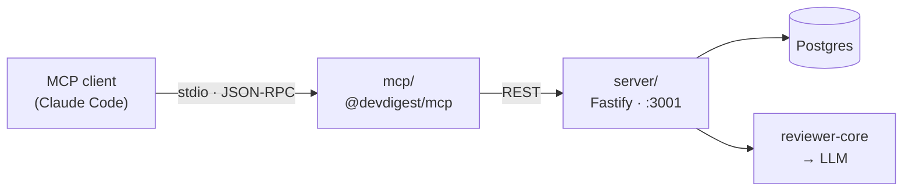

# `@devdigest/mcp` — the `devdigest-mcp` server (L04)

Exposes the DevDigest reviewer to any MCP client (Claude Code, Claude Desktop,
the MCP Inspector) as **five tools**. It is a protocol adapter and nothing else:
no database access, no business logic — it talks to the DevDigest API over the
same REST surface the web client uses, so the module boundaries in `server/src`
stay intact.



## Tools

| Tool | Input | Reads / writes |
|------|-------|----------------|
| `list_agents` | `enabled_only?` | `GET /agents` |
| `run_review` | `repo`, `pr`, `agent?` | `GET /pulls/:id` **then** `POST /pulls/:id/review` |
| `get_findings` | `repo`, `pr`, `severity?`, `agent?`, `all_runs?`, `limit?`, `format?` | `GET /pulls/:id/reviews` |
| `get_conventions` | `repo`, `status?` | `GET /repos/:id/conventions` |
| `get_blast_radius` | `repo`, `pr` | `GET /pulls/:id/blast` |

Repositories are addressed as `owner/name` and pull requests by their GitHub
number. No uuid ever crosses the tool boundary: `src/resolve.ts` translates the
human identifier into the internal id, and every failure lists the valid
alternatives so a wrong guess costs one retry instead of a dead end.

### Why `run_review` calls `GET /pulls/:id` first

It is not an optimisation, it is a correctness requirement. `POST /repos/:id/poll`
imports PR *metadata* only; the file patches land in `pr_files` solely via
`GET /pulls/:id`. Reviewing without that warm-up silently reviews an **empty
diff** and returns "approve / score 100" for a fraction of a cent. See
`server/INSIGHTS.md` (2026-08-02) and `server/src/modules/reviews/diff-loader.ts:19-29`.

### Why `get_blast_radius` errors when the index is missing

It used to be a stub, and it returned `isError: true` because an empty
*successful* result reads to a model as "this change impacts nothing" — the exact
wrong conclusion for an impact tool, and indistinguishable from a real empty
answer.

The tool is implemented now, and that principle moved rather than disappeared:
when the server reports `state: "degraded"` (no usable code index), the tool
returns `isError: true` saying the impact is **UNKNOWN** and naming the resync
action. An indexed repository with genuinely no downstream returns a normal
success saying so. `partial` returns a success whose first line flags that
callers may be missing.

## Token budget

The two costs of an MCP server are **schema bloat** (definitions loaded at
session start) and **response bloat** (tool output flowing back into context).

Measured on this server:

| What | Cost |
|------|------|
| `instructions` (always in context, even when tools are deferred) | 448 chars |
| All five tool definitions (`tools/list`) | 3 888 chars ≈ **972 tokens** |

Both numbers are **asserted by `test/context-budget.test.ts`**, which prints them
on every run. A copy change that blows the budget fails the suite instead of
quietly costing every session context.

Claude Code's **tool search is on by default**: only tool *names* plus the server
`instructions` load at session start, and schemas arrive on demand. This
repository ships **no `.mcp.json`**, so that default applies — registration is
local-scope and on demand (see [Run it](#run-it)).

Design choices that keep the number down:

- **Five high-leverage tools, not one per endpoint.** More tools measurably
  degrade selection accuracy as well as costing context.
- **No `outputSchema`.** An output schema is pure upfront cost for a tool whose
  result the model reads as prose.
- **One short `.describe()` per parameter.** Claude Code truncates each tool
  description *and* the server instructions at **2 KB**.
- **Every tool caps its own output** (`src/format.ts`) well under Claude Code's
  25 000-token limit, and says how to narrow the query instead of cutting
  silently. `get_findings` also has `format: "concise" | "detailed"`.

### `get_findings` returns the latest run per agent

A PR accumulates runs — one per agent, plus every re-run. Merging them reports a
finding from a **superseded** run as if it were still current; measured on this
repo's working-tree PR, which reached nine `Security Reviewer` reviews, that
surfaced a finding against a file that had already been deleted. So the default
keeps only the newest review per agent, and `all_runs: true` asks for the
history. The count of hidden runs is always stated, never dropped in silence.
The same rule, for the same reason, is applied server-side at
`server/src/modules/smart-diff/service.ts:36-38`.

If a future tool must return more, annotate it with
`_meta["anthropic/maxResultSizeChars"]` (ceiling 500 000 chars) rather than
asking users to raise `MAX_MCP_OUTPUT_TOKENS`.

## `devdigest review` — the pre-push CLI

Blast Radius and PR review both start after a pull request exists. This command
moves the same review earlier, onto the working tree.

```sh
cd mcp && ./bin/devdigest.mjs review --agent "Security Reviewer"
```

| Flag | Meaning |
|---|---|
| `--mode working` | the current working tree (default, and the only mode implemented) |
| `--agent <name>` | one agent, by the name `list_agents` shows. Default: every enabled agent |
| `--all` | every enabled agent (the default; accepted for symmetry) |
| `-h`, `--help` | the text above, including the exit contract |

### Exit codes — the contract

| Code | Meaning |
|---|---|
| `0` | reviewed, no blocking findings |
| `1` | reviewed, **blocking** findings present |
| `2` | could not review: bad usage, API unreachable, empty diff, a failed run, or a timeout |

"Blocking" is not defined here. It is the server's own denormalised blocker
count, computed from each agent's `ci_fail_on` gate — the same number CI uses.
Recomputing it in the CLI would be a second policy that could disagree with the
first.

The `bin/devdigest.mjs` shim re-execs the TypeScript entry through the local
`tsx` and **forwards the child's exit code unchanged**; a wrapper that swallowed
it would make the whole tool decorative.

### Untracked files are not reviewed, and say so

`git diff HEAD` covers staged **and** unstaged changes to **tracked** files. Git
cannot diff a file it has never seen, so untracked files are counted and
reported on stderr rather than silently dropped:

```
59 untracked file(s) were NOT reviewed — run 'git add -N <path>' to include them.
```

The difference between "no findings" and "not looked at" is the entire value of
a pre-push gate.

### Why it goes through the server

The assignment's overriding requirement is to **reuse** the reviewer, not build
a second one. So the CLI POSTs the diff to `POST /reviews/diff`, which:

1. resolves the repo by `owner/name` within the workspace;
2. upserts a synthetic pull request numbered **0** — idempotent on the existing
   `pr_repo_number_uq` index, so repeated runs reuse one row;
3. replaces that PR's `pr_files` with the parsed diff, in one transaction;
4. calls the **existing** `ReviewService.runReview`.

`loadDiff` tries `git diff base...head` first and falls through to reconstructing
from `pr_files` when it yields nothing (`reviews/diff-loader.ts:19-29`). With
base and head both `working`, the git attempt cannot produce files, so the
executor reviews exactly the CLI's diff — through the unchanged grounding gate,
agent selection, run trace and persistence. `run-executor.ts` is not modified,
and nothing in this package imports `reviewer-core`.

The pseudo-PR is deliberately **visible** in the web app as "Working tree": a
CLI run you cannot open and inspect is a worse trade than one extra row in a
list.

The wait for the run is the same `review-wait.ts` the `run_review` tool uses —
one implementation, two callers, because both must agree on what "finished"
means and on how politely they poll.

## Run it

```sh
cd mcp && pnpm install

# 1. the API must be running
cd ../server && pnpm dev            # :3001

# 2a. drive it by hand
cd ../mcp && pnpm inspect           # MCP Inspector in the browser

# 2b. or register it with Claude Code, on demand
claude mcp add devdigest \\
  --env DEVDIGEST_API_URL=http://localhost:3001 \\
  -- "$PWD/mcp/node_modules/.bin/tsx" "$PWD/mcp/src/index.ts"
```

**No `.mcp.json` is committed, deliberately.** A project-scoped one would make
Claude Code spawn this server at the start of every session in the repo once
approved; the owner's decision is that it comes up only when wanted. Local scope
lives in `~/.claude.json` under this project's path and is never version
controlled. Turn it off again with `claude mcp remove devdigest`.

`scripts/dev.sh` neither installs nor starts this package, for the same reason —
`cd mcp && pnpm install` is an explicit, one-time step.

| Env var | Default | Purpose |
|---------|---------|---------|
| `DEVDIGEST_API_URL` | `http://localhost:3001` | where the DevDigest API runs |
| `DEVDIGEST_API_TIMEOUT_MS` | `30000` | per-request timeout for reads |
| `DEVDIGEST_REVIEW_TIMEOUT_MS` | `600000` | timeout for `run_review` (a real LLM run) |

## stdio contract

**stdout belongs to the MCP wire.** Anything written there that is not a
JSON-RPC message corrupts the session. All diagnostics go to stderr
(`console.error`). This is why `.mcp.json` invokes the local `tsx` binary
directly instead of going through `pnpm`, which prints its own banner.

## Layout

```
src/
  index.ts       entry: instructions, tool registration, serveStdio
  api.ts         thin REST client + actionable ApiError
  resolve.ts     "owner/name" + PR number + agent name → uuids
  format.ts      ok/fail/guard, truncation, one-lining
  tools/         one file per tool
```
