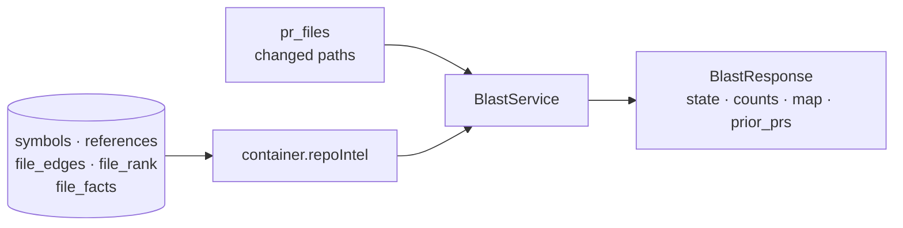

# `blast` — Blast Radius (L04)

Answers the reviewer's first question about any diff: **what else can this
touch?** Changed lines alone cannot say — the answer lives in the relationships
between symbols and files.

```
GET  /pulls/:id/blast          → the impact map (index read, no model)
POST /pulls/:id/blast/summary  → one paragraph explaining it (exactly one model call)
```



## Three rules, each an acceptance criterion

### 1. No parsing at request time

Every fact is read from the prebuilt index. `file_facts` exists for exactly this
reason — its own schema comment says it holds precomputed endpoints and crons
*"so the blast service doesn't have to re-parse the clone on every request"*
(`db/schema/repo-intel.ts:73-88`).

The trap is that `RepoIntelService.getBlastRadius` has a **fallback** that reads
the clone and runs `extractEndpoints` per caller file (`repo-intel/service.ts:290-294`).
That is request-time parsing. So the service checks `getIndexState` **first** and
never calls the facade when the index is unusable — and if a returned result
still carries `degraded: true`, it is **discarded** rather than rendered.

One structured log line per request proves it:

```
blast: served from index  prId=… state=ok indexedSha=… symbols=2 callers=12 endpoints=36 source=index
```

### 2. No LLM on the main path

`GET` never touches `container.llm`. The paragraph is a separate `POST`, makes
**one** completion, and returns **409** on a degraded map rather than narrating
data it does not have.

### 3. Missing data is never an empty map

| State | Meaning | UI |
|---|---|---|
| `ok` | the index is complete | the map |
| `partial` | the index skipped files | the map **plus a caveat** |
| `degraded` | no usable index | **no map**, and the reason |

`degraded` says the impact is *unknown*. An empty map on `ok` says there is
genuinely nothing downstream. Collapsing the two would tell a reviewer the change
is safe precisely when that cannot be known — the one failure mode this feature
must not have. The MCP tool carries the same rule: `degraded` → `isError: true`.

## Graph direction

**Dependents, not dependencies.** From a changed file, walk `file_edges`
*backwards* — who imports me? — bounded to `BFS_DEPTH` (2). The
`(repoId, toFile)` index exists for this; the schema says so outright:
*"the reverse-lookup index (repoId, toFile) is what blast uses to walk 'who
depends on this file?'"* (`db/schema/repo-intel.ts:70-72`).

`getCriticalPaths` in the same facade walks the **opposite** way (importer →
imported). Do not copy it. `test/repo-intel-blast.test.ts` pins the direction on a
fixture `A → B → C`: a change in `C` yields `B`(1) and `A`(2); a change in `A`
yields neither.

Each dependent also records the seed file it was reached from (`via`). Without
that, every changed symbol inherits every endpoint in the app — the first version
of this module attributed 31 HTTP endpoints to a test mock.

## Two facade defects fixed here

- **The caller cap was global, not per symbol.** `callers.slice(0, MAX_CALLERS_PER_SYMBOL)`
  ran over the flat array, so two changed symbols with 25 callers each yielded 20
  rows *in total* and a high-ranked symbol could erase the rest from the map.
- **The persistent path never excluded the declaring file.** The ripgrep path
  always had `if (r.fromPath === sym.file) continue`; `getResolvedCallers` filters
  on `decl_file` without excluding self-references, so a helper used inside its
  own file counted itself as downstream impact.

## Caller links point at the INDEXED revision

A caller's line number is only valid in the tree the index was built from, so the
client links callers with `indexed_sha` and changed symbols with `head_sha`.

This is not theoretical. Measured on this repository: the clone sat 38 commits
behind `HEAD`, and `pulls/routes.ts:27` was a `getContext` call in the indexed
tree and a comment in the current one. Linking to the head would have opened a
plausible-looking wrong line. When nothing is indexed, the path renders as plain
text instead of a link.

**Before demoing or trusting the map, resync** (`POST /repos/:id/resync`) and
check `lastIndexedSha`.

## Not here

No DB migration, no `blast` table, no repo-level route (blast is about a diff),
no re-indexing from this module — the UI links to the existing resync. The HTTP
envelope is module-local (`contract.ts`) and deliberately not a shared contract;
that file explains why.
